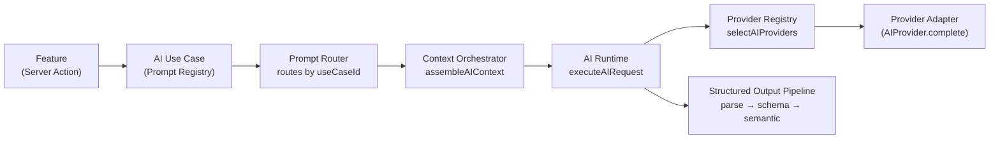

# AI — "Bloom AI"

**Status: reusable platform, v2 Checkpoint 9.** Bloom AI moved from a single-feature, single-provider seam (v1) to shared infrastructure: a multi-provider registry, an execution Runtime (timeout/retry/fallback), a Prompt Registry + Router, a Context Orchestrator, token budgeting, a structured-output pipeline, an AI Tool Registry foundation, and a Memory & Knowledge Layer. The Event Operations Brief (Checkpoint 2) proved this platform works by migrating onto it with zero behavioral change. The Proposal Generator (Checkpoint 3, see `docs/proposal-generator.md`) is the platform's first genuinely new feature built on top of it. Checkpoint 4 (see `docs/skills.md`, `docs/v2-checkpoint-4-skills-layer.md`) adds one more layer on top of all of this: every AI capability, real or placeholder, is now a **Skill**, executed exclusively through `executeSkill()` — no UI component calls the Runtime, Prompt Registry, or Context Orchestrator directly anymore. Checkpoint 5 (see `docs/daily-brief.md`, `docs/v2-checkpoint-5-daily-brief.md`) delivers the first workspace-wide Skill — a Daily Operations Brief aggregating Events, Finance, Contracts, Clients, Notifications, and Activity into one morning briefing, proving the Skill contract fits a cross-entity capability as cleanly as a per-Event one. Checkpoint 6 (see `docs/memory.md`, `docs/v2-checkpoint-6-memory-layer.md`) gives every Skill shared, structured operational memory — not a vector database, not semantic search — through one Memory Manager: Daily Brief now references its own prior runs to highlight new/resolved/persistent issues, Proposal Generator surfaces relevant historical decisions without ever auto-modifying a draft, and a new "Browse AI Memory" Skill lets a member browse this Workspace's own remembered history directly. Checkpoint 7 (see `docs/crm-assistant.md`, `docs/v2-checkpoint-7-crm-assistant.md`) delivers Bloom AI's first full business assistant — a CRM Assistant reading Clients, Leads, Contracts, Invoices, Events, Proposal history, and approved AI Memory to surface relationship health, at-risk Clients, and prioritized opportunities on its own dedicated `/crm-assistant` page, proving the Skill contract scales to a capability spanning six entity types at once. Checkpoint 8 (see `docs/finance-assistant.md`, `docs/v2-checkpoint-8-finance-assistant.md`) delivers Bloom AI's second full business assistant — a Finance Assistant reading Invoices, Payments, Contracts, Expenses, Events, Proposal values, approved AI Memory, and (optionally) the CRM Assistant's own context to surface revenue, cash flow, and financial risk on its own dedicated `/finance-assistant` page, proving the Context Orchestrator's sections compose across Skills, not just within one. Checkpoint 9 (see `docs/automation-engine.md`, `docs/v2-checkpoint-9-automation-engine.md`) adds BloomOS's first execution layer — the **Automation Engine** — outside the AI platform proper: Skills may suggest that an Automation exists, but only `executeAutomation()`/`dispatchAutomationTrigger()` ever runs a deterministic business action, after an explicit trigger and, when required, explicit human approval. No Skill imports `core/automation` directly; the one safe direction (an Automation Action calling into a Skill) is proven by this checkpoint's own `generate-proposal`/`generate-daily-brief`/`generate-crm-report`/`generate-finance-report` Actions. Everything else in "Anticipated capabilities" remains undesigned.

## Vision

Bloom AI is an assistant embedded in BloomOS that helps the team run the business faster and with fewer mistakes — grounded in the same lifecycle and data every other module uses (`BLOOMOS_BIBLE.md`, `docs/workflows.md`). It is not a chatbot bolted on for novelty; it must clear the same bar as any other feature: save time, reduce mistakes, improve the client experience, or increase operational efficiency.

## Platform architecture

Every AI feature is required to flow through the same seam, so no feature reimplements prompt/provider/parsing plumbing:

- **Provider Registry** (`core/ai/providerRegistry.ts`): a multi-provider registry (`registerAIProviderEntry`/`unregisterAIProviderEntry`/`setAIProviderHealth`), keyed by id, each entry carrying its `AICapability[]` and health (`available`/`degraded`/`unavailable`). `selectAIProviders()` returns an ordered, de-duplicated candidate list — preferred, then the fallback chain in order, then the registered default — skipping anything `unavailable` or missing a required capability. `core/ai/registry.ts`'s v1 surface (`registerAIProvider`/`getAIProvider`/`isAIConfigured`) is preserved byte-for-byte, now delegating to this registry under one fixed id (`legacy-registered`) — no caller of the v1 functions needed to change.
- **AI Runtime** (`core/ai/runtime/`): the single execution seam (`executeAIRequest`) every use case should call instead of a provider's `.complete()` directly. Handles provider selection (or accepts an already-resolved `provider`, bypassing selection — see the Event Operations Brief migration below), a per-call timeout, bounded exponential backoff retry (`baseMs * 2^attempt`, capped, deterministic — no jitter, so tests stay fast and exact), and provider-to-provider fallback. A caught exception's own `.message` is **never** surfaced in the returned error or logged — only fixed, safe strings — since a provider's thrown error could contain connection details or partial secrets.
- **Prompt Registry & Router** (`core/ai/prompts/`): `registerAIUseCase`/`getAIUseCase`/`listAIUseCases` hold an `AIUseCaseDefinition` per feature (prompt version, system instructions, `buildMessages`, output schema, required capabilities, token budget, `humanApprovalPolicy`). `routeAIUseCase(useCaseId)` resolves one by id, returning a typed `AIError` (`category: "invalid_request"`) for an unregistered id instead of a runtime crash.
- **Context Orchestrator** (`core/ai/context/`): `assembleAIContext({ workspaceId, sections, refs })` fans out to registered per-section builders (`AIContextBuilder`, one per `AIContextSectionKey`) in parallel, assembles the result in a fixed canonical order (never request order, so results are deterministic), and records provenance (which function produced each section) plus an estimated token count. `workspace`, `user`, `event`, `client`, `eventServiceAssignment`, and the Checkpoint-3-added `proposalContext` all have real builders; `service`/`finance`/`contract`/`blueprint` remain reserved keys with no builder registered, so requesting them is a safe no-op (the section is simply absent from the result), not an error. `workspace`/`user` format facts the caller already resolved (never re-querying); `event` (`modules/ai/contextBuilders/eventContextBuilder.ts`) wraps the pre-existing `fetchEventContextRecord` + `buildEventOperationsBriefContext` pipeline; `client` and `eventServiceAssignment` (`modules/ai/contextBuilders/`) are thin, safe-fields-only reads; `proposalContext` is the Proposal Generator's own composite section (Event/Venue/Timeline/Consultation Notes/Contract payment terms) — see `docs/proposal-generator.md`. Every builder that needs Supabase imports `@/lib/supabase/server` dynamically inside its `"supabase"`-mode branch (never as a static top-level import) specifically so a `"server-only"`-guarded module is never evaluated when a test registers builders in mock mode.
- **Token Budgeting** (`core/ai/tokenBudget.ts`): `estimateTokens` (a documented ~4-characters-per-token heuristic, no external tokenizer dependency) and `applyTokenBudget` (section-granularity, priority-ordered truncation — a dropped section is named in `omittedSections`, never silently lost). Available to any use case via its `tokenBudget` config; the migrated Event Operations Brief does not apply it (see below).
- **Structured Output Pipeline** (`core/ai/structuredOutput.ts`): `parseStructuredOutput` (JSON parse → Zod schema validation) and the optional `applySemanticValidation` (a use case's own domain-specific check, e.g. "this risk kind must be one BloomOS actually detected") — a use case with nothing further to check simply skips the second stage.
- **AI Tool Registry foundation** (`core/ai/tools/`): `AIToolDefinition` (input/output Zod schemas, `requiredPermission`, `approvalPolicy`) + `executeAITool`, which enforces — in order — that the tool exists, the caller holds its required permission, a human has approved the call if the tool demands it, and the input/output both match their schemas. **No tool is registered yet** — this is infrastructure only, ahead of any AI feature that calls out to a real BloomOS mutation.
- **AI Memory foundation** (`core/ai/memory/`, `lib/data/core/aiMemory/`): `proposeMemory` always creates a `"proposed"` entry — never auto-approved; only a human's explicit `approveMemory`/`rejectMemory` call changes that, and `getMemoryForScope` only ever returns `"approved"` entries. Mock-only this checkpoint (same "architecture ahead of a consuming feature" precedent as `core/tags`/`core/comments`/`core/featureFlags`) — **no use case proposes a memory yet**.

## Shipped: Event Operations Brief (now running on the platform)

An on-demand, internal-only operational briefing for one Event, generated from `src/modules/ai/`:

- **Where**: an "AI Operations Brief" section embedded in Event Detail (`/events/[id]`) — not a standalone chat page. Reuses the page's existing `events.view` RouteGuard; no new permission was introduced.
- **Architecture**: `EventOperationsBriefSection` (Client Component) → `generateEventOperationsBrief` (a `"use server"` Server Action — the only place a provider is ever called). Internally it now: resolves the use case via `routeAIUseCase("event-operations-brief")`, assembles context via `assembleAIContext({ sections: ["event"], refs: { eventId } })`, executes via `executeAIRequest` (`maxRetries: 0`, `timeoutMs: 20_000` — preserving v1's exact no-retry, 20-second behavior), and validates the result via `parseStructuredOutput`. The Server Action still re-resolves the caller's session and `events.view` permission itself and re-fetches the Event server-side — it never trusts a client-supplied Workspace, permission, or Event payload.
- **Why `maxRetries: 0` and a pre-resolved `provider`**: this migration's mandate was byte-for-byte behavioral compatibility with the pre-platform implementation, proven by its own 15-test suite (`generateEventOperationsBrief.test.ts`) running **unmodified** against the new code. That test suite mocks `getAIProvider`/`isAIConfigured` directly, so the Runtime call passes an already-resolved `provider: getAIProvider() ?? createMockAIProvider()` — `AIRuntimeRequest.provider` bypasses registry-based selection specifically for this reason. New use cases going forward should prefer `requiredCapabilities`/`preferredProviderId`/`fallbackProviderIds` and let the Runtime select via the Provider Registry instead.
- **Facts vs. narrative**: every fact (status, lifecycle stage, Health Score + its top contributing factors, checklist/schedule summary, missing information, detected operational risks, confidence score) is computed deterministically by existing Events/`core/workflows` code plus `riskEngine.ts`/`confidence.ts`, never by the model. The model (or the deterministic mock provider) only supplies an `executiveSummary`, a `healthExplanation` of the *existing* score, an explanation for each already-detected risk, and `recommendedActions` — each with a mandatory `reason` and an optional `actionTargetType` — validated against a Zod schema (via the shared structured-output pipeline), then semantically cross-checked in `assembleBrief.ts` (an invented risk `kind` or a real risk the model skipped are both handled safely — see "Risk engine" below) before ever reaching the UI.
- **Health Score explanation, never a second score**: `riskEngine.ts`/the context builder never recompute Health — they read `core/workflows/eventHealth.ts`'s existing `score`/`status`/factors and hand them to the model purely to narrate ("why is this score what it is"), with an explicit system-prompt instruction not to calculate, restate, or imply a different one.
- **Risk engine** (`riskEngine.ts`): a small, explicitly extensible list of pure detector functions (overdue checklist, delayed schedule, missing owner, incomplete information, approaching date without readiness) — each reusing a signal Events already computes, never a new fact. Inventory/Purchases/Finance detectors have an obvious extension point (append to `RISK_DETECTORS`) once Events gains a real relationship to those modules; none does today, so none are implemented.
- **Confidence score** (`confidence.ts`): derived purely from which of 7 context fields are present (client, date, location, budget, owner, checklist, schedule) — never from the model's own self-reported confidence.
- **Actionable output** (`actionTargets.ts`): a recommendation's `actionTargetType` is a closed enum (`"checklist" | "schedule" | "event" | null`) the model chooses from; the actual `href` is resolved deterministically in code to one of three fixed, real BloomOS routes — the model can never supply or influence a URL directly.
- **Mock mode**: no AI provider is registered yet (`isAIConfigured()` is `false`), so `generateEventOperationsBrief` falls back to a deterministic mock provider (`src/modules/ai/mockProvider.ts`) that reflects the real Event's current data. The UI clearly labels mock output as "Development mock — not a real AI call." To go live, register a real `AIProvider` (Anthropic/Claude per `docs/integrations.md`) via `registerAIProvider()`; no other code changes.
- **Versioning metadata, not persistence**: every generated brief carries `promptVersion`, `contextVersion`, `provider`, `model`, and `sourceEventUpdatedAt` (the Event's `updated_at` at generation time) — output itself stays ephemeral (nothing is written to the database), but a future persistence phase could add a `brief_generations` table with exactly these columns to compare versions over time, without reshaping this result.
- **Feedback-ready, not yet wired**: every recommendation carries a stable, code-assigned `id` (`RecommendedAction.id`), and `AIRecommendationFeedback`/`AIRecommendationFeedbackRating` types exist in `modules/ai/types.ts` purely as the future interface a 👍/👎 UI and its storage would implement — no repository, no migration, no UI control exists yet.
- **Bloom AI Skill Picker** (Checkpoint 4): while `EventOperationsBriefSection` is mounted, it registers itself as the Event Operations Brief Skill's runner (`registerSkillRunner`/`unregisterSkillRunner`, `core/ai/skills/runnerRegistry.ts`) — running it from the "Ask Bloom" Skill Picker (`modules/ai/components/BloomAISkillPicker.tsx`) triggers the same generation flow as clicking "Generate brief". Superseded this checkpoint's own prior per-feature Command Palette registration; see `docs/skills.md` §8.
- **Observability**: logs (via `core/observability/logger`) `useCaseId`, `promptVersion`, and an estimated token count on invocation, plus the validation outcome (success, or a failure `category`) after the structured-output pipeline runs — safe metadata only, never prompt text, context facts, or a provider's raw response/error message.

## Shipped: Proposal Generator (Checkpoint 3)

A structured, human-reviewed proposal draft for one Event — the platform's first genuinely new AI feature, not a migration. See `docs/proposal-generator.md` for the full architecture, validation strategy, and human-approval guarantees; `docs/v2-checkpoint-3-proposal-generator.md` for the certification report.

## Architecture for a future Daily Operations Brief

`src/modules/ai/dailyBrief/` — a parallel, equally server-only pipeline (context builder → prompt builder → mock provider → `"use server"` generate action) for a workspace-wide daily briefing, **not wired to any route or UI yet**. It aggregates already-built per-Event `EventOperationsBriefContext` objects (via `fetchDailyOperationsBriefContext.server.ts`, which loops `fetchEventContext.server.ts` per active Event) into upcoming/at-risk Event lists and workspace-wide overdue counts — reusing every per-Event computation rather than recalculating anything. `financeWarnings` is intentionally always empty today: no safe, already-existing cross-Event finance aggregate exists in BloomOS (only a per-Event `getEventFinancialSummary`), so the field is reserved rather than fabricated.

## Anticipated capabilities (not yet designed in detail)

- Drafting follow-up communications from consultation notes
- Summarizing a client's or event's history and current status
- Flagging risk (e.g., a stalled lead, an overdue deposit, an approaching event with an incomplete Planning checklist)
- Answering team questions against the business's own data (leads, clients, events, contracts, finance)

## Guardrails

- **Data-grounded, not speculative.** Bloom AI answers from BloomOS's actual data; it does not fabricate client, contract, or financial information.
- **Assist, not replace.** It drafts and suggests; a human approves anything client-facing or financially consequential before it goes out.
- **Scoped to Workspace data.** Same tenant-isolation rule as everything else in `docs/permissions.md` — no cross-tenant leakage, ever.
- **Transparent.** Where Bloom AI takes or suggests an action, it's visible and attributable, not a silent background process.

## Explicitly out of scope for now

Everything in "Anticipated capabilities" above beyond the Event Operations Brief: no general chat interface, no direct mutation of Events/Pipeline/Finance/Clients, no client-facing communication sent without human review, no live provider credentials committed anywhere. The MVP's six modules remain fully usable through direct human action with no AI dependency.

**Resolved by the v2 Checkpoint 2 platform** (previously listed here as deferred): retry-with-backoff and a true multi-provider fallback chain now exist generically in the AI Runtime (`executeAIRequest`); an AI Tool Registry foundation now exists (`core/ai/tools/`). The Event Operations Brief itself still uses `maxRetries: 0` and a single pre-resolved provider by deliberate choice (preserving its exact v1 behavior), not because the platform can't do more — a future use case can opt into real retry/fallback simply by not setting `provider` and instead declaring `requiredCapabilities`/`fallbackProviderIds`.

Still explicitly deferred: Service/Blueprint context builders (`workspace`/`user`/`event`/`client`/`eventServiceAssignment`/`proposalContext`/`dailyBriefContext`/`memory`/`crmAssistantContext`/`financeAssistantContext` now have real builders — the rest remain reserved `AIContextSectionKey`s with no builder registered); the "Operational Graph" named in `docs/services.md`/`eventServicePurchaseRequirement.ts` (a documented future concept, no graph data structure exists yet); semantic embeddings/vector storage (the Memory & Knowledge Layer, `docs/memory.md`, is structured typed filters over a flat store — no embedding is computed or stored anywhere, and Context Orchestrator sections remain structured facts, not a retrieval index); autonomous agents or automatic email/contract/financial/status mutations (every AI Tool Registry call still requires the human-approval gate in `executeAITool`, and no tool is registered; the Proposal Generator's own human-review gate is separate and described in `docs/proposal-generator.md`); a real provider integration (no production credentials are committed anywhere — `isAIConfigured()` stays `false` until one is registered); a Document Assistant (only the Event Operations Brief, Proposal Generator, Daily Operations Brief, Browse AI Memory, CRM Assistant, and — as of Checkpoint 8 — the Finance Assistant have been built onto the platform so far — see `docs/skills.md`); and the Workflow Builder, Mobile Companion, or Marketplace (unrelated v2 modules, not part of the AI platform at all — the Automation Engine itself now exists as of Checkpoint 9, see `docs/automation-engine.md`, but deliberately outside this platform's own seams). None of these require a platform change to add later — `core/ai`'s seams (Provider Registry, Prompt Registry, Context Orchestrator, Tool Registry, Memory) are already built to extend incrementally rather than be rearchitected.
