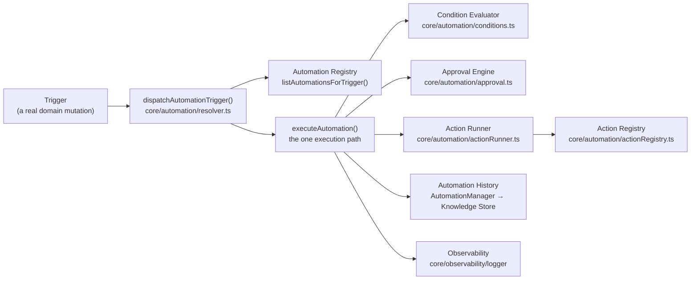

# Automation Engine

**Status: v2 Checkpoint 9.** BloomOS's execution layer — the one path every deterministic business action runs through, shared by every module. It is deliberately **not** a Workflow Builder, **not** background scheduling, and **not** autonomous AI: an Automation only ever runs after an explicit trigger fired by BloomOS's own code, evaluates deterministic conditions, resolves whether a human must approve it, and only then executes a fixed, linear sequence of typed Actions. Bloom AI's Skills Layer (`docs/skills.md`) may suggest that an Automation exists; it may never call `executeAutomation()` or `dispatchAutomationTrigger()` itself — the reverse direction (an Automation Action calling into a Skill) is the one that's allowed, and this checkpoint's own `generate-proposal`/`generate-daily-brief`/`generate-crm-report`/`generate-finance-report` Actions are the proof.

## Why this exists

Checkpoints 2–8 gave BloomOS an *advisory* AI platform — every Skill drafts a report, a brief, or a proposal, and a human decides what to do with it. Nothing in BloomOS could yet act on an event by itself, even deterministically: an overdue Invoice never notified anyone, a rejected Proposal never recorded anything, a Contract signature never triggered a downstream step. The Automation Engine is BloomOS's first *execution* layer — a typed, auditable, approval-aware pipe from "something happened" to "something ran," entirely separate from and never entangled with the AI Runtime's own non-determinism.

## Architecture

No UI component ever executes an Action or an Automation directly — a UI (the Automation Dashboard's Approve/Reject buttons, or a future trigger surface) only ever calls `executeAutomation()`/`dispatchAutomationTrigger()`/`getAutomationManager()`, the same three seams every caller shares.

## 1. Automation Domain (`types/automation.ts`)

An **Automation Definition** is a plain, declarative, code-owned object (`registerAutomation()`, mirroring `registerSkill()`) — never something a business user authors through a UI this checkpoint (that is the future Workflow Builder's job):

| Field | Purpose |
|---|---|
| `id`, `name`, `description`, `category`, `version` | Identity — `category` is a closed set (`operations`/`finance`/`crm`/`proposal`/`notifications`/`memory`/`general`). |
| `status` | `"active"` / `"disabled"` — a disabled Automation stays discoverable but never dispatches. |
| `trigger` | One `AutomationTriggerType` (see §2). |
| `conditions` | `AutomationCondition[]`, AND-combined (see §3). |
| `actionIds` | Ids into the Action Registry, run in a fixed, linear sequence. |
| `approvalPolicy` | One of four kinds (see §4). |
| `requiredPermissions`, `minimumRole`, `featureFlag` | The same permission/role/feature-flag gates `executeSkill()` already established for Skills — checked in `executeAutomation()` before conditions are even evaluated. |
| `maxRetries` | How many additional attempts a failing Action gets, synchronously, no backoff. |
| `workflow` | Reserved, always `null`/`undefined` this checkpoint — see §11. |

## 2. Trigger System — a closed enum, on purpose

`AUTOMATION_TRIGGER_TYPES` (`types/automation.ts`) is a **closed, 12-value enum** — `proposal.accepted`, `proposal.rejected`, `invoice.overdue`, `invoice.paid`, `contract.signed`, `event.created`, `event.updated`, `event.completed`, `daily_brief.generated`, `crm_recommendation.accepted`, `finance_recommendation.accepted`, `memory.created`. This is the deliberate opposite of the Action Registry's own open design: the checkpoint's own spec only ever says "Future *actions* should register automatically" and "No hardcoded *actions*" — never said of Triggers — so a curated, typo-proof list beats an open string here, matching the same "small closed set" bias `AICapability`/`AI_CONTEXT_SECTION_KEYS` already use elsewhere in this codebase.

An `AutomationTriggerEvent` (`{type, workspaceId, occurredAt, actorMemberId, facts}`) is fired by real BloomOS code — **never** an external webhook, per the checkpoint's own explicit instruction. `facts` is a deterministic, structured bag (an amount, a count, an id, a status) — never a Note's freeform content, a Client's sensitive fields, or a payment credential, since it's persisted verbatim as part of a pending approval's own history record (`AutomationExecution.triggerFacts`).

`dispatchAutomationTrigger(trigger, context)` (`core/automation/resolver.ts`) is the fan-out entry point: it looks up every **active** Automation registered against `trigger.type` and runs `executeAutomation()` for each independently — one Automation's own failure never stops a sibling on the same trigger.

**Live-wired this checkpoint**: `acceptProposalDraft.ts`/`rejectProposalDraft.ts` (the Server Action layer, not the mock repository — firing a trigger from inside a data-persistence function would mix persistence with orchestration) each dispatch a real `proposal.accepted`/`proposal.rejected` trigger after a successful accept/reject, in a `try/catch` that only logs on failure — an Automation Engine problem never surfaces as a rejection/acceptance failure. Every other trigger type is registered and testable but not yet wired to a real emitter — a deliberate scope boundary (see the Checkpoint 9 report's "Known limitations").

## 3. Condition Engine (`core/automation/conditions.ts`)

`AUTOMATION_CONDITION_FIELDS` is an 8-value closed set: `role`, `workspaceId` (resolved from the execution context — a trigger can never forge who is running it), `eventType`, `invoiceAmountMinor`, `daysOverdue`, `proposalValueMinor`, `contractStatus` (resolved from `trigger.facts` by key name), and `featureFlag` (the one field requiring an async `evaluateFeatureFlag` lookup — its own `value` names the flag key, and the condition passes when the flag's resolved boolean matches `operator: "eq"` or its inverse for `"neq"`). Operators: `eq`/`neq`/`gt`/`gte`/`lt`/`lte`/`in`/`notIn`.

`evaluateConditions(conditions, {trigger, role})` is async and **AND-combines** every condition — one failure fails the whole set. "Conditions must remain deterministic" holds **by construction**, not by convention: there is no condition field through which a model's own output could ever be referenced, so an AI prompt can never be evaluated here even by mistake.

## 4. Approval Engine (`core/automation/approval.ts`)

Two distinct questions, deliberately kept separate:

- **`resolveApprovalRequirement({workspaceId, automationId, policy})`** — "does this execution need a human's explicit approval at all." `always_required`/`role_restricted` → always `true`. `never_required` → always `false`. `workspace_configurable` → defers to a per-Workspace, per-Automation override (`AutomationManager.getApprovalOverride`/`setApprovalOverride`), defaulting to **required** when unset — the safer default, per `PRODUCT_PRINCIPLES.md` #4.
- **`canGrantApproval({policy, approverRole})`** — "is *this* member allowed to grant it." Only `role_restricted` narrows this (via `minimumApproverRole`, checked with the same role-rank comparison used throughout); every other policy accepts any approver, since the requirement question is already settled.

Every approval decision is auditable: `AutomationExecution.approvalStatus` (`not_required`/`pending`/`approved`/`rejected`), `approvedBy`, `approvedAt` are persisted on every execution record, including a still-pending one.

## 5. Action System — open, registry-based (`core/automation/actionRegistry.ts`)

Deliberately the open counterpart to Triggers' closed enum: `AutomationActionDefinition.id` is a plain string, registered via `registerAutomationAction()`, the same `Map<id, definition>` shape as every registry in this codebase. **No hardcoded action list anywhere in the Engine** — `runAutomationAction`/`executeAutomation` only ever look an id up in this Map.

Nine Actions ship this checkpoint (`modules/automation/actions/`), each a genuine, working implementation, not a stub:

| Action id | What it does |
|---|---|
| `create-task` | Records a to-do as a Note (`category: "reminder"`) attached to a real BloomOS record. |
| `create-notification` | Creates an in-app Notification for a Workspace member. |
| `generate-proposal` | Runs the Proposal Generator Skill for a given Event, through the same session-resolving wrapper `/events/[id]`'s own panel calls. |
| `generate-daily-brief` | Runs the Daily Operations Brief Skill for the Workspace. |
| `generate-crm-report` | Runs the CRM Assistant Skill for the Workspace. |
| `generate-finance-report` | Runs the Finance Assistant Skill for the Workspace. |
| `create-memory` | Records a structured AI Memory entry (`source: "system"`) via the shared Memory Layer. |
| `update-status` | Updates an Event's own status field — deliberately scoped to Events only; BloomOS has no universal "status" concept. |
| `open-review-queue` | Flags a real record for human review via an in-app Notification — BloomOS has no dedicated Review Queue module yet, so this reuses Notifications honestly rather than fabricating a placeholder data structure. |

The four "Generate X" Actions call directly into the Skills Layer's own session-resolving Server Action wrappers (`generateProposalDraft`/`generateDailyOperationsBrief`/`generateCRMAssistantBrief`/`generateFinanceAssistantBrief`). This is safe specifically because of this checkpoint's own non-goals: no external webhooks, no scheduled/background execution means every Automation this checkpoint actually dispatches fires synchronously within a real, already-authenticated request — never from a detached background job with no session to resolve.

## 6. Action Registry

`registerAutomationAction`, `unregisterAutomationAction`, `getAutomationAction`, `listAutomationActions`, `listAutomationActionsByCategory`, `resetAutomationActionRegistry` (test-only) — structurally identical to the Automation Registry (§2) and the Skill Registry, on purpose: one more instance of this codebase's single registry pattern, not a new one.

## 7. Execution Engine — `executeAutomation()` (`core/automation/resolver.ts`)

The single path every Automation runs through, in this fixed order:

1. **Permission validation** — every `requiredPermissions` entry must be present.
2. **Role validation** — `minimumRole`, if set.
3. **Feature flag validation** — `featureFlag`, if set.
4. **Condition evaluation** (§3) — a failure persists `status: "skipped_conditions_not_met"` and returns early; **this is not an error**.
5. **Approval resolution** (§4) — if required and `approved !== true`, persists `status: "pending_approval"`, `approvalStatus: "pending"`, and returns early. If required and `approved: true`, validates `canGrantApproval` — a failure persists `status: "rejected"`.
6. **Action execution** — a fixed, linear sequence via `runAutomationAction` for each `actionIds` entry (never parallel, never branching this checkpoint — see §11).
7. **Status aggregation** — `"success"` (zero failures), `"partial_failure"` (some), `"failure"` (all).

Every branch persists via one `persist()` helper — **every** execution attempt is recorded, including denied, skipped, and pending ones, matching the Audit Log's own append-only precedent. If the Knowledge Store write itself fails, `persist()` still returns an in-memory structured record rather than throwing — Step 7's own "structured result" guarantee holds even then.

**Retry strategy** (`core/automation/actionRunner.ts`): on a thrown exception or a `{success: false}` result, `runAutomationAction` retries synchronously, no backoff, up to `automation.maxRetries` additional times. Deliberately simple — a future Workflow Builder's own per-step, backed-off retry policy (§11) is a strictly bigger concept, not built here.

## 8. Automation History (`lib/data/core/automation/`, `core/automation/manager.ts`)

Every execution attempt is persisted as an `AutomationExecution`: `trigger`, `triggerFacts` (a safe copy — see §2), `conditionsPassed`, `approvalStatus`/`approvedBy`/`approvedAt`, `actionResults[]`, `status`, `durationMs`, `startedAt`/`completedAt`. Persisting `triggerFacts` on the execution itself (not just referencing the original trigger) is specifically what lets a `"pending_approval"` execution be resumed later without the original caller still being in scope — see §4's approval flow below.

`AutomationManager` (`getAutomationManager()`) sits directly on the Knowledge Store, the same "Manager sits on a Store" shape `core/ai/memory/manager.ts` established: `recordExecution`, `getRecentExecutions`, `getExecutionById`, `getPendingApprovals`, `approveExecution`, `rejectExecution`, `getApprovalOverride`, `setApprovalOverride`. Every write logs safe, structural fields only (`workspaceId`/`automationId`/`status`/`durationMs`/`approvalStatus`) — **never** a trigger's own `facts` content.

### The approval flow, end to end

1. A real trigger fires → `executeAutomation()` stops at "pending_approval," persisting a record with the trigger's own facts.
2. The Dashboard's Pending Approvals section shows it; `canGrantApproval` decides whether *this* member may act on it.
3. **Approve** (`modules/automation/approveAutomationExecution.ts`) reconstructs the original `AutomationTriggerEvent` from the persisted record and calls `executeAutomation()` again with `approved: true` — the same single execution path, producing a **new**, fully-executed history record. The original pending record is then marked `approvalStatus: "approved"` via the Manager's own `approveExecution`, so the original request itself also shows as resolved — append-only, never mutated into looking like it ran the actions itself.
4. **Reject** (`modules/automation/rejectAutomationExecution.ts`) never runs any Action — it calls the Manager's `rejectExecution`, flipping the one record to a terminal `"rejected"` state directly.

## 9. Automation Dashboard (`/automation`)

The one page a human watches the Engine work and acts on what it's waiting for (`modules/automation/components/AutomationDashboardView.tsx`, data from `getAutomationDashboardData.ts`, one aggregate computed server-side per load): **Pending Approvals** (with Approve/Reject), **Recent Executions**, **Automation Health** (success rate, registered counts, triggers with no listener), **Execution Statistics** (counts by status, average duration), **Registered Triggers** (every trigger type and its active listener count), **Registered Actions**, **Failure Summary** (automations with a recent failure, sorted by count), and **Registered Automations** (this member's own workspace-visible list). `AutomationActionSummary` — `AutomationActionDefinition` minus its own `execute` function — exists specifically because an RSC boundary cannot serialize a function prop to a Client Component.

## 10. Permissions, Feature Flags & Observability

**Workspace scoped**: every query (`getRecentExecutions`, `getPendingApprovals`, `listAutomationsForWorkspace`) takes an explicit `workspaceId` and never crosses it. **Role aware**: `minimumRole` on both Automations and Actions, plus `canGrantApproval`'s own role-restricted check. **Approval aware**: §4 above. **Feature Flag aware**: both Automations and Actions may declare one, checked async via `evaluateFeatureFlag`, in both `executeAutomation`/`runAutomationAction` (enforcement) and `listAutomationsForWorkspace` (discovery).

Every stage logs via `core/observability/logger`, safe fields only — trigger type, automation/action id, condition result, approval requirement, status, duration, attempt count on retry. **Never logged**: a trigger's own `facts`, an Action's own result message content beyond its safe summary, or any business record. `/automation` has no dedicated entry in `core/permissions/routeAccess.ts` — viewing the Dashboard requires only active Workspace membership (the same precedent `/finance-assistant`/`/bloom-ai` already established), since it is a read model spanning every domain at once; per-Automation enforcement still happens on every real execution inside `executeAutomation()` regardless of who can merely *view* the Dashboard.

## 11. Future Workflow Builder integration (reserved, not implemented)

`AutomationDefinition.workflow?: AutomationWorkflowExtension | null` is the one seam a future Workflow Builder extends without a breaking change to every existing registration: `branches`, `parallelActionGroups`, `timers`, `scheduledExecution`, `retryPolicy` (deliberately distinct from `AutomationDefinition.maxRetries` — this checkpoint's own single-action retry count — `workflow.retryPolicy` is reserved for a bigger, workflow-level concept, e.g. "retry the whole chain from step 3"). All fields are `unknown`-typed and never populated or read by anything this checkpoint builds. A Workflow Builder can be layered on top of this Engine without touching `resolver.ts`'s own execution order, the Approval Engine, the Action Registry, or the History schema.

## Developer guide — adding a new Automation

Per Step 14's own Developer Experience requirement, a new Automation needs only:

1. **Trigger** — pick one of the 12 existing `AutomationTriggerType`s (adding a 13th means one line in `types/automation.ts`'s own closed enum — a deliberate, rare edit).
2. **Conditions** — an `AutomationCondition[]`, or `[]` for none.
3. **Actions** — existing `actionIds`, or a new `AutomationActionDefinition` registered via `registerAutomationAction()` first if none of the nine existing ones fit.
4. **Registration** — one `registerAutomation(definition)` call.

Nothing else — no registry-side change, no Dashboard change, no Command Palette change. `core/automation/registry.test.ts` includes a dedicated test proving exactly this. The three example Automations shipped this checkpoint (`modules/automation/definitions/`) are the working proof: `notifyOnOverdueInvoice` (`workspace_configurable` approval, registered and tested, not yet wired to a live emitter), `recordMemoryOnProposalRejection` (`never_required`, live-wired), and `suggestFollowUpProposal` (`role_restricted`, live-wired, proving one trigger fans out to more than one Automation).
