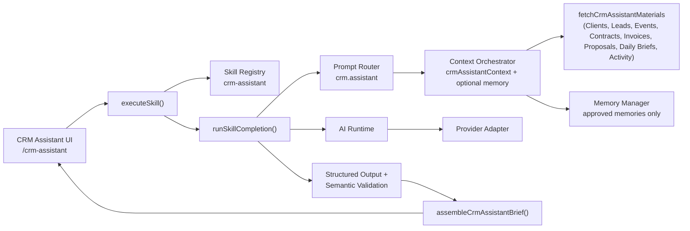

# CRM Assistant

**Status: v2 Checkpoint 7.** Bloom AI's first full business assistant — an intelligent relationship manager, not a chatbot and not a search interface. A Workspace member opens `/crm-assistant` and, with one click, sees which Clients need attention, which Contracts are pending, which Invoices remain unpaid, which relationships are at risk, and which opportunities to prioritize next — synthesized from BloomOS's own live Clients, Leads, Events, Contracts, Invoices, Proposal history, and this Workspace's own AI Memory. Built entirely on the Checkpoint 4 Skills Layer (`docs/skills.md`) and the Checkpoint 6 Memory Layer (`docs/memory.md`) — it executes through `executeSkill()` exactly like Proposal Generator, Event Operations Brief, and Daily Operations Brief, with no special execution path.

## Architecture

`generateCRMAssistantBrief.ts` is a thin wrapper: its own permission check, one `executeSkill()` call, error-category mapping via `mapSkillErrorToMessage`, then its own post-processing (`assembleCrmAssistantBrief` + observability logging). Everything else — routing, context assembly, provider selection, structured-output validation — is the same generic pipeline every other Skill already uses. No execution history table is persisted for this Skill (unlike Daily Brief) — the checkpoint spec names no "View Previous" requirement here; Step 11's observability ask is satisfied by logging alone (see "Observability" below).

## CRM Context Builder — one composite section, eight independently-fetched categories

`crmAssistantContext` is a new composite `AIContextSectionKey` (`core/ai/context/types.ts`), backed by one `AIContextBuilder` (`crmAssistantContextBuilder.ts`) that wraps `fetchCrmAssistantMaterials` + `buildCrmAssistantContext` — the same "wrap the fetch pipeline as one builder" shape `dailyBriefContextBuilder.ts` already uses, just spanning Clients/Leads/Events/Contracts/Invoices/Proposals/Daily Briefs/Activity instead of Daily Brief's own six operational categories.

Eight categories are fetched **independently, in parallel, via `Promise.allSettled`** — a single failing source never blanks out the rest of the report:

| Category | Source | Notes |
|---|---|---|
| Clients | `getClients({includeArchived:false})` (mock) / raw Supabase read (supabase mode) | Classified into Priority/Inactive/At-Risk — never sent to the model as a raw roster |
| Leads | `getLeads({includeArchived:false})` | Filtered to active (not converted/lost/archived) — feeds Upcoming Opportunities |
| Events | `getEvents({includeArchived:false})` | Split into upcoming (including unscheduled) and past, bounded and sorted |
| Contracts | `getContracts({includeArchived:false})` | Filtered to `signature_status: "unsigned"` — feeds Unsigned Contracts and Client Risk |
| Invoices | `getInvoices({includeArchived:false})` | Filtered to a positive, non-voided, non-archived balance — feeds Outstanding Payments, Outstanding Balance, and Client Risk |
| Proposal history | `getProposalsRepository().getRecentProposals()` | Always mock-only — no real `proposals` table yet, same as `getBloomAIOverview.ts`'s own precedent |
| Daily Brief history | `getDailyBriefExecutionsRepository().getRecentExecutions()` | Metadata only (status/generatedAt) — always mock-only, same rationale |
| Activity | `getCoreAuditLogService().getAuditLogForWorkspace()` | Safe `{action, ownerType, occurredAt}` projection — always mock-only |

**A category that fails to read is never confused with a category that's genuinely empty.** `unavailableCategories` names exactly which of the eight failed; `confidence.ts` and `missingInformation` are computed entirely from that list.

### The Supabase-mode server-read constraint

`getClients`/`getLeads`/`getEvents`/`getContracts`/`getInvoices` (`@/lib/data`) are safe to call as-is in mock mode, but their Supabase repositories are wired to the *browser* Supabase client (`getClientWorkspaceSession`) and throw `"Authentication is required."` the instant they're called from server-side code — the exact same documented constraint `fetchDailyOperationsBriefContext.server.ts` already works around. `fetchCrmAssistantContext.server.ts` gives each of these five categories its own direct, server-side Supabase read (`select("*")`, RLS as the real workspace-isolation boundary), extending the established pattern from three data sources (Finance/Contracts/Clients) to five (adding Leads and Events).

### Never expose sensitive internal notes

`Client`'s own type carries several fields explicitly marked internal-only in their own doc comments — `allergies`, `accessibility_needs`, `dietary_restrictions`, `preferred_communication_time`, `do_not_call`, `surprise_event_confidentiality`, `emergency_contact_name`, `emergency_contact_phone` — plus a freeform "Couple information" block and Client Notes' own arbitrary `content: string`. **None of these ever reach `CrmAssistantContext`, the model's own prompt, or the assembled report.** `CrmAssistantClientSummary` (the only Client shape this feature ever constructs) is a closed, hand-picked projection: `clientId`, `name`, `status`, `isVip`, `isReturning`, `tags`, `createdAt` — structurally incapable of carrying a sensitive field, the same "closed projection, not a redaction pass" guarantee `DailyBriefActivityEntry` already established for Audit Log entries (`action`/`ownerType`/`occurredAt` only, never `before`/`after`).

### Communication Summary — an honest, derived aggregate

BloomOS has no dedicated communication log yet (`ClientExtensionSummary.communicationHistory` is a hardcoded-empty stub, confirmed during discovery). Rather than fabricate one, `CrmCommunicationSummary` is a deterministic aggregate computed over the same Timeline Activity entries already fetched for Recent Activity, filtered to three communication-adjacent action types (`welcome_guide_sent`, `note_added`, `communication_preference_changed`) — `totalLoggedTouchpoints` and `mostRecentTouchpointAt`, nothing more. No second fetch, no invented data source.

### Why Clients/Leads aren't sent to the model as raw lists

`CrmAssistantContext` never holds "every Client" or "every Lead" — only the already-classified, bounded subsets (`priorityClients`, `inactiveClients`, `clientsAtRisk`, `activeLeads`, each capped and sorted). This mirrors Daily Brief's own precedent (it never sends "every Event," only Today/ThisWeek/AtRisk) and keeps the prompt payload bounded regardless of how large a real Workspace's roster grows — classification is a deterministic computation in `contextBuilder.ts`, not something the model needs to see every record to perform itself.

## Prompt & Output

`crm.assistant` (`registerCRMAssistantUseCase.ts`) is the registered use case — versioned (`crm-assistant-v1`), with a system prompt that names every category the model is given and repeats, explicitly, that it must never invent a Client, Lead, Contract, Payment, Event, Proposal status, or relationship between any of these.

The model is trusted with exactly six narrative fields — everything else in the rendered report is deterministic, straight from context:

| Model-authored | Deterministic (never touched by the model) |
|---|---|
| `executiveSummary`, `relationshipHealthSummary` | `relationshipHealth`'s own counts (totalClients/totalLeads/priorityClientCount/inactiveClientCount/atRiskClientCount) |
| `clientRiskExplanations` (tied to a real `clientId` already on the at-risk list) | Priority Clients, Inactive Clients, `clientsAtRisk`'s own membership (who counts as at-risk is decided in code, never by the model) |
| `upcomingOpportunities`, `suggestedFollowUps`, `recommendedActions` (each optional `targetType`/`targetId`) | Unsigned Contracts, Outstanding Payments, Outstanding Balance, Confidence, Missing Information |

A `targetType` is one of a closed enum (`"client" | "lead" | "event" | "contract" | "invoice"`, never a raw URL) resolved to a real href by `actionTargets.ts` — the same architectural guarantee `dailyBrief/actionTargets.ts` already established.

## Semantic Validation — hard reject, not silent drop

`semanticValidation.ts` mirrors Daily Brief/Proposal Generator's precedent (hard `semantic_failure`), not Event Operations Brief's silent-drop precedent. Every `clientRiskExplanations[].clientId` must already be on the deterministic at-risk list (the model may explain a risk, never decide who's at risk); every action's `targetId` (when a `targetType` is set) is cross-checked against the real ids actually present in context for that type. Any invented reference — a fabricated Client, Lead, Event, Contract, or Invoice id — rejects the whole response rather than rendering a partially-trusted one.

This is architectural prevention, not detection: the model has no free-text field through which it could name a fabricated business record at all — every reference is either fully deterministic (who's at risk, who's a priority) or gated behind a closed `targetType` enum + id cross-check.

## Memory Integration

The Skill declares `optionalContext: ["memory"]` — requested, never required (a Workspace with no memory yet gets a perfectly good report). `memoryContextBuilder.ts` (Checkpoint 6) already filters to `approvalStatus: "approved"` only, so **"never expose rejected memories" is satisfied at the source**, not by a second check here. `registerCRMAssistantUseCase.ts`'s `composeContext` merges the optional `memory` section into `context.recentMemories`, which is used two ways:

1. **Threaded into the model's own prompt** (`promptBuilder.ts`) — unlike Daily Brief (which only diffs memory deterministically) or Proposal Generator (which never lets memory touch the prompt at all), the CRM Assistant is explicitly meant to "understand... AI memory" as one of its core competencies, so approved memory summaries inform the model's own narrative (Executive Summary, Recommended Actions).
2. **Surfaced directly in the assembled report** (`assembleBrief.ts`'s `relevantMemories`, capped at 5, newest first) — rendered as the Dashboard's own "Recent AI Recommendations" section, informational only.

## CRM Dashboard (`/crm-assistant`)

A dedicated page, not a `/dashboard`-embedded card like Daily Brief — this Skill's context spans seven entity types in one report, too broad for a shared dashboard card (confirmed via research into the existing `/bloom-ai`/`/dashboard` precedents before building). `CRMAssistantView.tsx` renders every spec'd section: **Relationship Health** (summary + counts + Priority Clients), **Client Risk**, **Upcoming Follow Ups**, **Revenue Opportunities**, **Contract Status**, **Payment Status**, **Recent AI Recommendations** (approved memory), plus the Executive Summary and a Missing Information section when relevant. **Generate**/**Refresh** and **Copy** (plain-text clipboard export) are the two actions — no Expand/Collapse, since nothing here is hidden by default; every section is already scoped to what's actionable.

Registers itself as the CRM Assistant Skill's runner (`registerSkillRunner`), so selecting it from the "Ask Bloom" Skill Picker (mounted on `/crm-assistant` itself, matching the fix `docs/v2-checkpoint-6-memory-layer.md` already made for Browse AI Memory) scrolls to and runs the same flow — zero Skill Picker code changes needed, per Checkpoint 4's own design guarantee.

**Accessibility**: every action is a native `<button>`/`<a>` (full keyboard reachability, no custom widgets); the result region is `aria-live="polite"`; every section heading carries a real `id` cross-referenced by its list's `aria-labelledby`; errors use `role="alert"`; the page's own `<h2>` is focusable (`tabIndex={-1}`) and receives focus when the Skill Picker's runner triggers a generation, so keyboard/screen-reader users land on the right content immediately; layout is the same responsive Tailwind grid pattern used throughout BloomOS, verified at both desktop and mobile widths.

## Bloom AI Dashboard & Command Palette

CRM Assistant needs zero Dashboard-specific code — `getBloomAIOverview.ts`'s existing registry-driven design (`listSkillsForWorkspace`/`getSkillMetadata`) already surfaces any newly-registered Skill automatically, the same "Statistics update automatically" guarantee every prior checkpoint's own Skill registration already got. It appears as the fifth Active Skill; the two remaining placeholders (Finance Assistant, Document Assistant) stay Coming Soon.

## Permissions

Workspace-scoped (every fetch reads only this session's own Workspace, via RLS in Supabase mode / single-tenant construction in mock mode); role-aware (the Skill declares `requiredPermissions: ["clients.view"]`, enforced inside `executeSkill()` — not a UI-only restriction); feature-flag aware (the Skill Definition carries a `featureFlag` slot, currently `null` — always available, subject to permission/role, matching every other Skill's own gating shape); memory-visibility-aware (a `"user"`-scoped memory is only ever returned to the member it belongs to, the same rule `memoryContextBuilder.ts` already applies for every Skill).

`requiredPermissions: ["clients.view"]` only, not every permission the context spans (Leads/Events/Contracts/Finance too) — the same "primary permission, not every underlying data permission" precedent `daily-operations-brief` already established with `events.view` alone. A member who can see Clients but not, say, Finance still gets a useful report; a missing category is reflected in `confidence`/`missingInformation`, never a reason to hide the whole Skill from them. Unlike Daily Brief/Browse AI Memory/Proposal Generator (which live on the unmapped `/bloom-ai`/`/dashboard`), `/crm-assistant` gets its own sidebar entry (nested under the existing CRM module, alongside Leads/Clients/Contracts) — so it's mapped in `routeAccess.ts` to `clients.view`, the exact same permission the Skill itself requires and the same gating convention every other CRM sidebar child already follows, rather than left open like a Bloom-AI-hosted Skill's own page.

## Observability

`generateCRMAssistantBrief.ts` logs, via `core/observability/logger`: on failure, `workspaceId`/error `category`/`latencyMs`; on success, `workspaceId`/`provider`/`promptVersion`/`mock`/`latencyMs`/`confidence`/`recommendationCount` (the sum of Upcoming Opportunities, Suggested Follow Ups, and Recommended Actions)/`validation: "passed"`. Everything except `confidence`/`recommendationCount` is already logged generically by `executeSkill`/`runSkillCompletion` (`skillId`/`useCaseId`/success/provider/latency/mock) — these two are the CRM-Assistant-specific derived metrics only this wrapper can compute. **Never logged**: the report's own narrative content, matching the "safe fields only" rule every prior AI checkpoint's observability already enforces.

## Future extensions (declared, not implemented)

Per this checkpoint's own non-goals:

- **Finance Assistant, Document Assistant** — remain registered `UPCOMING_SKILLS` placeholders (`registerUpcomingSkills.ts`), not built this checkpoint.
- **Workflow Builder, Automation Engine** — unrelated v2 modules, no code path from this Skill to either.
- **Email/SMS/phone integration, CRM automations** — this Skill drafts insight for a human to read; it has no code path to send anything or trigger any automated action, per `PRODUCT_PRINCIPLES.md` #4 ("AI assists humans; it never replaces business approval").
- **Predictive ML** — every classification (Priority/Inactive/At-Risk) is a deterministic, explainable rule computed in `contextBuilder.ts`, never a trained model's own prediction.
- **A dedicated `crm.*` permission** — reserved for a future write path; the current read-only report reuses `clients.view`.

See `docs/v2-checkpoint-7-crm-assistant.md` for the full certification.
