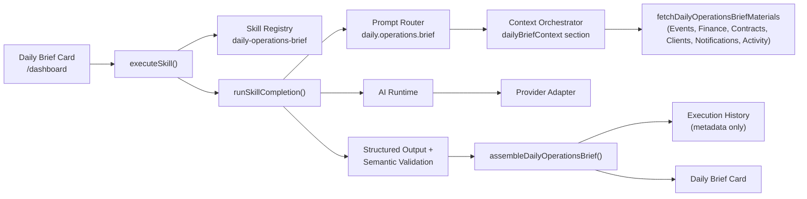

# Daily Operations Brief

BloomOS's first workspace-wide operational intelligence feature — not a chatbot, an operational dashboard powered by Bloom AI. A Workspace owner opens `/dashboard` and, with one click, sees today's operational status, upcoming risks, and recommended actions, synthesized from BloomOS's own live data. Built entirely on the Checkpoint 4 Skills Layer (`docs/skills.md`) — it executes through `executeSkill()` exactly like the Proposal Generator and Event Operations Brief, with no special execution path.

## Architecture

`generateDailyOperationsBrief.ts` is a thin wrapper: its own permission check, one `executeSkill()` call, error-category mapping via `mapSkillErrorToMessage`, then its own post-processing (`assembleDailyOperationsBrief` + execution-history persistence). Everything else — routing, context assembly, provider selection, structured-output validation — is the same generic pipeline the Proposal Generator and Event Operations Brief already use.

## Context — one composite section, six independent categories

`dailyBriefContext` is a new composite `AIContextSectionKey` (`core/ai/context/types.ts`), backed by one `AIContextBuilder` (`dailyBriefContextBuilder.ts`) that wraps `fetchDailyOperationsBriefMaterials` + `buildDailyOperationsBriefContext` — the same "wrap the fetch pipeline as one builder" shape `eventContextBuilder.ts` already uses, just at workspace scope instead of per-Event.

Six categories are fetched **independently, in parallel, via `Promise.allSettled`** — a single failing source (e.g. Finance temporarily unavailable) never blanks out the rest of the brief:

| Category | Source | Notes |
|---|---|---|
| Events | `fetchDailyOperationsBriefRecords` (reuses `fetchEventContextRecord` per active Event) | Feeds Today's Events, This Week's Events, Operational Risks — reuses Event Operations Brief's own Health Score/risk detection, never recomputes it |
| Finance | Overdue Invoices (`status: "overdue"`) | → Late Payments |
| Contracts | Unsigned Contracts (`signature_status: "unsigned"`) | → Contract Issues |
| Clients | VIP Clients (`is_vip: true`) | → High-Priority Clients |
| Notifications | Unread count for the *acting member only* | There is no "unread notifications for the whole Workspace" concept — notifications are per-recipient by design |
| Activity | Workspace Audit Log (`core/audit`), projected to `{action, ownerType, occurredAt}` only | Never `before`/`after` — those are raw field diffs that could carry any entity's data |

Checklist Progress and Team Assignments are derived from the same per-Event checklist data the Events category already fetches (no separate read) — aggregated into open/overdue/completed counts and per-assignee open/overdue workload. Calendar Summary and Upcoming Deadlines are pure derivations over the same six categories — nothing here issues a seventh fetch.

**A category that fails to read is never confused with a category that's genuinely empty.** `unavailableCategories` names exactly which of the six failed; `confidence.ts` and `missingInformation` are computed entirely from that list — zero late payments is a real, good data point, not "missing information."

### The Supabase-mode server-read constraint

`getInvoices`/`getContracts`/`getClients` (`@/lib/data`) are safe to call as-is in mock mode, but their Supabase repositories are wired to the *browser* Supabase client (`getClientWorkspaceSession`, `@/lib/auth/workspaceSessionClient.ts`) and throw `"Authentication is required."` the instant they're called from server-side code — the same documented constraint `fetchEventContextRecord.ts`'s own doc comment already names. `fetchDailyOperationsBriefContext.server.ts` gives each of these three categories its own direct, server-side Supabase read (mirroring `fetchEventContextRecordSupabase`'s exact pattern: the server client, RLS as the real workspace-isolation boundary) rather than routing through those browser-only repositories. **Found and fixed via this checkpoint's own live browser verification against a real Supabase-backed Workspace** — every automated test runs in mock mode, where this constraint doesn't exist, so it would not otherwise have surfaced before a real deployment hit it.

## Prompt & Output

`daily.operations.brief` (`registerDailyOperationsBriefUseCase.ts`) is the registered use case — versioned (`daily-operations-brief-v2`), with a system prompt that names every category the model is given and repeats, explicitly, that it must never invent an Event, payment, client, contract, service, date, or staff member.

The model is trusted with exactly five narrative fields — everything else in the rendered brief is deterministic, straight from context:

| Model-authored | Deterministic (never touched by the model) |
|---|---|
| `executiveSummary`, `todaysPriorities` | Events Today, Events This Week |
| `riskExplanations` (tied to a real `eventId`) | Late Payments, Contract Issues |
| `recommendations` | Checklist Progress, Team Assignments |
| `suggestedActions` (optional `targetType`/`targetId`) | Confidence, Missing Information |

A `suggestedAction`'s `targetType` is a closed enum (`"event" | "invoice" | "contract"`, never a raw URL) resolved to a real href by `actionTargets.ts` — the same architectural guarantee `modules/ai/actionTargets.ts` already established for Event Operations Brief.

## Semantic Validation — hard reject, not silent drop

`semanticValidation.ts` mirrors the **Proposal Generator's** precedent (hard `semantic_failure`), not Event Operations Brief's silent-drop precedent — Daily Brief now touches payments/contracts/clients the same way a Proposal does, so a hallucinated reference rejects the whole response rather than rendering a partially-trusted one. Every `riskExplanations[].eventId` and every `suggestedActions[].targetId` (when a `targetType` is set) is cross-checked against the real ids actually present in context; any invented reference fails validation.

This is architectural prevention, not detection: the model has no free-text field through which it could name a fabricated client, service, or date at all — those categories are either fully deterministic (Checklist Progress, Team Assignments, Confidence) or gated behind a closed enum + id cross-check (`suggestedActions`). The residual risk is the same one Event Operations Brief already accepts: prose fields (`executiveSummary`, `recommendations`) could contain a stray unverified claim in free text, not a structured hallucination.

## Execution History

`lib/data/dailyBrief/` persists **metadata only** — `timestamp`, `provider`, `model`, `prompt_version`, `mock`, `latency_ms`, `status` (`"success" | "failure"`), `workspace_id`. **Never the prompt, never the brief's own content** (executive summary, priorities, anything narrative) — per the checkpoint's own explicit instruction, extending the AI platform's standing "never persist generated content" rule from logging into storage. Both successful and failed generations are recorded, mirroring the append-only, no-update/no-delete shape `core/audit`'s own `AuditLogRepository` already established.

Because content is never stored, the Dashboard card's **"View Previous" action shows only the last run's metadata** ("Last generated 2 hours ago via mock — success in 340ms"), not a re-display of what it said — an honest, deliberate limitation, not an oversight.

## Notifications — prepared, never sent

`notifications.ts`'s `prepareCriticalFindings` builds `Notification`-shaped objects (`core/notifications/types.ts`) for the brief's own critical findings (a high-severity Event risk, any late payment, an unsigned Contract for an Event within a week) — structurally identical to a real notification, but **never persisted and never dispatched**. This function imports neither `getCoreNotificationsService`/`createInAppNotification` (the one call that actually persists a member-visible notification) nor any `NotificationProvider` (the one interface that actually dispatches email/SMS/push) — there is no code path from this function to either. The UI renders them as a highlighted "Critical Findings" section on the Daily Brief card.

## Dashboard Integration

`DailyBriefCard.tsx` (`/dashboard`) offers all five spec'd actions: **Generate** / **Refresh** (same action, regenerates), **View Previous** (execution-history metadata, see above), **Copy** (plain-text clipboard export), **Expand**/**Collapse** (toggles the full detail — Events Today/This Week, Operational Risks, Late Payments, Contract Issues, Checklist Progress, Team Assignments, Recommendations, Suggested Actions, Missing Information — the Executive Summary and Today's Priorities are always visible). Registers itself as the Daily Operations Brief Skill's runner (`registerSkillRunner`, `core/ai/skills/runnerRegistry.ts`), so selecting it from the "Ask Bloom" Skill Picker (mounted on `/dashboard` alongside the card) scrolls to and runs the same flow.

**Accessibility**: every action is a native `<button>`/`<a>` (full keyboard reachability, no custom widgets); the Expand toggle carries `aria-expanded`/`aria-controls`; the result region is `aria-live="polite"`; errors and Critical Findings use `role="alert"`; the card's own container is focusable (`tabIndex={-1}`) so the Skill Picker's runner can move focus to it; layout is the same responsive Tailwind grid/flex pattern used throughout BloomOS, verified at both desktop and mobile widths.

## Permissions

Workspace-scoped (every fetch reads only this session's own Workspace, via RLS in Supabase mode / single-tenant construction in mock mode), role-aware (the Skill declares `requiredPermissions: ["events.view"]`, enforced inside `executeSkill()` — not a UI-only restriction), and feature-flag aware (the Skill Definition carries a `featureFlag` slot, currently `null` — always available, subject to permission/role — matching every other Skill's own gating shape).

## Future scheduling (not implemented)

Per the checkpoint's own non-goals, there is no automatic scheduling, no email delivery, and no push delivery. The seams that would carry a future scheduled run already exist without any redesign: `generateDailyOperationsBrief()` is a plain, parameterless async function a future cron/scheduled job could call directly; `prepareCriticalFindings`'s output is already `Notification`-shaped, so wiring it to `createInAppNotification` (and, later, a real `NotificationProvider`) is additive, not a rearchitecture; and `lib/data/dailyBrief`'s execution history already has everything a "last scheduled run" indicator would need. None of this is built — see `docs/v2-checkpoint-5-daily-brief.md`'s "Known limitations" for the current, honest state.
