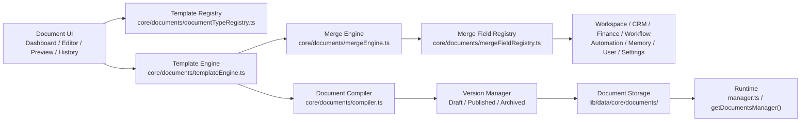

# Document Platform

**Status: v2 Checkpoint 12.** BloomOS's centralized document system — not a PDF generator, not a template library. Every Proposal, Contract, Invoice, Receipt, Welcome Guide, Questionnaire, Checklist, and Run Sheet BloomOS produces originates here, compiled from a registered Template through a deterministic Merge Engine.

## Why this exists

Before this checkpoint, `modules/contracts/mergeFields.ts` defined a `{{merge_field}}` placeholder convention but nothing ever compiled it — every document-shaped output in the app (contract text, invoice line items) was hand-assembled in its own module. The Document Platform generalizes that unfinished idea the same way Checkpoint 11 generalized ad-hoc config into the Settings Platform: one Template Registry, one Merge Engine, one Compiler, used by every document type present today and any future type that registers itself.

## Architecture

Every arrow is one-way. `compileTemplate()` is the only path a Template ever becomes a Document through: resolve merge fields → render blocks → validate → persist — the same "validate then commit" shape the Workflow Publisher and Settings Manager already established.

## 1. Document Domain (`types/documentPlatform.ts`)

Framework-agnostic — nothing here imports React. Named `documentPlatform.ts` rather than `document.ts` because the pre-existing file-storage module already owns that filename and its own unrelated `Document` type; colliding concepts here are prefixed `Composed*`.

| Type | Purpose |
|---|---|
| `ComposedDocumentStatus` | Closed 3-value set: `draft` / `published` / `archived` — a Template's and a compiled Document's own lifecycle. |
| `MERGE_FIELD_DOMAINS` | 8-value closed set a Merge Field is drawn from: Workspace, CRM, Finance, Workflow, Automation, Memory, User, Settings. |
| `MergeValue` | `string \| number \| boolean \| null \| MergeValue[] \| { [key: string]: MergeValue }` — the one shape every resolved field value must fit, checked structurally by the Compiler. |
| `DocumentTypeDefinition` | id, label, icon, description, category, requiredPermissions — what a document type registers. |
| `MergeFieldDefinition` | id, domain, label, description, valueType, and a `resolve(context)` function — a field definition and its resolver are co-located, never split across files. |
| `DocumentBlock` | The block-tree content model: `HeadingBlock \| ParagraphBlock \| TableBlock \| ImageBlock \| PageBreakBlock \| DividerBlock \| ConditionalBlock \| LoopBlock` — shared identically between an authored Template's content and a compiled Document's content. Rendered to HTML/React, never to a binary file format — the concrete proof this is "not a PDF generator." |
| `Template` | id, workspaceId, documentTypeId, name, description, status, content/header/footer (all `DocumentBlock[]`), variables, version, requiredPermissions, featureFlag, minimumRole, createdBy, timestamps. |
| `MergeContext` | workspaceId, memberId, and optional entity ids (`clientId`/`leadId`/`eventId`/`invoiceId`/`contractId`/`automationId`/`automationExecutionId`) — everything a Merge Field resolver might need, resolved once per compile. |
| `ComposedDocument` / `ComposedDocumentVersion` | A compiled Document and its immutable version history — the Storage layer never overwrites a published version, only appends a new one. |
| `DocumentIssue` / `DocumentCompileResult` | 6-value closed issue-code set (`missing_variable`, `invalid_formatting`, `unknown_field`, `permission_denied`, `unknown_document_type`, `template_not_published`) plus the compiled result — a compile can succeed with warnings but never silently drop an issue. |
| `DocumentSuggestion` | The Bloom AI Integration type — inert by design, mirroring `SettingRecommendation`. Nothing holding one of these ever edits a Template by itself. |

## 2. Template Registry (`core/documents/documentTypeRegistry.ts`)

A `Map<id, DocumentTypeDefinition>`, the same shape every registry in this codebase already uses. `registerDocumentType()` overwrites by id; `listDocumentTypes()` sorts alphabetically by label. Eight document types self-register today (Contract, Proposal, Invoice, Receipt, Welcome Guide, Questionnaire, Checklist, Run Sheet), each its own file in `modules/documentTemplates/types/`, aggregated by one idempotent `registerDocumentTypes()` call — a future 9th type needs exactly one new file plus one array entry, never a change to the Registry itself.

## 3. Template Engine (`core/documents/templateEngine.ts`)

Renders a Template's block tree against a resolved variable scope:

- **Variables** — `{{merge_field}}` and `{{item.field}}` placeholder syntax, extracted via `extractPlaceholdersFromText()` and resolved via `resolvePath()` against the current `TemplateScope`.
- **Conditional Sections** — `ConditionalBlock` evaluates an 8-operator `compare()` (equals/not-equals/contains/greater-than/less-than/is-empty/is-not-empty/in) against a resolved field, mirroring the Automation Engine's own condition evaluator exactly.
- **Loops** — `LoopBlock` iterates a resolved array field, rendering `itemBlocks` once per item with `item.*` bound in scope; `isLoopLocalReference()` distinguishes a loop-local field from a page-level one so the Compiler's missing-variable check never false-positives on a field only meaningful inside the loop.
- **Formatting, Rich Text, Headers, Footers, Page Breaks, Images, Tables** — each is its own `DocumentBlock` variant; `renderBlocks()` is the single recursive function every block type, including nested conditional/loop blocks, renders through.

Templates are never hardcoded: every block, every placeholder, every condition is data read from the Template's own `content`/`header`/`footer`, not a Template-specific code path.

## 4. Merge Engine (`core/documents/mergeEngine.ts`, `mergeFieldRegistry.ts`)

`mergeFieldRegistry.ts` is a Map-based registry mirroring the Settings Registry's own shape. `resolveMergeFields()` resolves every field a Template actually references in parallel via `Promise.all`, deterministic for a given `MergeContext` — the same inputs always produce the same resolved values, no hidden randomness or clock-dependent formatting inside a resolver itself.

Eight domain files under `modules/documentTemplates/mergeFields/` co-locate field definitions with their real resolver implementations — ~27 fields total:

| Domain | Example fields |
|---|---|
| Workspace | Name, address, phone, timezone |
| Settings | Currency, invoice prefix/numbering, payment terms default |
| User | Acting member's name, email, role |
| CRM | Client name, company, address, contacts, event, risk flags, proposal history |
| Finance | Invoice numbers, taxes, pricing, payment terms (`invoice_payment_terms` is derived — `daysBetween(issue_date, due_date)`, formatted as `"Net 30"`), discounts, outstanding balance |
| Workflow | `generated_via_workflow_id` — parses the real `workflow-${id}-trigger-...` Automation id convention via `/^workflow-(.+?)-trigger-/` |
| Automation | Execution id, triggered-by, triggered-at |
| Memory | Relevant stored Memory entries for the resolved client/lead, surfaced read-only |

## 5. Document Compiler (`core/documents/compiler.ts`)

`compileTemplate(template, context, permissionContext)` — Template + resolved variables → final Document, validating four things before a compile is allowed to produce output:

1. **Missing variables** — every placeholder the Template references must resolve to a non-`undefined` value (a resolved `null` is valid; unresolved is not).
2. **Invalid formatting** — a block's own structural shape (e.g. a `TableBlock` row with a mismatched column count).
3. **Unknown fields** — a placeholder naming a Merge Field id that isn't registered.
4. **Missing permissions** — `checkPermissions()` checks, in order: the acting member's permissions against `template.requiredPermissions`, their role against `template.minimumRole` (via `roleMeetsMinimum()`), and — if the Template declares one — its `featureFlag`, evaluated async via `evaluateFeatureFlag()`. All three collect into the same `DocumentIssue[]` rather than short-circuiting, the same "collect every issue" shape Settings' own Validation Engine uses.

A compile only proceeds to Storage when `issues` is empty; issues are always returned to the caller, never thrown.

## 6. Versioning (Step 6)

Both Templates and compiled Documents move through `draft → published → archived`, plus `duplicate` (an independent copy owned by the acting member) and `restore` (archived → draft). A **published Template version is immutable** — editing a published Template's content creates a new draft rather than mutating the published one in place, and every successful compile appends a new `ComposedDocumentVersion` rather than overwriting the last. History is always additive.

## 7. Document Storage (`lib/data/core/documents/`)

`DocumentsRepository` is the interface (Template CRUD + lifecycle, ComposedDocument CRUD + lifecycle + versions); `mockRepository.ts` is the current implementation, persisting Template, compiled version, metadata, history, owner, and workspace for every record, workspace-scoped throughout. `getDocumentsManager()` (`core/documents/manager.ts`) is the one Runtime entry point that bridges Compiler output into Storage via `compileAndCreateDocument()`.

## 8. Document UI (Steps 8-9)

Dashboard, Template Library, and global Search are folded into one page (`DocumentTemplatesListView.tsx`) rather than separate routes — the same "Dashboard folded into the List page" precedent Checkpoint 10's `WorkflowsListView.tsx` already established. `TemplateEditorView.tsx` is the Template Editor: drag-free block reordering via move-up/move-down controls (reaching the "drag sections" outcome from Step 9 without adding a drag library), rich text runs, variable insertion via `VariablesPanel.tsx`, tables, images, conditional/loop blocks via `BlockEditor.tsx`, live preview via `BlockPreview.tsx`, and a Validation tab that calls the real Compiler's issue list. `ComposedDocumentView.tsx` renders a compiled Document's Preview, History, and lifecycle actions (Publish/Duplicate/Archive/Download).

Adding a new document type therefore needs exactly what Step 18 requires:

1. **Template/Merge Definition** — a `DocumentTypeDefinition` in its own file, and any new Merge Fields it needs in the relevant domain file.
2. **Registration** — one array entry each in `registerDocumentTypes.ts` / `registerMergeFields.ts`.
3. **Renderer** — nothing to add. `BlockPreview.tsx`/`BlockEditor.tsx`/the Compiler all render generically off `DocumentBlock`, never off a document type id.

## 9. Bloom AI Integration (Step 10, `core/documents/suggestions.ts`)

Deterministic — a static `INFORMAL_REPLACEMENTS` map and a small set of structural rules, never a generative call, the same scope decision Checkpoint 11's Settings Recommendations and Checkpoint 10's Workflow Suggestions already made. `getWordingSuggestions()` flags informal phrasing; `getMissingSectionSuggestions()` flags document-type-conventional sections absent from a Template's content, capped at 3. **Nothing in this module ever edits a Template** — applying a suggestion in `TemplateEditorView.tsx` routes through the same `updateTemplateDraftAction` a manual edit uses.

## 10. CRM & Finance Integration (Steps 11-12)

Both are Merge Field domains, not special-cased code paths — see the Merge Engine table above. A Contract Template referencing `{{client_name}}` and an Invoice Template referencing `{{invoice_outstanding_balance}}` resolve through the identical `resolveMergeFields()` call.

## 11. Automation & Workflow Integration (Steps 13-14)

Five Automation Actions (`generate{Contract,Proposal,Invoice,WelcomeGuide,Checklist}DocumentAction.ts`) share one factory, `makeGenerateDocumentAction(spec)`, registered in `registerAutomationActions.ts` alongside the pre-existing 9 — 14 total. Each resolves "the most recently published Template of its own type" rather than requiring an explicit `templateId`, because `AutomationActionParams` only exposes trigger `facts` at runtime, never a Workflow node's own static configuration. The same five surface as Workflow nodes (`generate{...}DocumentActionNode` in `modules/workflow/nodes/actionNodes.ts`), compiling through the existing Workflow → Automation publish path — **the Automation Engine is never bypassed**, a generated-via-Workflow document and a manually-generated one go through the identical `compileAndCreateDocument()` call.

## 12. Search (Step 15, `core/documents/search.ts`)

`searchDocuments(query, templates, documents)` ranks — not filters — by Title, Client, Template, Variables, Content, and Metadata across both Templates and compiled Documents at once, capped at 20 results. `DocumentSearchBox.tsx` debounces at 150ms and navigates straight to whichever result the member picks.

## 13. Permissions & Observability (Steps 16-17)

**Workspace scoped**: every query resolves against the session's own `workspaceId`. **Role aware / Template aware / Feature Flag aware**: the same `checkPermissions()` gate the Compiler runs is reused by every lifecycle action (`templateLifecycleActions.ts`, `documentLifecycleActions.ts`) — publish/archive/duplicate can never bypass the gate a compile itself enforces. No new `documents.*` permission was introduced; `/document-templates` reuses the pre-existing file-storage module's own `documents.view`/`documents.create`, matching the "reuse an existing permission" precedent Settings (`workspace.manage`) and Automation/Workflow (no route-level permission) already set.

Tracked, safe fields only, **document contents are never logged**: creation, compilation (issue codes, not values), merge (field ids resolved, not resolved values), publish, download, and restore — each an id + actor + timestamp, mirroring Settings' own "never log the value" rule extended to "never log the content."

## 14. Testing (Step 19)

211 tests across 29 files cover the Registry, Merge Engine, Compiler, Versioning, Storage, Editor server actions, Permissions, Search, Automation integration, Workflow integration, CRM/Finance merge resolution, and Bloom AI suggestions — see [v2-checkpoint-12-document-platform.md](v2-checkpoint-12-document-platform.md) for the full breakdown and project-wide quality-gate results.

## 15. Checkpoint 44 extensions

**WorkspaceBranding (Step 1, `core/branding/getWorkspaceBranding.ts`)** — the single, unified branding read every Checkpoint 44 surface (PDF Renderer, DocuSign signing document, future email sends) now calls. Every field resolves through `getSettingsManager().getResolvedSettingValue()` (Checkpoint 11) — a stored per-workspace override if one exists, else the Setting's own registered default — never a second storage location. Replaces the fragmented pattern the Step 0 audit found: `getLuxuryBranding.ts` and `getClientDashboardData.ts` each independently re-fetched their own subset of the same settings; both now call this function instead. `applyBrandingToDocument(branding)` (`core/branding/applyBrandingToDocument.ts`) projects a `WorkspaceBranding` down to the narrower `DocumentBrandTheme` (`primaryColor`, `logoUrl`, `brandName`, `footerLines`, `legalLine`) the PDF Renderer actually consumes.

**Merge Field Engine extension (Step 2)** — no new engine. The existing `mergeFieldRegistry.ts`/`resolveMergeFields()` (Section 4 above) gained a `journey` domain sourced from the Client Journey Platform (Checkpoint 32), used by both the Onboarding read model and any Template referencing `{{journey_current_stage}}`-style fields.

**Shared PDF Renderer (Step 3, `core/documents/pdfRenderer.ts`)** — the one PDF renderer this checkpoint's own instructions require ("Never create separate PDF generators"). The Step 0 audit confirmed none existed anywhere in the codebase — `jspdf` was previously only a dependency of Analytics' own client-side CSV/PDF export, a different concern (a summary of on-screen numbers, not a compiled Document's own block tree). `renderDocumentToPdf(content: DocumentBlock[], options)` walks the identical `DocumentBlock[]` shape `exportPlainText.ts` already reads — a second, richer rendering of the same compiled tree, never a competing document model. Supports a diagonal watermark (auto "PREVIEW" in preview mode, or an explicit `watermarkText` like "VOID"), page numbering, an attachment-names appendix, and inline signature image substitution (any `image` block whose `alt` is exactly `"signature"`). Runs equally in a server action or client component — never touches `document`/`window`. Every future Bundle/Guide/Proposal/Contract/Invoice PDF must call this function, never a second `new jsPDF()` call site.

**Document Template Library (Step 4)** — no new library. "Reusing the Document Platform atual" meant literally reusing Sections 2-3 above (Template Registry + Template Engine) as-is; no new file was needed for this step beyond what Steps 1-3 already extended.

**Document Bundles (Step 5)** — a genuinely new domain concept (a named group of already-existing client-facing documents), fully covered in [document-bundles.md](document-bundles.md).

**Document Health & Analytics (Step 12)** — `computeComposedDocumentHealth()` and `computeDocumentBundleHealth()` (`core/documents/documentHealthEngine.ts`) follow the same `{category, score, issues, notApplicableReason}` contract every Health Engine in this codebase already uses. `summarizeDocumentPlatformHealth()` folds both into a single `DocumentPlatformHealthSummary` consumed by Business Health's own `document_platform_health` category (Step 13). `computeDocumentAnalytics()` (`core/documents/documentAnalyticsEngine.ts`) produces one `DocumentAnalyticsSnapshot` covering both Composed Documents and Bundles — draft/published/archived counts, template usage, bundle status counts, average items per bundle.

**Workflow/Timeline/Reporting/Business Health/Executive Decisions integration (Step 13)** — required almost no new code, by design. `recordTimelineActivity()` (`lib/data/mock/timelineStore.ts`) already auto-dispatches the generic `trigger.timeline-event` Workflow Trigger (Checkpoint 39) for any new `TimelineActivityType`, so the six new Bundle-lifecycle events (see [document-bundles.md](document-bundles.md)) became usable Workflow Triggers immediately. Registering the two new metrics into the older `core/analytics/metricRegistry.ts` (Checkpoint 15) auto-surfaces them in the Reporting Platform (Checkpoint 42) via `adaptRegisteredAnalyticsMetrics()` — no second Reporting-specific registration was needed. Business Health gained a `document_platform_health` category following the exact "optional-field pattern" `workflowHealth`/`searchHealth`/`notificationHealth` already established (`core/knowledge/businessHealthEngine.ts`). Executive Decisions gained a `document_platform_engine` recommendation source in the standard `recommendationSources` array.

## Future extension points (declared, not implemented)

Per this checkpoint's own non-goals: no Electronic Signatures, PDF Annotations, OCR, External Storage Providers, Google Docs sync, Microsoft Word sync, Collaborative Editing, or Real-time Multiplayer. The block-tree content model and Compiler place no architectural ceiling on any of these — they're a scope decision for this checkpoint, not a limitation of the design.
