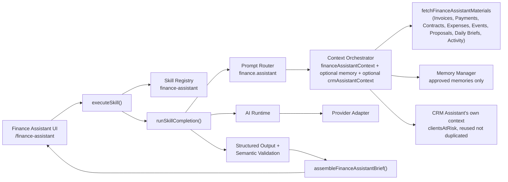

# Finance Assistant

**Status: v2 Checkpoint 8.** Bloom AI's second full business assistant — a financial analyst for the Workspace, not a calculator and not a chatbot. A Workspace member opens `/finance-assistant` and, with one click, sees current revenue, outstanding balances, upcoming cash flow, financial risk, and revenue opportunities, synthesized from BloomOS's own live Invoices, Payments, Contracts, Events, and Proposal history — plus this Workspace's own approved AI Memory and, when available, the CRM Assistant's own client-risk view. Built entirely on the Checkpoint 4 Skills Layer (`docs/skills.md`), the Checkpoint 6 Memory Layer (`docs/memory.md`), and Checkpoint 7's CRM Assistant (`docs/crm-assistant.md`) — it executes through `executeSkill()` exactly like every other Skill, with no special execution path.

## Architecture

`generateFinanceAssistantBrief.ts` is a thin wrapper: its own permission check, one `executeSkill()` call, error-category mapping via `mapSkillErrorToMessage`, then its own post-processing (`assembleFinanceAssistantBrief` + observability logging). Everything else — routing, context assembly, provider selection, structured-output validation — is the same generic pipeline every other Skill already uses. No execution history table is persisted (matching CRM Assistant's own precedent) — Step 11's observability ask is satisfied by logging alone.

## Finance Context Builder — one composite section, reusing established math

`financeAssistantContext` is a new composite `AIContextSectionKey` (`core/ai/context/types.ts`), backed by one `AIContextBuilder` (`financeAssistantContextBuilder.ts`) that wraps `fetchFinanceAssistantMaterials` + `buildFinanceAssistantContext`. Eight categories are fetched **independently, in parallel, via `Promise.allSettled`** — a single failing source never blanks out the rest of the report:

| Category | Source | Notes |
|---|---|---|
| Invoices | `getInvoices({includeArchived:false})` | Feeds Revenue, Outstanding Payments, Payment Delays, Upcoming Revenue, Financial Risks |
| Payments | `getPayments({})` | Feeds Revenue/Collected totals and Refunds — a closed, hand-picked projection (see below) |
| Contracts | `getContracts({includeArchived:false})` | Feeds Contract Value (signed/unsigned split) and Financial Risks |
| Expenses | `getExpenses({includeArchived:false})` | Feeds Cash Flow's Net Cash Position — fetched even though Step 2 doesn't name "Expenses" explicitly, since `computeWorkspaceFinancialSummary` requires it and a Cash Flow Snapshot without money *out* would be incomplete |
| Events | `getEvents({includeArchived:false})` | Feeds Upcoming Events |
| Proposal values | `getProposalsRepository().getRecentProposals()` | Always mock-only — no real `proposals` table yet, same precedent `crm-assistant`/`getBloomAIOverview.ts` already established |
| Daily Brief history | `getDailyBriefExecutionsRepository().getRecentExecutions()` | Metadata only — always mock-only, same rationale |
| Activity | `getCoreAuditLogService().getAuditLogForWorkspace()` | Safe `{action, ownerType, occurredAt}` projection — always mock-only |

**Revenue and Cash Flow figures are computed by reusing `modules/finance/financialSummary.ts`'s already-established, already-tested `computeWorkspaceFinancialSummary`/`computeAllTimeFinancialTotals`** — never reinvented in this Skill. This is the same "one true formula, shared by the Dashboard and every AI Skill" guarantee that keeps this report and `/dashboard`'s own Finance metrics from ever disagreeing about what "revenue this month" or "outstanding receivables" means.

### The Supabase-mode server-read constraint

`getContracts`/`getInvoices`/`getPayments`/`getExpenses`/`getEvents` (`@/lib/data`) are safe to call as-is in mock mode, but their Supabase repositories are wired to the *browser* Supabase client (`getClientWorkspaceSession`) and throw `"Authentication is required."` the instant they're called from server-side code — the exact same constraint `fetchCrmAssistantContext.server.ts` already works around. `fetchFinanceAssistantContext.server.ts` extends the established pattern from five data sources (Clients/Leads/Events/Contracts/Invoices, Checkpoint 7) to include Payments and Expenses too.

### Never expose sensitive payment credentials

`Payment`'s own type doc comment already confirms BloomOS never stores card numbers, bank account numbers, or any other payment credential — `reference` is explicitly documented as a non-sensitive free-text field (a check number, a provider transaction id). Per this checkpoint's own instruction, `FinanceAssistantPaymentSummary` stays conservative anyway: a closed projection (`paymentId`, `clientId`, `invoiceId`, `eventId`, `paymentType`, `status`, `amountMinor`, `currency`, `transactionDate`) that deliberately **excludes** `reference`, `payment_method`, and `notes` — nothing transaction-identifying or payment-method-specific ever reaches a model prompt, only the facts a financial summary needs.

### Why "CRM recommendations" reuses CRM Assistant's own context, not a duplicate read

Step 2 lists "CRM recommendations" as a Finance Context Builder input. Rather than re-implement CRM Assistant's own Client-risk detection a second time, the Finance Assistant Skill declares `optionalContext: ["memory", "crmAssistantContext"]` — requesting the already-registered `crmAssistantContext` Context Orchestrator section (Checkpoint 7) as enrichment. `registerFinanceAssistantUseCase.ts`'s `composeContext` extracts `clientsAtRisk` from whatever that section supplied into `context.crmRecommendations`. This is **the first time one Skill's own composite context section is itself consumed, optionally, by a different Skill** — proving the Context Orchestrator's sections compose across Skills, not just within one. A Workspace where the CRM Assistant's own context happens to be unavailable (or the member lacks `clients.view`) still gets a perfectly good Finance report — `crmRecommendations` is simply `[]`.

## Prompt & Output

`finance.assistant` (`registerFinanceAssistantUseCase.ts`) is the registered use case — versioned (`finance-assistant-v1`), with a system prompt that names every category the model is given and repeats, explicitly, that it must never invent a Payment, an amount, a Contract, a Client, an Event, or a balance, and never claim that money has moved.

The model is trusted with exactly six narrative fields — everything else in the rendered report is deterministic, straight from context:

| Model-authored | Deterministic (never touched by the model) |
|---|---|
| `executiveSummary`, `revenueOverviewSummary`, `cashFlowSummary` | Revenue Overview's own totals, Cash Flow Snapshot's own numbers (all reused from `financialSummary.ts`) |
| `financialRiskExplanations` (tied to a real `riskId` already on the risk list) | Which Invoice/Contract counts as a financial risk in the first place — decided in code, never by the model |
| `revenueOpportunities`, `recommendations` (each optional `targetType`/`targetId`) | Outstanding Payments, Upcoming Revenue, Payment Delays, Contract Value |

A `targetType` is one of a closed enum (`"invoice" | "contract" | "event"`, never a raw URL) resolved to a real href by `actionTargets.ts` — the same architectural guarantee `crmAssistant/actionTargets.ts` already established.

## Financial Risks — a deterministic escalation, not a duplicate of Payment Delays

Payment Delays (Step 4) is every overdue Invoice, mirroring Daily Brief's own `latePayments`. Financial Risks is a narrower, escalated view computed in `contextBuilder.ts`'s own `computeFinancialRisks`:

1. An overdue Invoice past a severity threshold (14 days) — `riskId: "invoice:{id}"`.
2. An unsigned Contract whose Event is imminent (within 14 days) or already past — `riskId: "contract:{id}"`.

Both `reasons` are computed facts (a real day count, a real formatted amount) — the model may only add a short *explanation* for an already-identified risk (`financialRiskExplanations`, matched by `riskId` in `assembleBrief.ts`), never decide what counts as a risk in the first place.

## Semantic Validation — hard reject, not silent drop

`semanticValidation.ts` mirrors Daily Brief/CRM Assistant/Proposal Generator's precedent (hard `semantic_failure`), not Event Operations Brief's silent-drop precedent. Every `financialRiskExplanations[].riskId` must already be on the deterministic risk list; every action's `targetId` is cross-checked against the real ids actually present in context for its `targetType`. This is architectural prevention, not detection — the model has no free-text field through which it could name a fabricated Payment, amount, Contract, Client, Event, or balance at all, satisfying Step 5's "never hallucinate financial data" by construction. 9 dedicated tests cover every rejection and acceptance path.

## Memory Integration

The Skill declares `optionalContext: ["memory", "crmAssistantContext"]` — requested, never required. `memoryContextBuilder.ts` (Checkpoint 6) already filters to `approvalStatus: "approved"` only, so **"never expose rejected memories" is satisfied at the source**. Approved memories are threaded into the model's own prompt (informing the Executive Summary and Recommendations) and surfaced directly in the assembled report's own "Recent AI Insights" section (capped at 5, newest first) — the same dual use CRM Assistant's own memory integration already established.

## Financial Dashboard (`/finance-assistant`)

A dedicated page, not a `/dashboard`-embedded card — this Skill's context spans seven data sources plus two optional enrichments in one report, the same "too broad for a shared dashboard card" reasoning that led CRM Assistant to its own dedicated page. `FinanceAssistantView.tsx` renders every spec'd section: **Revenue Overview**, **Cash Flow Snapshot** (Collected/Outstanding/Upcoming/Refunded/Expenses/Net Cash Position), **Outstanding Payments**, **Upcoming Revenue**, **Payment Delays**, **Financial Risks**, **Contract Value**, **Revenue Opportunities**, **Recommendations**, and **Recent AI Insights** (approved memory + CRM recommendations), plus the Executive Summary and a Missing Information section when relevant. **Generate**/**Refresh** and **Copy** (plain-text clipboard export) are the two actions.

Registers itself as the Finance Assistant Skill's runner (`registerSkillRunner`), so selecting "Finance Assistant" from the "Ask Bloom" picker while this page is mounted scrolls to and runs the same flow — zero Skill Picker code changes needed, per Checkpoint 4's own design guarantee.

**Accessibility**: every action is a native `<button>`/`<a>` (full keyboard reachability, no custom widgets); the result region is `aria-live="polite"`; every section heading carries a real `id` cross-referenced by its list's `aria-labelledby`; errors use `role="alert"`; the page's own `<h2>` is focusable (`tabIndex={-1}`) and receives focus when the Skill Picker's runner triggers a generation; layout is the same responsive Tailwind grid pattern used throughout BloomOS, verified at both desktop and mobile widths.

## Bloom AI Dashboard & Command Palette

Finance Assistant needs zero Dashboard-specific code — `getBloomAIOverview.ts`'s existing registry-driven design already surfaces any newly-registered Skill automatically, the same "Statistics update automatically" guarantee every prior checkpoint's own Skill registration already got. It appears as the sixth Active Skill; only Document Assistant remains Coming Soon.

Unlike CRM Assistant, Finance Assistant does **not** get its own sidebar entry — the existing "Finance" nav module is a direct link (`/finance`), not an expandable group, and converting it into one purely to slot in a second link would be a larger, more disruptive UX change than this checkpoint's own scope calls for. Finance Assistant stays fully discoverable via the Bloom AI Dashboard's Active Skills grid, the "Ask Bloom" picker, and its own direct URL (`/finance-assistant`) — the same three discovery paths Daily Brief and Browse AI Memory already rely on without a dedicated sidebar entry either.

## Permissions

Workspace-scoped (every fetch reads only this session's own Workspace, via RLS in Supabase mode / single-tenant construction in mock mode); role-aware (the Skill declares `requiredPermissions: ["finance.view"]`, enforced inside `executeSkill()` — not a UI-only restriction); feature-flag aware (`featureFlag: null` — always available, subject to permission/role, matching every other Skill's own gating shape); memory-visibility-aware (a `"user"`-scoped memory is only ever returned to the member it belongs to, the same rule `memoryContextBuilder.ts` already applies for every Skill).

`requiredPermissions: ["finance.view"]` only, not every permission the context spans (Contracts/Events/CRM too) — the same "primary permission, not every underlying data permission" precedent `daily-operations-brief`/`crm-assistant` already established. A member who can see Finance but not, say, Contracts still gets a useful report; a missing category is reflected in `confidence`/`missingInformation`. `/finance-assistant` itself is left **unmapped** in `routeAccess.ts` (the same precedent `/bloom-ai`/`/services` already established, and consistent with it having no sidebar entry) — any active Workspace member may open the page; the Skill itself is what's actually gated.

## Observability

`generateFinanceAssistantBrief.ts` logs, via `core/observability/logger`: on failure, `workspaceId`/error `category`/`latencyMs`; on success, `workspaceId`/`provider`/`promptVersion`/`mock`/`latencyMs`/`confidence`/`financialMetricsGenerated` (the sum of Revenue Opportunities, Recommendations, and Financial Risks)/`validation: "passed"`. Everything except `confidence`/`financialMetricsGenerated` is already logged generically by `executeSkill`/`runSkillCompletion`. **Never logged**: the report's own narrative content or any dollar amount, matching the "safe fields only" rule every prior AI checkpoint's observability already enforces.

## Future extensions (declared, not implemented)

Per this checkpoint's own non-goals:

- **Document Assistant, Workflow Builder, Automation Engine** — remain out of scope; no code path from this Skill to any of them.
- **Payment processing, accounting exports, tax calculations, bank integrations** — this Skill drafts insight for a human to read; it has no code path to move money, generate an export, calculate tax, or connect to any bank, per `PRODUCT_PRINCIPLES.md` #4 ("AI assists humans; it never replaces business approval").
- **A dedicated `finance.*` AI permission** — reuses `finance.view`, the same "primary permission" precedent every other workspace-wide Skill already follows.
- **A Finance Assistant sidebar entry** — deliberately not added this checkpoint (see "Bloom AI Dashboard & Command Palette" above); revisiting "Finance" as an expandable nav group is a reasonable future UX improvement, not done here to avoid an unrelated, more disruptive change.

See `docs/v2-checkpoint-8-finance-assistant.md` for the full certification.
