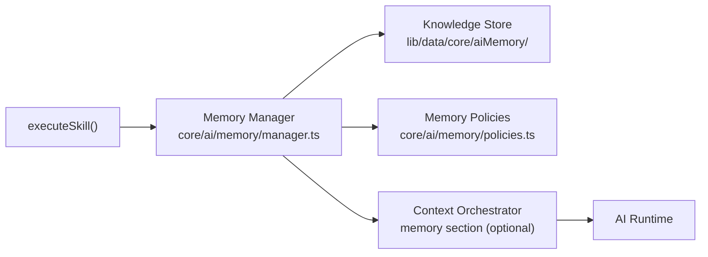

# AI Memory & Knowledge Layer

**Status: v2 Checkpoint 6.** Every Skill built on the Checkpoint 4 Skills Layer (`docs/skills.md`) — Proposal Generator, Event Operations Brief, Daily Operations Brief — can now optionally read and write **structured operational memory**: a typed, auditable, permission-aware record of what happened, what was decided, and what's worth remembering, shared through one Memory Manager rather than reimplemented per feature.

**This is explicitly not** a vector database, not semantic search, not an agent, and not streaming. There is no embedding anywhere in this layer and no similarity search — every lookup is a plain, typed filter (`workspaceId` + category/entity/skill/importance/tags/approval status), the same "structured filter over a flat store" shape every other repository in this codebase already uses (`ProposalsRepository`, `DailyBriefExecutionsRepository`). "Remembering" here means *writing a typed row a future request can deterministically look up*, never *retrieving semantically similar text*.

## Why this exists

Checkpoints 4–5 gave every Skill a shared execution pipeline but no shared memory: each successful generation vanished the moment its result was returned (aside from Proposal Generator's own narrow "suggested memory" concept, which only it used, with a different shape and no other Skill able to read it). Daily Brief couldn't say "here's what changed since yesterday" — it had no yesterday. Proposal Generator couldn't say "here's what was decided last time for this Client" — nothing was linked. This checkpoint gives every Skill the same answer to "should this be remembered, and can a future request find it again": the Memory Manager.

## Architecture



Two independent paths into a Skill's own request, both going through the same Memory Manager:

1. **Through the Context Orchestrator** — a Skill declares `optionalContext: ["memory"]`; `memoryContextBuilder.ts` reads from the Memory Manager and hands the result to `composeContext`, alongside the Skill's own required context. This is how Daily Brief reads its own prior snapshot (see "Daily Brief integration" below).
2. **Direct Memory Manager calls from a feature's own wrapper**, entirely outside the Skill's own context/prompt pipeline. This is how Proposal Generator surfaces relevant historical decisions (see "Proposal integration" below) — a structurally airtight way to guarantee "never modify proposal content automatically," since there is no code path from memory to the model's prompt at all in that case.

## 1. The Memory Model (`types/aiMemory.ts`)

`AIMemoryEntry` — the one typed shape every memory takes, regardless of which Skill wrote it:

| Field | Purpose |
|---|---|
| `id`, `workspace_id` | Identity — every lookup is workspace-scoped; there is no cross-workspace read anywhere in this layer. |
| `skill_id` | Which Skill created this memory, `null` for a human-authored entry. |
| `entity_type`, `entity_id` | What real BloomOS record this memory is *about* — the same "subject, not identity" pattern `Notification.related_owner_type`/`related_owner_id` already uses. `null` for a Workspace-wide memory with no single subject (e.g. a Daily Brief snapshot). |
| `title`, `summary` | Human-readable content. **Never a raw prompt. Never a raw provider response.** A memory is always a *derived* fact (a snapshot, a decision, a suggestion) — never the literal text sent to or received from a model. |
| `category` | One of the five Knowledge Store categories (§2). |
| `importance` | `"low"` \| `"medium"` \| `"high"` — drives the default expiry policy (§3). |
| `visibility` | `"workspace"` (every member) or `"user"` (`user_id`-scoped to one member). |
| `tags`, `confidence` | Free-form tags; `confidence` (0–100) is the *source's* own confidence, never the model's general self-reported confidence used anywhere else. |
| `source` | `"skill"` (a Skill's own free-text suggestion) \| `"system"` (a deterministic snapshot, no model judgment) \| `"human"` (a Workspace member wrote it directly). |
| `approval_status` | `"proposed"` → `"approved"`/`"rejected"` (human review), or `"archived"`/`"expired"` (terminal, reached only through the Memory Manager itself). |
| `reviewed_by`, `reviewed_at` | Set only by `approveMemory`/`rejectMemory`. |
| `created_at`, `updated_at`, `expires_at` | `expires_at: null` means "never auto-expires" — reserved for `reference_knowledge`/high-importance entries. |

A `"skill"`-sourced memory always starts `"proposed"` — a model's own suggestion is never authoritative until a human reviews it, the same "assist, not replace" principle every other AI feature in BloomOS already follows. A `"system"`- or `"human"`-sourced memory may start `"approved"` directly, since neither involves a model's own free-text judgment call.

## 2. Knowledge Store categories (`AI_MEMORY_CATEGORIES`)

| Category | What belongs here |
|---|---|
| `workspace_knowledge` | Durable facts about how this Workspace operates — preferences, policies a human recorded directly. |
| `operational_knowledge` | A specific operational decision or outcome ("this Contract was expedited because..."). |
| `ai_generated_knowledge` | A model's own proposed insight — always born `"proposed"`. |
| `reference_knowledge` | A stable fact worth citing repeatedly — rarely expires. |
| `historical_knowledge` | A point-in-time snapshot a future Skill run can diff against (a prior Daily Brief's own summary). |

## 3. Memory Policies (`core/ai/memory/policies.ts`)

Three small, pure functions, applied by the Memory Manager on every write — never bypassed by a feature calling the Knowledge Store directly, because no feature is meant to (§4):

- **`shouldRemember(skillExecutionStatus)`** — `false` for `"failure"`, `true` otherwise. "Never remember failed executions," literally: a failed generation has nothing worth persisting, and `createMemory`/`proposeMemory` refuse the write outright rather than recording a failure's own attempted content.
- **`defaultApprovalStatusFor(source)`** — `"skill"` → `"proposed"`; `"system"`/`"human"` → `"approved"`. Only applied when the caller doesn't pass an explicit `approvalStatus`.
- **`computeDefaultExpiresAt(importance, now?)`** — low importance expires in 30 days, medium in 90, high never auto-expires. "Expire low-value memories," as a computed default a caller can still override with an explicit `expiresAt` (Daily Brief does exactly this — see below).

## 4. Memory Manager (`core/ai/memory/manager.ts`)

The **one** place every Skill, the Bloom AI Dashboard, and a future review UI read or write memory — sitting directly on the Knowledge Store. `getMemoryManager()` returns a singleton implementing:

`createMemory` · `proposeMemory` · `updateMemory` · `archiveMemory` · `expireStaleMemories` · `lookupMemory` · `filterMemories` · `summarizeMemories` · `approveMemory` · `rejectMemory` · `getPendingProposals`

Every write applies the policies above; every call logs safe, structural fields only via `core/observability/logger` — `workspaceId`/`memoryId`/`skillId`/`category`/`importance`/`approvalStatus`/`source` — **never** a memory's own `title`/`summary` content, the same rule `core/ai/skills/resolver.ts` already established for prompts. `filterMemories`/`lookupMemory` additionally log latency, and `summarizeMemories` aggregates `byCategory`/`byImportance`/approval-status counts fresh on every call — nothing here is precomputed or cached.

## 5. Knowledge Store (`lib/data/core/aiMemory/`)

The persistence layer the Memory Manager sits on — same `Repository` interface + mock implementation shape every other domain in this codebase uses (`ProposalsRepository`, `DailyBriefExecutionsRepository`). No hard delete: `archiveMemory`/`expireMemories` move an entry to a terminal `approval_status` rather than removing the row, matching the Audit Log's own immutable-record precedent. `filterMemories` excludes `"expired"`/`"archived"` entries by default (`includeExpired`/`includeArchived` opt back in) and is AND-combined across every filter dimension except `tags`, which is any-match.

## 6. Context Integration — memory is optional, by construction (`core/ai/skills/types.ts`, `core/ai/skills/resolver.ts`)

`SkillDefinition` gained one new optional field: `optionalContext?: AIContextSectionKey[]`. `runSkillCompletion` requests every section in `[...requiredContext, ...optionalContext]` from the Context Orchestrator, but the hard-fail loop — the one that rejects a request with `"context_unavailable"` — stays scoped strictly to `requiredContext`. A Skill that lists `"memory"` only in `optionalContext` runs perfectly well the very first time a Workspace has no memory at all; the section is simply absent from what `composeContext` receives. **No existing Skill needed to change** to adopt this — Proposal Generator and Event Operations Brief neither declare nor use it.

`memoryContextBuilder.ts` (`core/ai/context/builders/`) is the one builder backing the `"memory"` section: it reads `refs.memorySkillId`/`refs.memoryCategory` (scoping which Skill's own memories to return) and `refs.eventId`/`refs.clientId` (scoping to one entity), always filtered to `approvalStatus: "approved"` — a still-`"proposed"` suggestion is never treated as ambient context for another request. Returns `null` (not an empty list) when nothing matches, which is exactly what makes it optional rather than "required but sometimes empty."

## 7. Daily Brief integration — reference previous Briefs

Daily Brief both writes and reads memory, closing a full loop:

- **Write** — after every *successful* generation, `generateDailyOperationsBrief.ts` calls `getMemoryManager().createMemory(...)` with `category: "historical_knowledge"`, `source: "system"` (so it's auto-approved — nothing here is a model's own judgment call), and `summary: JSON.stringify(computeIssueSnapshots(context))` — a stable, diffable `{key, label}[]` (`risk:{eventId}:{riskKind}`, `late-payment:{invoiceId}`, `unsigned-contract:{contractId}`). An explicit `expiresAt` (30 days) is set directly rather than relying on the generic low-importance policy default, keeping this feature's own retention window self-documenting in its own file.
- **Read** — the Skill declares `optionalContext: ["memory"]`; `registerDailyOperationsBriefUseCase.ts`'s `composeContext` extracts the most recent snapshot (`extractPreviousSnapshot`) into `context.previousSnapshot`.
- **Diff** — `assembleBrief.ts`'s `computeBriefComparison` deterministically diffs this run's own `computeIssueSnapshots(context)` against `context.previousSnapshot` using plain set operations on `key`, producing `briefComparison: {newIssues, resolvedIssues, persistentRisks} | null` (`null` on a Workspace's very first Brief, when there's nothing to diff against). **The model never computes this comparison** — the same "facts computed in code, the model only narrates" principle every other Daily Brief section already follows.

## 8. Proposal integration — surface relevant historical decisions, never modify content

Proposal Generator's own wrapper (`generateProposalDraft.ts`) runs `fetchRelevantMemories(workspaceId, eventId, clientId)` **concurrently with, and entirely independent of**, its `executeSkill()` call:

```ts
const [result, relevantMemories] = await Promise.all([
  executeSkill({ ... }),
  fetchRelevantMemories(session.workspace.id, eventId, clientId),
]);
```

`fetchRelevantMemories` queries `filterMemories` for `{entityType: "event", entityId, approvalStatus: "approved"}` and `{entityType: "client", entityId, approvalStatus: "approved"}` in parallel, dedupes by id, sorts newest-first, and caps at 5 — returned as a new `relevantMemories: AIMemoryEntry[]` field on the result, rendered in the UI as a "Relevant History" section with copy explicitly stating it's informational only. **This guarantees "never modify proposal content automatically" by construction, not by policy**: `relevantMemories` is never passed into `composeContext`, `buildMessages`, or anything the model sees — there is no code path from a memory to this feature's own prompt.

## 9. Bloom AI Dashboard — Memory Usage, Knowledge Statistics, Recent Memories, Memory Health

`getBloomAIOverview.ts` adds `memorySummary` (from `summarizeMemories`) and `recentMemories` (the five most recent approved memories this member may see — workspace-visible plus their own user-visible ones) to its existing read-only aggregate. `BloomAIOverviewView.tsx` renders four new cards from this same data, no separate fetch:

- **Memory Usage** — total memory count, broken down by importance.
- **Knowledge Statistics** — count per Knowledge Store category.
- **Memory Health** — approval-status breakdown (approved/proposed/rejected/archived/expired), with a one-line "N memories awaiting review" summary.
- **Recent Memories** — the five most recent entries, each showing title, category, approval status, source, and importance.

## 10. Command Palette — "Browse AI Memory" (`modules/ai/memory/registerBrowseAIMemorySkill.ts`)

The one genuinely new Skill this checkpoint adds. Unlike every other Skill, its `execute` **never calls the AI Runtime at all** — "browse my own structured memory" is a read against the Knowledge Store, not a question for a model. Building it on `runSkillCompletion` would mean inventing a prompt and a provider call for a feature with nothing for either to do — exactly the "no agents, no semantic search" line this checkpoint's non-goals draw. It's still declared and discovered exactly like every other Skill (same registry, same `executeSkill` permission/role/feature-flag gates); Step 10's "through `executeSkill()`" is about the front door, not about forcing every Skill through the AI Runtime.

Visibility-aware by construction: a `"user"`-scoped memory is only ever included for the member who ran the Skill, never merged across members. `BloomAIOverviewView.tsx` registers itself as this Skill's runner (`registerSkillRunner`) — selecting "Browse AI Memory" from the "Ask Bloom" picker on `/bloom-ai` runs it live and renders a "Full Memory Browser" panel inline; picked from any other page, it falls back to navigating to `/bloom-ai`, the same fallback every other Skill without a page-specific runner already uses.

## 11. Permissions — workspace scoped, role aware, visibility aware

- **Workspace scoped** — every Memory Manager call takes an explicit `workspaceId`; the Knowledge Store filters every read/write to it. No cross-workspace read exists anywhere in this layer.
- **Role aware** — Browse AI Memory reuses the Bloom AI Dashboard's own precedent (any active Workspace member may view read-only AI activity, no dedicated permission); `requiredPermissions: []`/`minimumRole: null`. No `memory.*` permission exists yet in `core/enums/permission.ts` — the Step 1 audit found none, and this checkpoint doesn't introduce one, since nothing here is a *write* a member could misuse (a proposed memory still requires a human `approveMemory`/`rejectMemory` call, which is where a future dedicated permission would earn its keep).
- **Visibility aware** — a `"user"`-scoped memory is only ever returned to the member it belongs to, both in `getBloomAIOverview.ts`'s "Recent Memories" and in Browse AI Memory's own `execute`, by querying `{visibility: "user", userId: <the caller's own id>}` rather than an unscoped `"user"` filter. A `"workspace"`-scoped memory is visible to any member who can reach the surface at all.

## 12. Observability

The Memory Manager logs, via `core/observability/logger`, on every write: `workspaceId`/`memoryId`/`skillId`/`category`/`importance`/`approvalStatus`/`source`. `filterMemories`/`lookupMemory` additionally log a `latencyMs`. `expireStaleMemories` logs the count expired per run. **Never logged**: a memory's own `title`/`summary` — the same "safe fields only" rule every prior AI checkpoint's observability already enforces.

## Future extension points (declared, not implemented)

Per this checkpoint's own non-goals:

- **Vector search / embeddings** — every lookup here is a plain typed filter; nothing computes or stores an embedding. A future vector layer would sit *alongside* this one (e.g. as a new, separate Knowledge Store category or a wholly separate service), not replace it — this layer's guarantee ("a fact this Workspace explicitly vetted, or a deterministic snapshot") is a different thing than "text that's semantically similar."
- **Agents / multi-step memory reasoning** — nothing here plans, loops, or chains Memory Manager calls; every read is a single, synchronous filter a feature's own code interprets.
- **A dedicated `memory.*` permission** — reserved for when a write path (approve/reject, or a future "delete my own memory") needs one; the current read-only Browse Skill doesn't.
- **Streaming** — not applicable; nothing in this layer calls the AI Runtime for its own operation (Browse AI Memory) or does so through the same non-streaming pipeline every other Skill uses (Daily Brief/Proposal's own memory reads, which ride inside their existing non-streaming Skill execution).

See `docs/v2-checkpoint-6-memory-layer.md` for the full certification.
