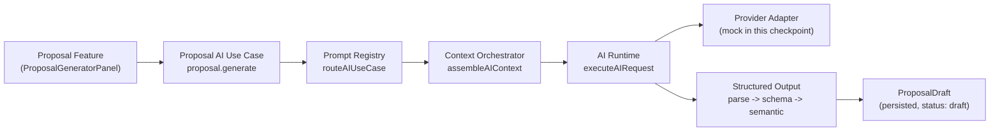

# AI Proposal Generator

The Bloom AI platform's first genuinely new feature (Checkpoint 2 built the platform and proved it by migrating the Event Operations Brief onto it, unchanged; Checkpoint 3 is the first feature designed for the platform from the start). It drafts a structured proposal for one Event's client — never a text blob, never authoritative until a human explicitly accepts it.

## The required flow

`generateProposalDraft.ts` (`src/modules/ai/proposal/generateProposalDraft.ts`) is the only entry point — no feature-specific provider call exists anywhere. Every step reuses Checkpoint 2 infrastructure: Prompt Registry (`routeAIUseCase`), Context Orchestrator (`assembleAIContext`), AI Runtime (`executeAIRequest`), Structured Output (`parseStructuredOutput` + `applySemanticValidation`), Observability (`getLogger()`), and AI Memory (`proposeMemory`, only when the model suggests one). The AI Tool Registry isn't used — this feature never calls out to a BloomOS mutation on its own; every mutation (accept/reject) is a separate, explicitly human-triggered Server Action.

## 1. Domain audit — what's reused, not duplicated

No new business logic was invented. The context builders and `assembleProposalDraftInput` read from, but never reimplement:
- `fetchEventContextRecord` (Event + Schedule) — the same pre-existing function the Event Operations Brief already uses.
- `readContracts`/Supabase `contracts` table — for existing deposit/remaining-balance payment terms, if a Contract already exists for the Event.
- `listEventServicesByEvent` — the Event's actually-assigned services (excluding `"cancelled"` assignments), the only services the model is allowed to reference.
- `getNotesByOwner` — the Event's own Notes, the closest existing BloomOS concept to "consultation notes."
- `computeScheduleStats` (`modules/events/scheduleStats.ts`) — reused verbatim for the Timeline Summary, not re-derived.

## 2. Context Builder (`proposalContext`)

A Proposal's context doesn't decompose cleanly into the platform's 6 generic domain keys (`workspace`/`user`/`event`/`client`/`service`/`finance`/`contract`/`blueprint`/`eventServiceAssignment`) — the same situation Checkpoint 2's own `event` key already handles by holding a feature-specific shape (`EventOperationsBriefContext`) rather than generic raw fields. Checkpoint 3 adds one new composite section key, `proposalContext` (`core/ai/context/types.ts`), built by `proposalDetailsContextBuilder.ts` (`src/modules/ai/contextBuilders/`): Event/Venue fields, Timeline Summary, Consultation Notes (capped at 8), existing Contract payment terms (`null` if no Contract exists yet), important constraints (e.g. surprise-event confidentiality), and missing-information flags (date/location/budget).

Three Context Orchestrator sections are requested together for this use case: `client` (safe fields only — see §2a), `eventServiceAssignment` (the Event's actually-assigned services), and `proposalContext`. `generateProposalDraft.ts` resolves `clientId` via one lightweight, explicitly-documented preliminary `fetchEventContextRecord` call before calling `assembleAIContext`, since the Orchestrator's sections run in parallel and `client` needs a `clientId` ref up front — `proposalDetailsContextBuilder` re-fetches the Event a second time internally for its own purposes, a minor, accepted double-fetch (the same trade-off Checkpoint 2's `workspace`/`user` builders already made: take facts the caller resolved rather than centralizing every fetch).

**2a. No secrets, no internal-only fields.** `clientContextBuilder.ts` excludes every internal-only Client field — allergies, accessibility needs, dietary restrictions, do-not-call, emergency contact, VIP flag (see `Client`'s own "never expose to a future Client Portal" comment) — verified by a dedicated test asserting none of these ever appear in the built context. A Proposal draft is headed toward eventually being client-facing, so these stay out of the model's context entirely, not just out of the rendered output.

**Dynamic Supabase imports.** Every builder that needs Supabase (`clientContextBuilder.ts`, `eventServiceAssignmentContextBuilder.ts`, `proposalDetailsContextBuilder.ts`) imports `@/lib/supabase/server` dynamically, inside its `"supabase"`-mode-only branch, instead of as a static top-level import. `@/lib/supabase/server` is marked `import "server-only"`, which throws the instant it's evaluated in a jsdom test environment (jsdom defines `window`, the exact condition `server-only` checks for) — a dynamic import is simply never evaluated when a test runs in mock mode (the default), so it can never trip that guard, without requiring every consuming test to mock the module wholesale.

## 3. Prompt (`proposal.generate`)

Registered once via `registerProposalUseCase()` (`src/modules/ai/proposal/registerProposalUseCase.ts`):
- `useCaseId: "proposal.generate"`, `promptVersion: PROPOSAL_PROMPT_VERSION` (`proposal-generator-v1`).
- `systemInstructions`/`buildMessages` — `promptBuilder.ts` renders the full `ProposalContext` (Workspace/Event/Venue/Client/Selected Services/Pricing/Payment Terms/Timeline/Consultation Notes/Important Constraints/Missing Information) into the prompt; the system prompt instructs the model to narrate and recommend only, never invent a fact not present in the context.
- `outputSchema`: `proposalModelOutputSchema` (Zod).
- `semanticValidate`: `validateProposalSemantics` (see §5).
- `requiredCapabilities: ["structured_output"]`.
- `tokenBudget: { maxInputTokens: 8000, reservedOutputTokens: 2000 }` — declared but not force-applied via `applyTokenBudget`, mirroring the Event Operations Brief's own choice not to truncate.
- `humanApprovalPolicy: "always_required"` — unlike the Event Operations Brief (`"not_required"`, purely advisory/internal), a Proposal is explicitly meant to eventually become client-facing content, so both generating and accepting it are gated the same way.

## 4. Output schema

The model returns only: Executive Summary, Event Overview, Services Included (`eventServiceId` + optional note), Timeline Summary, Payment Terms (label/amount/due date/description), Recommendations, Optional Add-ons, Questions for Client, Missing Information, and an optional suggested Memory. It never returns pricing, service names/prices, dates, or contract terms directly — those are always the deterministic facts already in `ProposalContext`, assembled into the final `ProposalDraft` by `assembleProposalDraft.ts`. AI Confidence (`ai_confidence`) is computed deterministically from context completeness (`computeConfidence()` in `proposalContextBuilder.ts`), never self-reported by the model — the same pattern the Event Operations Brief already established for its own confidence score. Everything is structured JSON validated against a Zod schema; nothing is ever markdown-parsed.

## 5. Validation — rejecting hallucinations

Two concrete, testable rules in `validateProposalSemantics` (`src/modules/ai/proposal/semanticValidation.ts`), run after schema validation via `applySemanticValidation`:

1. **Service references** — every `eventServiceId` in `servicesIncluded`/`optionalAddOns` must exist in `context.selectedServices` (the Event's actually-assigned services). A reference to any other service — invented or belonging to a different Event — rejects the entire draft.
2. **Pricing consistency** — if `paymentTerms` is non-empty, the sum of its `amountMinor` values must exactly equal `context.pricingSummary.subtotalMinor`. A payment schedule that doesn't add up to the real total rejects the draft.

Both reject outright rather than silently dropping the offending part — a hallucinated service or price in a client-facing proposal is a business risk, not a cosmetic one. Required-section presence and timeline consistency are enforced earlier, at the Zod schema stage (`schema.ts`) — every required field is non-optional, and Timeline Summary is always the deterministic `computeScheduleStats` narrative, never model-supplied structure. Missing information is a first-class, non-rejecting output field (`missingInformation`) rather than a validation failure, since an incomplete Event is an expected, common state, not an error.

## 6. UI (`ProposalGeneratorPanel.tsx`)

Embedded in Event Detail (`/events/[id]`), directly below the Event Operations Brief section — the same "embedded in the page it's about" precedent, not a standalone chat surface. Actions: **Generate Draft** (first draft) / **Regenerate** (continues the same Event's version chain) / **Copy** (plain-text clipboard export) / **Accept Draft** / **Reject Draft** / **View Missing Information** (a collapsible disclosure, closed by default). Every draft displays its provider, latency (ms), prompt version, and draft version number in a metadata strip, plus a clear "Development mock — not a real AI call" badge whenever no real provider is registered (`proposal.mock === true`).

## 7. Human review — mandatory, no self-approval

The AI cannot create, email, or modify a Contract; cannot change a price; and cannot accept its own draft. `generateProposalDraft.ts` only ever creates a row with `status: "draft"` — nothing in its code path calls `acceptProposal`/`rejectProposal`. `acceptProposalDraft.ts`/`rejectProposalDraft.ts` are separate Server Actions, reachable only from the UI's own Accept/Reject buttons, each requiring an active session with `events.update` and stamping the acting human's user id as `reviewed_by`. `mockRepository.ts`'s `acceptProposal`/`rejectProposal` both refuse any proposal not currently `"draft"` — a proposal can be accepted or rejected exactly once. A `ProposalDraft` never becomes authoritative (never referenced by a real Contract, never emailed, never changes any Event/Finance state) at any status — accepting it only flips its own `status` field; wiring an accepted Proposal into Contract creation is explicitly out of scope for this checkpoint (see "Known limitations" in the checkpoint report).

**Version chain.** `version` always continues the Event's own max-version+1, regardless of whether a `parent_proposal_id` was passed — a fresh "Generate" after a prior rejection still gets the next version number, since it's the same Event's history, not a reset. Only a referenced parent still in `"draft"` status is flipped to `"superseded"` when a newer version is created; an already-accepted or -rejected parent is left untouched — **regenerating never silently overturns a human decision**.

## 8. Memory — proposed, never automatic

If the model returns a non-null `suggestedMemory` (e.g. "this client prefers a warm, conversational tone"), `generateProposalDraft.ts` calls `proposeMemory()` (`core/ai/memory`) — which, per Checkpoint 2's own safety model, **always** creates an entry with `approval_status: "proposed"`. There is no code path from a model's suggestion directly to something a future Context Orchestrator builder could read back; only a human's explicit `approveMemory` call would do that, and no review UI for pending proposals exists yet (same "infrastructure ahead of a review surface" state Checkpoint 2 left it in).

## 9. Command Palette

While `ProposalGeneratorPanel` is mounted, it registers three Command Palette actions (group "Bloom AI"), matching the Event Operations Brief's "Ask Bloom" precedent — registered on mount, removed on unmount:
- **Generate Proposal** — runs the same generation flow as the "Generate draft"/"Regenerate" button.
- **Open Proposal Draft** — scrolls the panel into view and focuses it.
- **Search Proposal** — navigates to the existing `/events` list. No dedicated Proposal list/search page exists (a Proposal lives embedded in Event Detail, not as its own entity list) — this is an honest, documented limitation rather than a non-functional or over-scoped search integration.

## 10. Observability

`generateProposalDraft` logs, via `core/observability/logger`: on invocation, `useCaseId`, `promptVersion`, an estimated token count, and `mock`; on completion, the validation outcome (a fixed success message, or a failure `category` from the structured-output pipeline). **Never logged**: proposal content (executive summary, services, pricing, notes) — only the same safe metadata shape the Event Operations Brief already established. `ProposalDraft` itself separately carries `provider`, `model`, `prompt_version`, `generation_latency_ms`, and `generated_at` for display in the UI's metadata strip — this is persisted feature data, not a log line.

## 11. Accessibility

Every content block is a labelled `<section aria-labelledby="...">`; the status region uses `aria-live="polite"` so loading/generating/error state changes are announced; the error state is `role="alert"`; the Missing Information disclosure uses `aria-expanded`/`aria-controls` on its toggle button; the panel itself is focusable (`tabIndex={-1}`) so "Open Proposal Draft" can move keyboard focus to it; all actions are real `<button>` elements, reachable and operable by keyboard alone, with an `aria-label` on the icon-only Copy action.

## 12. Testing

`schema.test.ts`, `semanticValidation.test.ts` (both hallucination rules + the happy path), `assembleProposalDraft.test.ts`, `proposalContextBuilder.test.ts` (composition + confidence scoring), `promptBuilder.test.ts`, `clientContextBuilder.test.ts` (including the internal-fields-excluded assertion), `eventServiceAssignmentContextBuilder.test.ts`, `proposalDetailsContextBuilder.test.ts`, `mockRepository.test.ts` (proposals — version chain, supersede, accept/reject-once), `generateProposalDraft.test.ts` (full end-to-end integration, including both hallucination-rejection paths), `reviewProposalDraft.test.ts` (accept/reject/get-latest, permission gating), and `ProposalGeneratorPanel.test.tsx` (13 cases: idle/loading/generate/error+retry/regenerate/accept/reject/no-actions-once-decided/copy/missing-info-toggle/all 3 Command Palette cases). See the Checkpoint 3 report (`docs/v2-checkpoint-3-proposal-generator.md`) for full pass counts and coverage.

## Known limitations

- An accepted Proposal is not yet wired into Contract creation, client-facing delivery (email/PDF/e-signature), or any Event/Finance state change — accepting only changes the Proposal's own `status`. Explicitly out of scope for this checkpoint.
- "Search Proposal" navigates to the general Events list; no dedicated Proposal list/search surface exists.
- No real AI provider is registered (`isAIConfigured()` is `false`), so every draft is generated by a deterministic mock provider (`mockProvider.ts`) that reflects the real Event's actual data — clearly labelled in the UI.
- The AI Memory suggestion path has no review UI yet — a proposed memory is stored but nothing surfaces it for a human to approve or reject.
