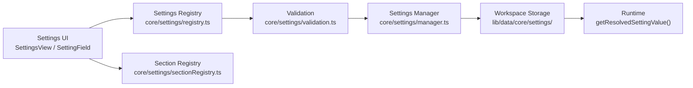

# Settings Platform

**Status: v2 Checkpoint 11.** BloomOS's configuration center — the one place every module's own configurable capability lives. It is deliberately **not** a hand-built settings page: the Settings page itself contains no module-specific logic at all. A module registers a Section and a set of Settings; the page renders whatever the Registry currently holds.

## Why this exists

Checkpoints 9-10 gave BloomOS an Automation Engine and a Workflow Builder, each configurable only by editing code (a `maxRetries` here, an `approvalPolicy` there). The Settings Platform is the generalized version of that same idea: a `SettingDefinition` is a configurable value anyone with the right permission/role can change from a real UI, validated the same way regardless of which module registered it.

## Architecture

Every arrow is one-way. `updateSetting()` is the **only** path a value ever changes through: validate → write, nothing in between — the same "validate then commit" shape `core/workflow/publisher.ts` established for a different domain.

### A deliberate departure from the closed-enum/open-registry split

Checkpoints 9-10 both paired a **closed enum** (Trigger types, Node kinds) with an **open Map-based registry** (Actions, Node types). The Settings Platform breaks that pattern on purpose: both the Setting Registry and the Section Registry are fully open. The spec's own wording — "Future sections should self-register," "Every module registers its own settings" — names no fixed set at all. A 15th Section or a 51st Setting needs exactly one registration call.

## 1. Settings Domain (`types/settings.ts`)

Framework-agnostic — nothing here imports React:

| Type | Purpose |
|---|---|
| `SettingValueType` | Closed 5-value type (`string`/`number`/`boolean`/`select`/`color`) — the one thing about a Setting that genuinely is a fixed set. |
| `SettingVisibility` | `visible` / `advanced` / `readonly` / `hidden` — distinct from permission/role/flag gating. `readonly` renders but can't be edited (e.g. `ai.provider`, which reflects real runtime state); `hidden` never renders at all. |
| `SettingDefinition` | id, sectionId, category, label, description, keywords (for Search), type, options, defaultValue, required, visibility, requiredPermissions, featureFlag, minimumRole, version, and an optional `validate` escape hatch — the same "closed-shape-plus-one-escape-hatch" pattern `WorkflowNodeDefinition.validate` established. |
| `SettingsSectionDefinition` | id, label, description, icon (a string name, resolved via `modules/settings/sectionIcons.ts` — never a component reference, so the definition stays importable from server code), order, and its own gates. |
| `SettingIssue` / `SettingIssueCode` | 7-value closed set: `invalid_type`, `required_missing`, `invalid_option`, `custom_validation_failed`, `permission_denied`, `feature_flag_disabled`, `unknown_setting`. |
| `SettingChangeRecord` | An append-only audit record — the Dashboard's own "Recently Changed." Stores actual before/after values; a legitimate, visible-to-admins audit contract, distinct from the observability logger's own "never log sensitive values" rule. |
| `SettingRecommendation` | The Bloom AI Integration type — inert by design. Nothing holding one of these ever writes a value by itself. |

## 2. Settings Registry & Section Registry (`core/settings/registry.ts`, `sectionRegistry.ts`)

The same `Map<id, definition>` shape every registry in this codebase already uses. `registerSetting()`/`registerSettingsSection()` overwrite by id (never duplicate); `listSettingsSections()` sorts by `order`, ties broken alphabetically by label — the one stable ordering the nav ever uses.

## 3. Validation Engine (`core/settings/validation.ts`, Step 13)

Runs in a fixed order, collecting **every** applicable issue rather than stopping at the first: required → type/option → custom `validate` → permission → role → feature flag. A UI showing why a save failed benefits from the full list, not just the first problem. `validateSettingById()` looks the Setting up first, returning `unknown_setting` for an id that isn't (or is no longer) registered — never a thrown exception.

## 4. Settings Manager & Workspace Storage (`core/settings/manager.ts`, `lib/data/core/settings/`)

`getResolvedSettingValue()` is the one function real runtime code should call: a stored override if one exists, otherwise the Setting's own registered `defaultValue`, `null` for an unregistered id — the "Workspace Storage → Runtime" arrow made concrete. `setSettingValue()` logs only safe, structural fields (`workspaceId`/`settingId`/`changedBy`) — never the actual value, matching Step 19's own "Never log sensitive values."

## 5. Sections (Steps 3-12)

Fourteen self-registered sections, each its own file in `modules/settings/sections/`, aggregated by `registerSettingsSections.ts` (idempotent, the same module-level guard `registerWorkflowNodes.ts` already established):

| Section | Notable settings |
|---|---|
| General | Default Landing Page |
| Workspace | Name, Timezone, Language, Currency, Date Format |
| Branding | Logo URL, Brand Color (validated as a 6-digit hex) |
| AI | Provider (`readonly` — reflects `isAIConfigured()`), Temperature (0-1), Token Limit, Confidence Threshold (0-100) |
| Skills | Default Skill (static option list — see "A known, deliberate exception" below) |
| Memory | Retention (days) |
| Automation | Default Approval Policy, Default Max Retries (0-5), Notify On Failure, Failure Handling Strategy |
| Workflow | Auto Save, Version Retention, Validation Strictness, Publishing Rule |
| CRM | Default Lead Stage, Default Client Status, Risk Threshold (0-100), Pipeline Default View |
| Finance | Currency, Tax Rate, Invoice Prefix/Numbering, Payment Terms, Late Fee, Default Revenue Category |
| Notifications | Email, In-App, Push, Digest, Critical Alerts |
| Security | Session Timeout, Password Policy, Require MFA (owner-only), plus read-only API Keys/Audit Log/Roles overviews |
| Developer | Feature Flags overview (read-only), Experimental Features, Debug Mode, Observability Level, Diagnostics overview |
| About | Version (read-only, informational only) |

### A known, deliberate exception

`skillsSection.ts`'s "Default Skill" hardcodes six real Skill ids as static `options` rather than importing the real Skill Registry — `registerDefaultAIContextBuilders()`'s own transitive chain reaches `server-only`-guarded modules, the same violation class this codebase has hit at every AI/Automation entry point. A future checkpoint could resolve this server-side instead, the same `WorkflowNodeSummary` pattern already established.

## 6. Global Settings Search (Step 14, `core/settings/search.ts`)

Ranked, not filtered — an exact label match scores highest, then a keyword match, then a substring match in the description or id. Runs against `listSettingsForWorkspace()`/`listSettingsSectionsForWorkspace()`'s own already-filtered results, so a search result can never surface a Setting or Section the searching member isn't otherwise permitted to see. Capped at 20 results; an empty query returns nothing (Search narrows, it doesn't browse).

## 7. Settings UI (Step 20 proof)

`SettingsView.tsx` is the entire proof of "no hardcoded module-specific logic": it walks `data.sections`/`data.settingsBySection`, never naming a specific Section or Setting id. `SettingField.tsx` — the generic renderer — switches on `setting.type` (closed, 5 values) and `setting.visibility`, never on `setting.id`. A 15th module's Setting renders correctly the moment it registers, with zero changes to either file.

Adding a new Setting therefore needs exactly four things, per Step 20:

1. **Definition** — a `SettingDefinition` object in the module's own section file.
2. **Validation** — only if it needs more than type/required (an optional `validate` function).
3. **Registration** — one array entry, picked up by `registerSettingsSections.ts`.
4. **Renderer** — nothing to add. `SettingField.tsx` already renders every `type` generically.

## 8. Settings Dashboard (Step 15, `getSettingsDashboardData.ts`)

One aggregate, computed fresh on every load, rendered as a panel above the Section nav (Settings has no separate top-level route the way Automation/Workflow do):

- **Workspace Health** — a percentage: `(visible settings − settings with an active warning) / visible settings`.
- **Recently Changed** — the last 10 `SettingChangeRecord`s, each resolved back to a real label/section via the Registry.
- **Warnings** — one validation pass over every visible Setting's own current resolved value. Permission/role/feature-flag issues can never appear here (the settings this runs against are already filtered to ones the viewer can see), so only genuine data-quality issues surface: missing required values, invalid stored values, a failed custom `validate`.
- **Missing Configuration** — a simple filter of Warnings down to `required_missing` — not a second, separate computation.
- **Recommended Configurations** — see below.

## 9. Bloom AI Integration (Step 16, `core/settings/recommendations.ts`)

Deterministic — a small set of pure rules over a workspace's own current resolved values, never a generative call, mirroring `getWorkflowSuggestions.ts`'s own precedent from Checkpoint 10. A rule fires only when the current value clearly warrants a change (MFA disabled, a confidence threshold below 50%, payment terms under a week). **Nothing in this module ever calls `updateSetting`** — the Dashboard's own "Apply" button is the only thing that does, routing through the exact same `updateSettingAction` a manual edit uses. "Dismiss" only hides a recommendation locally for the session; it isn't persisted (recommendations are recomputed fresh every load).

## 10. Command Palette (Step 17)

Self-registers from `SettingsView.tsx` the same way every other Dashboard in this codebase does (the global `CommandPalette` shell still isn't mounted anywhere — see Checkpoint 9's own precedent): "Open Settings," "Search Settings" (focuses the search box), "AI Settings," "Security Settings," "Developer Settings" (each jumps straight to that Section).

## 11. Permissions & Observability (Steps 18-19)

**Workspace scoped**: every query is scoped to the resolved session's own `workspaceId`. **Role aware / Section aware / Feature Flag aware**: `discovery.ts`'s `listSettingsForWorkspace()`/`listSettingsSectionsForWorkspace()` apply the exact same permission/role/flag gate to both Settings and Sections, mirroring `listAutomationsForWorkspace`/`listWorkflowNodesForWorkspace` almost exactly.

Tracked, safe fields only, never a value: setting changes (`workspaceId`/`settingId`/`changedBy`), validation failures (`issueCount`/`issueCodes` — this also covers permission denials, since `permission_denied` is one of the collected issue codes), and feature flag usage (flag key + resolved boolean, logged once per Section/Setting whose own `featureFlag` is actually evaluated).

## Future extension points (declared, not implemented)

Per this checkpoint's own non-goals: no Billing, Marketplace, OAuth integrations, external providers, user invitations, organization management, or API usage dashboard. The registries themselves place no ceiling on a future Section — the non-goals are a scope decision for this checkpoint, not an architectural limit.
