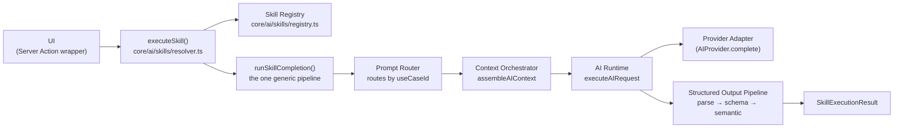

# Bloom AI Skills Layer

**Status: v2 Checkpoint 4.** Every Bloom AI capability — the Proposal Generator, the Event Operations Brief, and every not-yet-built assistant (CRM, Finance, Document, Daily Brief) — is a **Skill**: one typed declaration plus, for a capability that's actually built, one `execute` function. A UI never calls the Prompt Registry, Context Orchestrator, or AI Runtime directly; it calls `executeSkill(skillId, ...)` and nothing else. This is additive on top of `docs/ai.md`'s platform (Provider Registry, AI Runtime, Prompt Registry, Context Orchestrator, Structured Output Pipeline) — the Skills Layer doesn't replace any of that, it's the one place all of it gets wired together consistently instead of once per feature.

## Why this exists

Checkpoints 2–3 built the shared plumbing (Runtime, Prompt Registry, Context Orchestrator, Structured Output Pipeline) but each feature's own Server Action — `generateEventOperationsBrief.ts`, `generateProposalDraft.ts` — still called `routeAIUseCase` → `assembleAIContext` → `executeAIRequest` → `parseStructuredOutput` itself, in the same order, with the same error handling, duplicated feature-by-feature. A third feature would have meant writing that sequence a third time. The Skills Layer collapses it to one implementation (`runSkillCompletion`) that every executable Skill's `execute` delegates to — a feature's own file becomes a thin wrapper around its own permission check and its own post-processing (assembling a brief, persisting a proposal draft), never orchestration.

## The required flow

No UI component and no feature's Server Action calls `routeAIUseCase`, `assembleAIContext`, `executeAIRequest`, or `parseStructuredOutput` directly anymore — `executeSkill()` is the only seam.

## 1. Skill Definition (`core/ai/skills/types.ts`)

A `SkillDefinition` is a plain, declarative object — no class, no hidden state:

| Field | Purpose |
|---|---|
| `id`, `name`, `description`, `category` | Identity and display — `category` is one of a fixed closed set (`SKILL_CATEGORIES`: proposal, operations, crm, finance, documents, briefing), same "small closed set" bias as `AICapability`. |
| `requiredPermissions` | `Permission[]` — every one must be present, or `executeSkill` rejects before any token is spent. |
| `requiredContext` | Which `AIContextSectionKey`s must come back non-`undefined` from the Context Orchestrator, or the call fails with `"context_unavailable"`. |
| `useCaseId` | The linked `AIUseCaseDefinition` in the Prompt Registry — this is how a Skill reuses `buildMessages`/`outputSchema`/`semanticValidate`/`composeContext` without redeclaring any of it. |
| `outputSchema` | The Zod shape the model's output must satisfy — kept on the Skill too (not only the use case) so a Skill's own contract is self-describing. |
| `supportedProviders`, `requiredCapabilities`, `supportsStreaming` | Provider-compatibility declarations (streaming is declared, not yet enforced or implemented — see "Future extension points"). |
| `requiresApproval`, `requiresReview` | Two distinct gates: `requiresApproval` blocks *execution itself* until `approved: true` is passed (`executeSkill` enforces it); `requiresReview` is a display-only signal that a human must review *the output* before it's authoritative (e.g. the Proposal Generator) — enforcement of that second gate stays in the feature's own accept/reject flow, exactly as `PRODUCT_PRINCIPLES.md` #4 already requires. |
| `commandPaletteVisible`, `sidebarVisible` | Discovery-surface visibility flags. |
| `featureFlag` | An optional `core/featureFlags` key — `null` means always available (subject to permission/role). |
| `minimumRole` | An optional `WorkspaceMemberRole` floor, checked via the same rank comparison `WORKSPACE_MEMBER_ROLES.indexOf` already uses elsewhere. |
| `version`, `estimatedLatencyMs` | Metadata surfaced by `getSkillMetadata` (see §6). |
| `contextFactsKey` | The key `runSkillCompletion` uses to shape `AICompletionRequest.conversation.context.facts` — kept per-Skill (not computed) so each feature's own pre-existing mock provider, which reads a fixed key off that object, keeps working unchanged. |
| `createMockProvider` | A zero-arg factory for this Skill's deterministic development stand-in, called only when `isAIConfigured()` is `false`. Absent for a placeholder Skill — there's nothing to demo yet. |
| `execute` | The one field that decides "Coming Soon" vs. runnable. **Absence, not a separate status flag, is the single source of truth** every discovery surface (Dashboard, Skill Picker, `executeSkill` itself) reads. |

## 2. Skill Registry (`core/ai/skills/registry.ts`)

The same `Map<id, SkillDefinition>` shape as every other registry in this codebase (`core/ai/providerRegistry.ts`, `core/ai/prompts/registry.ts`, `core/commandPalette/registry.ts`): `registerSkill`, `unregisterSkill`, `getSkill`, `listSkills`, `listSkillsByCategory`, `resetSkillRegistry` (test-only). Registering an id already in use replaces that entry; each Skill's own `registerXSkill()` function guards actual "registered exactly once" behavior with a module-level `let registered = false`, matching `registerProposalUseCase`'s own precedent — the registry itself doesn't need to reject a second call.

## 3. Skill Resolver — `executeSkill()` (`core/ai/skills/resolver.ts`)

The single seam every feature calls instead of the Runtime, Prompt Registry, or Context Orchestrator directly. Enforces, in this fixed order, before a single token is spent:

1. **Existence** — the `skillId` must be registered (`"invalid_request"` otherwise).
2. **Availability** — the Skill must have an `execute` function ("Coming Soon" Skills reject with `"invalid_request"`).
3. **Permission** — every `requiredPermissions` entry must be in the caller's `permissions` (`"permission_denied"` otherwise).
4. **Role** — if `minimumRole` is set, the caller's `role` must meet it (`"permission_denied"` otherwise).
5. **Feature flag** — if `featureFlag` is set, `evaluateFeatureFlag(workspaceId, flag)` must resolve `true` (`"invalid_request"` otherwise).
6. **Approval** — if `requiresApproval` is set, `approved: true` must have been passed (`"approval_required"` otherwise).

Only after every gate passes does it call `skill.execute(params)` and return the result, logging `"Skill execution requested"`/`"Skill execution finished"` with `skillId`/`useCaseId`/success/provider/latency/mock — never generated content. This mirrors `executeAITool`'s own enforcement-order precedent from Checkpoint 2.

## 4. The generic pipeline — `runSkillCompletion()` (`core/ai/skills/resolver.ts`)

The actual "Prompt Registry → Context Orchestrator → AI Runtime → Provider → Structured Output" pipeline, existing **exactly once**. Every executable Skill's own `execute` calls this rather than reimplementing any of it:

1. `routeAIUseCase(skill.useCaseId)` — `"invalid_request"` if not registered.
2. `assembleAIContext({ sections: [workspace, user, ...skill.requiredContext], refs })` — a thrown exception becomes `"provider_failure"`; a required section coming back `undefined` becomes `"context_unavailable"`.
3. `useCase.composeContext?.(sections) ?? sections` — shapes the Orchestrator's raw section-keyed bag into whatever `buildMessages`/`semanticValidate` actually expect (see §5).
4. `useCase.buildMessages(context, input)`, then resolve a provider: `getAIProvider() ?? skill.createMockProvider?.()` — `"unavailable_provider"` if neither exists.
5. `executeAIRequest({ provider, ... })` — the Runtime's own error category (`timeout`/`provider_failure`/`unavailable_provider`/`fallback_exhausted`) is returned as-is.
6. `parseStructuredOutput` then, if declared, `applySemanticValidation` — `"malformed_output"`/`"schema_failure"`/`"semantic_failure"` respectively.
7. On success: `{ success: true, data, context, metadata: { skillId, useCaseId, provider, model, promptVersion, mock, latencyMs, generatedAt } }`.

The only per-Skill inputs are already-declarative fields (`useCaseId`, `requiredContext`, `contextFactsKey`, `createMockProvider`) plus whatever `composeContext` does — never a feature-specific branch inside this function itself.

## 5. `composeContext` — the seam that kept two features' prompts unchanged (`core/ai/prompts/types.ts`)

`AIUseCaseDefinition` gained one optional field: `composeContext?: (sections: Record<string, unknown>) => unknown`. The Context Orchestrator always returns a flat, section-keyed bag (e.g. `{ event, workspace, user }` or `{ client, eventServiceAssignment, proposalContext, workspace }`); `composeContext` turns that into exactly the shape each use case's pre-existing `buildMessages`/`semanticValidate` already expects (`EventOperationsBriefContext` / `ProposalContext`), defaulting to the raw sections when absent. This is what let both migrated features' prompt text, output schema, and semantic validation logic stay **byte-for-byte unchanged** — the composition step lives at the Prompt Registry level (owned by the feature that registered the use case), not duplicated inside the Skill Resolver.

## 6. Skill Metadata & Discovery (`core/ai/skills/discovery.ts`)

- `listSkillsForWorkspace({ workspaceId, permissions, role })` — every Skill this member may even be *offered*, filtered by permission/role (feature flags checked async via `evaluateFeatureFlag`), sorted alphabetically for a stable order. Capability/provider compatibility is deliberately **not** filtered here — an unavailable live provider still leaves a Skill worth discovering (its mock stand-in still runs); `executeSkill`/`runSkillCompletion` is where provider availability actually gates *execution*.
- `getSkillMetadata(id)` — combines a Skill's static declaration with what's true about it right now: `status` (`"active"` iff `execute` exists, else `"coming_soon"`), `provider` (the live provider's name, `"mock"`, or `null`), `promptVersion` (the linked use case's own `promptVersion` if registered, else the Skill's own `version`), and `availability` (`"live"` / `"mock"` / `"unavailable"`). Never persisted — always computed fresh.

Both functions back the Bloom AI Dashboard (`docs/ai.md`'s Bloom AI landing page) and the Skill Picker (§8) — neither hardcodes a card or a count; every number and every card comes from these two functions.

## 7. Permissions & Feature Flags — enforced once, not per-UI

Every gate a Skill can declare (`requiredPermissions`, `minimumRole`, `featureFlag`, `requiresApproval`) is checked **inside `executeSkill`**, server-side, before execution — not only in a UI's decision to show or hide a card. `listSkillsForWorkspace` re-derives the same permission/role/feature-flag logic purely to decide what's worth *displaying*; a Skill hidden there would also be rejected by `executeSkill` if invoked anyway. No UI-only restriction exists anywhere in this layer.

## 8. Command Palette integration — "Ask Bloom" (`modules/ai/components/BloomAISkillPicker.tsx`)

Checkpoint 4 replaces the several individual AI commands each panel used to register on its own (`"Generate Proposal"`, `"Open Proposal Draft"`, `"Search Proposal"`, `"Ask Bloom"`) with exactly one: **pick a Skill, run it.** `BloomAISkillPicker` is self-contained (its own trigger button and modal, not dependent on the global `CommandPalette` shell being mounted — it still registers into `core/commandPalette`'s registry too, so it's found there for free once that shell is ever mounted). It lists every Skill from `getBloomAIOverview`'s own `skills` field (Skill-Registry-driven, §6) and, on selection:

- If the current page registered a runner for that Skill (`registerSkillRunner(skillId, fn)` — see `core/ai/skills/runnerRegistry.ts`), it calls that runner. `EventOperationsBriefSection` and `ProposalGeneratorPanel` each register themselves this way on mount, unregister on unmount.
- Otherwise it falls back to navigating to `/bloom-ai`, the Skill's own generic discovery surface.

A future Skill needs zero Skill Picker changes — it appears automatically once registered; only a Skill whose panel wants a page-specific trigger needs its own `registerSkillRunner` call.

## 9. Observability

`executeSkill`/`runSkillCompletion` log, via `core/observability/logger`: on request, `skillId`/`useCaseId`; on invocation, `useCaseId`/`promptVersion`/an estimated token count/`mock`; on completion, `success`, and either `provider`/`latencyMs`/`mock` (success) or the failure `category` (failure). **Never logged**: prompt text, context facts, or a provider's raw response — the same rule every prior AI checkpoint enforces, verified by dedicated observability tests.

## 10. Developer experience — adding a new Skill

A new AI capability that reuses an existing context shape needs, at minimum:

1. A **Skill Definition** file (`registerXSkill.ts`) — the `SkillDefinition` object plus `registerSkill(...)`.
2. A **Prompt** registration (`registerXUseCase.ts`) — `buildMessages`, `outputSchema`, optionally `semanticValidate`/`composeContext`.
3. A **Context Builder**, only if no existing `AIContextSectionKey` already covers what it needs.
4. An **Output Schema** (Zod) — often shared with the use case registration above.
5. A **Semantic Validator**, only if a Zod shape alone can't express the check.

That's the ceiling, not the floor — the Event Operations Brief and Proposal Generator migrations (§11 of `docs/v2-checkpoint-4-skills-layer.md`) each needed only a Skill Definition file plus one field added to their already-existing use case registration, since both context shapes already existed. `core/ai/skills/registry.test.ts` includes a test proving a brand-new Skill needs nothing beyond a `SkillDefinition` object and one `registerSkill()` call to become discoverable.

## Future extension points (declared, not implemented)

Per the Checkpoint 4 non-goals, these are prepared for but deliberately not built yet:

- **Streaming** — `SkillDefinition.supportsStreaming` exists; no Skill sets it `true`, and `runSkillCompletion` always awaits a complete response.
- **Tool calling** — the Checkpoint 2 AI Tool Registry (`core/ai/tools/`) remains a separate, unconsumed foundation; no Skill invokes a tool mid-execution.
- **Agent orchestration / multi-step workflows** — `SkillExecuteParams`/`SkillExecutionResult` are single-shot request/response; nothing here models a plan, a loop, or a chain of Skill calls.
- **Parallel execution** — `executeSkill` calls are independent and unbatched; no concurrency primitive exists for running several Skills together.

## Migration guide (for the two already-migrated features)

Both `generateEventOperationsBrief.ts` and `generateProposalDraft.ts` now:

1. Keep their own early access/permission check (the Proposal Generator additionally keeps a preliminary `fetchEventContextRecord` call to resolve `clientId` before a Skill can even be invoked — its own test suite asserts that fetch never happens when unauthorized).
2. Call `executeSkill({ skillId, workspaceId, workspaceName, userId, userName, permissions, role, refs })`.
3. Map `SkillExecutionError.category` back to their own pre-existing, exact error strings via `mapSkillErrorToMessage` (`core/ai/skills/errorMapping.ts`) — so neither feature's error copy changed even though the underlying error now originates one layer further out.
4. Do their own post-processing on success — `assembleEventOperationsBrief(data, context)` for the Brief; suggested-memory proposal + `assembleProposalDraftInput` + persistence for the Proposal.

See `docs/v2-checkpoint-4-skills-layer.md` for the full certification, including exactly which tests prove zero behavioral regression.
