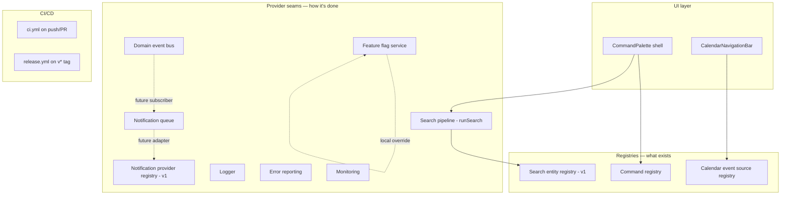

# v2.0 Checkpoint 1 — Foundation, Developer Experience & Platform

This checkpoint built infrastructure only — no business logic, no AI features, no automation rules. Every piece below follows the same shape v1's Core domains (`core/search`, `core/notifications`, `core/ai`) already established: an interface, a registry or provider seam, and a safe default that does nothing real yet. This document records the decisions, the abstractions future checkpoints will build on, and where each one's next real increment plugs in.

## Why one shape, repeated eight times

Every pluggable concern in this checkpoint is one of two patterns:

1. **A registry** (`Map<key, config>` + `register*`/`get*`/`reset*`) for "what exists" — Command Palette actions, Calendar event sources, Universal Search entities.
2. **A provider seam** (`interface` + `set*Provider`/`get*Provider` + a safe default) for "how something is actually done" — Search execution, Notification delivery, AI completion (already existed), Logging, Error reporting, Monitoring.

This isn't incidental repetition — it's the deliberate "Design consistency" principle from this checkpoint's brief, and it's why a reader who understands one of these eight systems already understands the shape of the other seven.

## 1. Command Palette (`src/core/commandPalette/`)

- `types.ts` / `registry.ts`: a `CommandAction` registry, empty by default — no business command is registered this checkpoint.
- `shortcuts.ts` / `useKeyboardShortcut.ts`: a platform-abstracting shortcut parser (`"mod+k"` → Cmd on macOS, Ctrl elsewhere) and a hook wiring it to `document`.
- `filter.ts`: label/keyword substring filtering — no ranking needed at command-list scale.
- `src/components/ui/CommandPalette.tsx`: a singleton shell, self-managing its own open state, opened by Cmd/Ctrl+K, composing `useDialogBehavior` (the same focus-trap/Escape/scroll-lock hook `Modal`/`Drawer` already use) and Universal Search's `runSearch()` for the results half of the list.

**Extension point**: any future checkpoint calls `registerCommand({...})` once, anywhere, at module-init time — the palette component never changes.

## 2. Universal Search (`src/core/search/pipeline.ts`, extending the existing registry)

v1 already had the provider abstraction, result model, and entity registration (`core/search/{types,registry,service}.ts`). This checkpoint added the one missing piece: `pipeline.ts`'s `runSearch()` = provider execution + `rankSearchResults()` (score-descending, `limit`-aware) as one documented entry point, so Command Palette and any future search surface call one function instead of re-implementing ranking each time.

**Extension point**: a real `SearchProvider` (Postgres full-text search, a hosted index) is a single `setActiveSearchProvider(...)` call — `runSearch()`'s callers never change.

## 3. Design System v2 (`docs/design-system-v2.md`, `src/styles/designTokens.ts`)

No visual value changed — `docs/design-system.md` remains authoritative for color/type/radius/shadow. What v2 adds:
- A written standards doc: the loading/error/empty convention, the registry/provider-seam convention (this document is an instance of following it), list/detail layout order, responsive breakpoint conventions.
- A typed, tested mirror of `globals.css`'s numeric tokens (`BREAKPOINTS_PX`, `DURATIONS_MS`, `SPACING_PX`) for the handful of cases JS itself needs a token's number, not just a className. A regression test fails loudly if this mirror and `globals.css` ever drift.

## 4. Calendar (`src/types/calendarEvent.ts`, `src/core/calendar/`, `src/modules/calendar/components/CalendarNavigationBar.tsx`)

- `CalendarEvent`: a generic, source-agnostic entry — deliberately not BloomOS's `Event` type, since a calendar will eventually show more than Events.
- `CalendarEventSource` registry: "what can appear on the calendar," same shape as Search's entity registry. Nothing registers an Events source yet — that's real scheduling logic, explicitly out of scope.
- `navigation.ts`: pure, fully-tested date math (`getRangeForView`, `goToNext/Previous`, `goToToday`) for month/week/day views.
- `CalendarNavigationBar`: the navigation shell (prev/next/today, view toggle, range label) with no data grid underneath it yet.

**Extension point**: a future checkpoint calls `registerCalendarEventSource({ sourceType: "event", fetch: ... })` and builds the actual date-grid component that consumes `getCalendarEventSources()` — the domain model and navigation math don't change.

## 5. Notification infrastructure (`src/core/events/`, `src/core/notifications/queue.ts`)

v1 already had the delivery-provider seam (`core/notifications/registry.ts`). This checkpoint added:
- `core/events/bus.ts`: a minimal, synchronous, in-process pub/sub (`publishDomainEvent`/`subscribeToDomainEvent`) — the "event bus integration" point Phase 3's Automation Engine and Smart Notifications will subscribe to. Nothing publishes a real domain event yet.
- `core/notifications/queue.ts`: a `NotificationQueue` interface plus `inMemoryNotificationQueue`, the same "interface + safe default" shape as everything else here.

**Extension point**: a real feature calls `publishDomainEvent({ type: "checklist.overdue", ... })`; a Phase 3 background-job worker subscribes and enqueues a real notification. Neither side needs to exist yet for the other to be built correctly today.

## 6. Feature Flags (`src/core/featureFlags/`, `src/lib/data/core/featureFlags/`)

Built mock-only — deliberately, matching the exact precedent `core/tags`/`core/comments`/`core/audit` already set (architecture ahead of a live table, not a live table ahead of a consumer), and matching this phase's standing rule not to change the database schema without a verified release blocker. `evaluateFeatureFlag(workspaceId, key)` is the one function anything gating on a flag should call; a local override (`NEXT_PUBLIC_FEATURE_OVERRIDES`, development-only) always wins, so a flag can be forced on locally before any live table exists.

**Extension point**: a live `feature_flags` migration (table + RLS, following the exact pattern every other module's migrations use) is the natural next step once Phase 2's Multi-Workspace rollout needs to progressively enable a real module — not invented speculatively here.

## 7. Observability (`src/core/observability/`, `src/app/api/health/route.ts`)

Three provider seams (`Logger`, `ErrorReportingProvider`, `MonitoringProvider`), each with a safe default: `consoleLogger` (structured JSON lines, ready for a real aggregator to ingest), `noopErrorReportingProvider` (logs rather than silently swallowing an exception), `noopMonitoringProvider` (discards, never throws). `/api/health` is a real, working route — unauthenticated, no database round-trip, reports "the process is up," which is a genuinely different and cheaper claim than "every dependency is healthy."

**Extension point**: a real Sentry/Datadog/etc. adapter is one `set*Provider(...)` call at app init — every call site that already logs or reports today needs no change.

## 8. CI/CD (`.github/workflows/ci.yml`, `.github/workflows/release.yml`)

`ci.yml` runs on every push/PR: lint → typecheck → test:coverage → build, the exact chain every v1 checkpoint ran manually. `release.yml` re-runs that same chain against a pushed `v*` tag before publishing a GitHub Release — a verify-and-publish workflow, not a deployment pipeline, since BloomOS has no configured deployment target yet.

## Architecture diagram — how these eight pieces relate

## What's deliberately not here

No business `CommandAction` is registered. No `CalendarEventSource` is registered. No domain event is published. No real notification/error-reporting/monitoring/logging provider is registered. No `feature_flags` table exists. No deployment step exists in `release.yml`. Every one of these is a real, named gap — not a silent omission — and each is the obvious next increment for the checkpoint that actually needs it.
