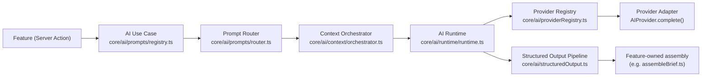

# v2.0 Checkpoint 2 — Bloom AI Platform Foundation

Bloom AI moves from a single-feature, single-provider seam (v1's `core/ai/{types,registry}.ts` + `modules/ai/`, built entirely for the Event Operations Brief) to reusable platform infrastructure. Every future AI feature — Proposal Generator, Daily Operations Brief, CRM Assistant, Finance Assistant, Document Assistant, Semantic Search — is expected to flow through the same seam, so no feature reimplements prompt construction, provider selection, retry/timeout, context assembly, or output validation. This checkpoint proves the seam works by migrating the one real feature that existed onto it, byte-for-byte behavior preserved, verified by that feature's own pre-existing test suite running unmodified against the new code.

**Non-goals, explicitly**: no Proposal Generator or any second AI feature UI, no semantic embeddings/vector storage, no autonomous agents, no automatic email/contract/financial/status mutations, no production provider credentials, no Automation Engine/Workflow Builder/Mobile Companion/Marketplace. See `docs/ai.md`'s "Explicitly out of scope for now" for the full, current list.

## The required flow

A feature never calls a provider's `.complete()` directly, never hand-builds a prompt inline, and never JSON-parses a provider response without going through the shared pipeline.

## 1. Provider lifecycle (`core/ai/providerRegistry.ts`)

- **Registration**: `registerAIProviderEntry({ id, provider, capabilities })` — an `id` already in use is replaced, matching every other registry in this codebase (Search entities, Command Actions, Feature Flags).
- **Health**: `setAIProviderHealth(id, { availability, lastError? })` — `"available"` | `"degraded"` | `"unavailable"`. A `degraded` provider is still offered as a candidate (lower confidence, not excluded); `unavailable` is a hard exclusion.
- **Selection**: `selectAIProviders({ requiredCapabilities, preferredProviderId, fallbackProviderIds })` returns an ordered, de-duplicated candidate list — preferred first (if eligible), then the explicit fallback chain in order, then the registered default — never including an `unavailable` entry or one missing a required `AICapability`.
- **Backward compatibility**: `core/ai/registry.ts`'s v1 surface (`registerAIProvider`/`getAIProvider`/`isAIConfigured`) is preserved with identical behavior, now delegating to this registry under one fixed id (`"legacy-registered"`). No existing caller — including the Event Operations Brief's own test suite, which mocks these three functions directly — needed to change.

## 2. AI Runtime execution flow (`core/ai/runtime/`)

`executeAIRequest(request, sleepFn?)` is the single seam every use case calls instead of a provider directly:

1. Resolve candidates — either the request's own pre-resolved `provider` (bypassing selection entirely) or `selectAIProviders(...)`.
2. For each candidate, attempt up to `maxRetries + 1` times: race the provider's `.complete()` against `timeoutMs` (default 20s); a timeout or thrown exception is retried with bounded exponential backoff (`computeBackoffDelayMs`: `baseMs * 2^attempt`, capped, no jitter — deterministic for tests); a `finishReason: "error"` completion is treated as a deliberate refusal and moves to the next candidate without retrying against the same one.
3. If every candidate is exhausted, return a typed `AIError` — `"fallback_exhausted"` only when more than one candidate was actually tried, otherwise the specific failure category (`"timeout"` / `"provider_failure"` / `"unavailable_provider"`).
4. **Never logs or returns a caught exception's own `.message`** — only fixed, safe strings — since a provider's thrown error could contain connection details or partial secrets. Verified against a fixture containing `"secret_key=sk-abc123"`.

`sleepFn` exists purely so tests can make retry delays instant; production callers never pass it.

## 3. Prompt versioning (`core/ai/prompts/`)

- `AIUseCaseDefinition` bundles everything one AI feature needs, registered once: `useCaseId`, `promptVersion`, `systemInstructions`, `buildMessages(context, input)`, `outputSchema` (Zod), optional `semanticValidate`, `requiredCapabilities`, `preferredProviderId`/`fallbackProviderIds`, `tokenBudget`, and `humanApprovalPolicy`.
- Generic types are intentionally erased to `unknown` at the registry boundary — a heterogeneous `Map` can't preserve per-entry generics, the same trade-off `core/search`'s `SearchableEntityConfig` already makes.
- `routeAIUseCase(useCaseId)` resolves a registration or returns a typed `{ success: false, error: { category: "invalid_request", ... } }` — a typo'd or not-yet-migrated id fails safely at the router, not deep inside the Runtime.
- **Prompt version is the audit trail**: every generated result should carry its `promptVersion` (the Event Operations Brief already did, pre-platform, via `EVENT_OPERATIONS_BRIEF_PROMPT_VERSION`; it now reads the same value from its registered `AIUseCaseDefinition` instead of importing the constant directly).

## 4. Context provenance (`core/ai/context/`)

- `AIContextSectionKey` reserves nine section names: `workspace`, `user`, `event`, `client`, `service`, `eventServiceAssignment`, `finance`, `contract`, `blueprint`. Only `workspace`, `user`, and `event` have a real `AIContextBuilder` registered this checkpoint — the rest are safe no-ops (silently absent from a result), not errors, so a future use case can already declare it needs `finance` context ahead of that builder existing.
- `assembleAIContext({ workspaceId, sections, refs, tokenBudget? })` fans out to every requested builder in parallel, then assembles the result in **canonical order** (`AI_CONTEXT_SECTION_KEYS`'s own declared order, never request order) — so the same request always produces the same section order regardless of how a caller listed `sections`.
- **Provenance**: each section's result carries a `source` string (e.g. `"fetchEventContextRecord+buildEventOperationsBriefContext"`, `"caller-provided session workspace"`) — surfaced in `AIContextAssemblyResult.provenance` so a caller or observability layer never has to guess where a fact came from.
- **Isolation**: `workspace`/`user` builders format facts the caller already resolved through its own session lookup — they never re-query, since re-deriving auth/session state inside `core/ai` would duplicate a concern that belongs to the calling feature. The `event` builder (`modules/ai/contextBuilders/eventContextBuilder.ts`) lives in `modules/ai`, not `core/ai/context/builders/`, specifically because it depends on Event-specific modules that `core/ai` must never import — `core` is the foundation modules build on, never the reverse.

## 5. Token budgeting (`core/ai/tokenBudget.ts`)

- `estimateTokens` — a documented ~4-characters-per-token heuristic (the same rule of thumb every major provider's own docs quote), avoiding an external tokenizer dependency this checkpoint doesn't need.
- `applyTokenBudget(sections, config)` — section-granularity (not per-field) truncation: sections are sorted by declared `priority` ascending (lower survives first) and greedily kept until the budget (`maxInputTokens - reservedOutputTokens`) is exhausted; anything past that is dropped whole and named in `omittedSections`, never silently lost.
- Available to any use case via its `tokenBudget` config and the Context Orchestrator's own `tokenBudget` request field — the migrated Event Operations Brief does not apply it (see §9), so this checkpoint's coverage of the mechanism is exercised entirely by `tokenBudget.test.ts` and `context.test.ts`, not yet by a real feature.

## 6. Structured output pipeline (`core/ai/structuredOutput.ts`)

Three stages, the middle one optional:

1. **Parse** — `JSON.parse` the provider's raw string content; a parse failure is `"malformed_output"`.
2. **Schema validation** — `schema.safeParse`; a shape mismatch is `"schema_failure"`.
3. **Semantic validation** (optional, via `applySemanticValidation`) — a use case's own domain-specific check a Zod shape alone can't express (e.g. "this risk kind must match one BloomOS actually detected"). A use case with nothing further to check simply doesn't call this stage.

The Event Operations Brief uses only stages 1–2 through the pipeline; its own semantic cross-checks (risk-kind filtering, action-target resolution) stay in `assembleBrief.ts`, unchanged, since they're lenient data transforms (silently drop an invented risk) rather than pass/fail validations — a different shape than `applySemanticValidation`'s success/failure contract.

## 7. AI Tool Registry — safety model (`core/ai/tools/`)

`AIToolDefinition` + `executeAITool(toolId, input, context)` enforce, in this fixed order, before any tool logic runs:

1. The tool must be registered (`"invalid_request"` otherwise).
2. The acting user must hold the tool's `requiredPermission`, if any (`"permission_denied"` otherwise) — the same permission strings used everywhere else in BloomOS (`core/permissions`), not a separate AI-only model.
3. A human must have already approved this specific call if `approvalPolicy: "always_required"` (`"approval_required"` otherwise) — `context.approved` is never inferred, only ever passed in by the caller after a real approval step.
4. The input must match the tool's Zod `inputSchema` (`"schema_failure"` otherwise).

The tool's own output is validated against its `outputSchema` too, and a thrown exception during `execute` never surfaces its own message (same rule as the Runtime). **No tool is registered yet** — this is infrastructure only, built ahead of any AI feature that needs to call out to a real BloomOS mutation.

## 8. AI Memory — safety model (`core/ai/memory/`, `lib/data/core/aiMemory/`)

- `proposeMemory` **always** creates an entry with `approval_status: "proposed"` — there is no code path from proposal directly to something a Context Orchestrator builder could read back.
- Only a human's explicit `approveMemory(id, reviewerId)` or `rejectMemory(id, reviewerId)` call changes that status; `getMemoryForScope` filters to `"approved"` only, by construction, not by caller discipline.
- Scoped by `AIMemoryScope` — `"workspace"` (applies to every request in that Workspace) or `"user"` (one specific member).
- Mock-only this checkpoint, same "architecture ahead of a consuming feature" precedent as `core/tags`/`core/comments`/`core/audit`/`core/featureFlags`, combined with the v2 standing rule against schema changes without a verified release blocker. **No use case proposes a memory yet.**

## 9. Human-approval boundaries

`PRODUCT_PRINCIPLES.md` #4 ("AI assists humans; it never replaces business approval") is enforced at the type level in two places, not left to convention:

- `AIUseCaseDefinition.humanApprovalPolicy` — every registered use case must declare `"always_required"` or `"not_required"`. The Event Operations Brief declares `"not_required"`: it is read-only and advisory (drafts a brief for a human to review), never sends anything or changes Event state itself.
- `AIToolDefinition.approvalPolicy` — every registered tool must declare the same, enforced by `executeAITool` before the tool runs at all (see §7). Anything client-facing, contractual, operational-status-changing, or financial must declare `"always_required"` once a real tool exists.

## 10. The proof: migrating the Event Operations Brief

`modules/ai/generateEventOperationsBrief.ts` now routes through `routeAIUseCase` → `assembleAIContext` → `executeAIRequest` → `parseStructuredOutput`, replacing its own inline prompt-building, timeout-wrapping, and JSON-parsing. Its pre-existing 15-test suite (`generateEventOperationsBrief.test.ts`) runs **completely unmodified** against the new implementation — every auth check, error message, versioning field, mock/live distinction, risk-kind filtering, and action-target resolution behaves identically. Two choices made this possible without weakening the platform for future use cases:

- **`AIRuntimeRequest.provider` escape hatch**: when set, the Runtime executes against exactly that provider, bypassing registry-based selection — because the existing test suite mocks `getAIProvider()`/`isAIConfigured()` from `@/core/ai` directly, so provider resolution had to stay exactly where those tests expect it. New use cases should prefer `requiredCapabilities`/`preferredProviderId`/`fallbackProviderIds` and let the Runtime select via the Provider Registry instead.
- **`maxRetries: 0`**: preserves the pre-platform feature's exact zero-retry behavior, even though the Runtime fully supports configurable retry — a deliberate choice for this migration, not a platform limitation.

One workspace-isolation subtlety surfaced during the migration and was corrected before it shipped: an early version of `eventContextBuilder` additionally compared the fetched Event's `workspace_id` against the request's `workspaceId` as "defense in depth." This broke the pre-existing test fixtures (which don't set `workspace_id` to match the test session's workspace, matching how mock mode has never modeled multi-tenancy) and was removed — workspace isolation for this builder stays exactly where it already lived: RLS in Supabase mode, single-tenant-by-construction in mock mode, matching `fetchEventContextRecord`'s own pre-existing contract.

## 11. Command Palette integration

`EventOperationsBriefSection` registers one Command Palette action, `"Ask Bloom"` (group "Bloom AI"), on mount and removes it on unmount, via Checkpoint 1's `core/commandPalette` registry. Running it calls the same `handleGenerate` the "Generate brief" button calls. This is intentionally page-scoped (only offered while an Event Detail page with this section is actually open) rather than a global command with nowhere specific to route to, since the Brief itself is embedded per-Event, not a standalone surface. The Command Palette UI shell itself isn't mounted anywhere in the app yet (still Checkpoint 1 infrastructure) — this command becomes reachable once a future checkpoint wires the palette into the global app shell.

## 12. Observability

`generateEventOperationsBrief` logs, via `core/observability/logger`, exactly:
- On invocation: `useCaseId`, `promptVersion`, an estimated token count (`estimateTokens` over the built prompt), and `mock` (boolean).
- On completion: the validation outcome — a fixed success message, or a failure `category` from the structured-output pipeline.
- The Runtime itself additionally logs `providerId` and `attempts` per request/attempt.

Never logged: prompt text, context facts, or a provider's raw response/error message — verified by dedicated tests asserting specific known-sensitive substrings (an Event title, a "BLOOM_CONTEXT" marker, a fabricated secret) never appear in any log call's serialized arguments.

## Future extension points

- A real provider adapter (Anthropic/Claude, per `docs/integrations.md`) is one `registerAIProviderEntry`/`registerAIProvider` call — no Runtime, Router, or Orchestrator change required.
- A second AI feature registers its own `AIUseCaseDefinition` and, if it needs Event/Client/Finance context, either reuses the `event` builder or adds a new one for its own section key — the Orchestrator's fan-out and ordering logic doesn't change.
- A real Context builder for `client`/`service`/`finance`/`contract`/`blueprint` is additive: implement `AIContextBuilder`, call `registerAIContextBuilder`, done.
- A real tool (e.g. "reschedule this Event") registers one `AIToolDefinition` with its permission and approval policy — `executeAITool`'s safety gates apply automatically, no caller-side enforcement needed.
- A use case that wants real memory calls `proposeMemory`; a review UI (not built yet) would list `getPendingProposals` and call `approveMemory`/`rejectMemory` — the repository contract already supports it.

## Testing

New test files, all deterministic and network-free: `providerRegistry.test.ts`, `runtime/runtime.test.ts`, `tokenBudget.test.ts`, `structuredOutput.test.ts`, `prompts/prompts.test.ts`, `context/context.test.ts`, `contextBuilders/eventContextBuilder.test.ts`, `tools/tools.test.ts`, `lib/data/core/aiMemory/mockRepository.test.ts`, and `generateEventOperationsBrief.observability.test.ts` — plus the pre-existing `generateEventOperationsBrief.test.ts` and `registry.test.ts` (both unmodified) and `EventOperationsBriefSection.test.tsx` (extended with three Command Palette cases). 236 tests across the AI platform, all passing; 3,905 across the full project.
