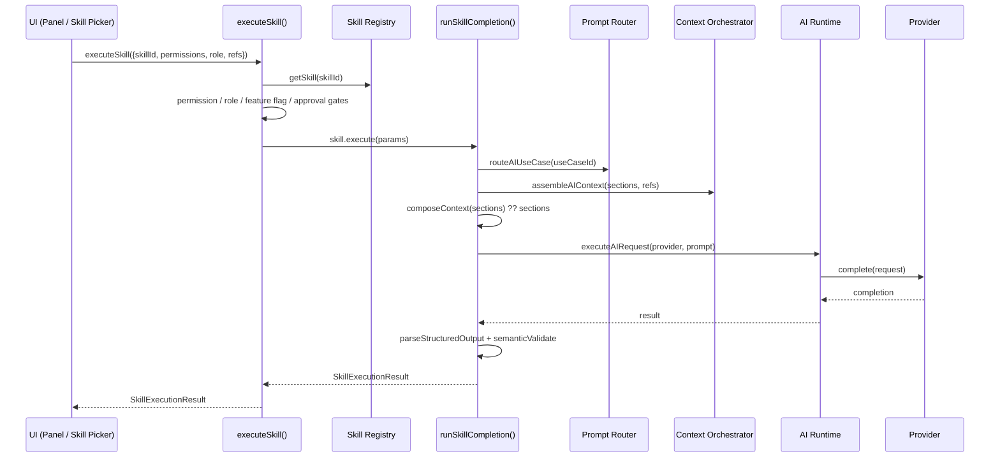

# v2.0 Checkpoint 4 — Bloom AI Skills Layer

Checkpoints 2–3 built the shared plumbing (Provider Registry, AI Runtime, Prompt Registry, Context Orchestrator, Structured Output Pipeline) and proved it twice — the Event Operations Brief (Checkpoint 2) and the Proposal Generator (Checkpoint 3) each routed through it, but each feature's own Server Action still called `routeAIUseCase` → `assembleAIContext` → `executeAIRequest` → `parseStructuredOutput` itself, in the same order, duplicated feature-by-feature. This checkpoint collapses that duplication into a single Skill abstraction: `UI → executeSkill() → Skill Registry → Skill Resolver → Prompt Registry → Context Orchestrator → AI Runtime → Provider → Structured Output`, with both real features migrated onto it and zero behavioral change.

**Non-goals, explicitly**: CRM Assistant, Finance Assistant, Document Assistant, and Daily Brief are registered as **placeholder Skills only** (metadata, no `execute`) — none is built as a real feature. No streaming, no agent orchestration, no vector database/embeddings, no Skill Marketplace, no Automation Engine/Workflow Builder. See `docs/skills.md`'s "Future extension points" for what's declared but deliberately not implemented.

## Architecture audit (Step 1)

Before writing the new layer, the existing AI surface was inspected for what would need to collapse:

- **`generateEventOperationsBrief.ts`** and **`generateProposalDraft.ts`** each independently called `routeAIUseCase`, `assembleAIContext`, `executeAIRequest`, and `parseStructuredOutput`/`applySemanticValidation` — same sequence, same error-handling shape, written twice.
- **The Bloom AI Dashboard** (`getBloomAIOverview.ts`) hardcoded two feature cards (Proposal Generator, Event Operations Brief) and a hardcoded `UPCOMING_SKILLS` array of four names/descriptions — a third real feature would have meant editing this file by hand.
- **The Command Palette** had three separate, feature-specific registrations (`"Ask Bloom"`, `"Generate Proposal"`, `"Open Proposal Draft"`, `"Search Proposal"`) with no shared invocation path.
- Two structural details discovered that shaped the design: `mockProvider.test.ts` (event brief) and the Proposal Generator's own mock-provider test call `createMockAIProvider()`/read a fixed `facts` key with zero arguments — their exact shape had to survive unchanged; and both features' existing `vi.mock("@/core/ai", ...)` test mocks targeted the barrel module, which would break once orchestration moved behind a resolver importing from `@/core/ai/registry` directly (to avoid a circular import back through the barrel) — both test files were retargeted to mock `@/core/ai/registry` instead, with every assertion unchanged.

## 1–2. Skill Definition & Registry (`core/ai/skills/types.ts`, `registry.ts`)

A `SkillDefinition` is a plain, 19-field declarative object (id, name, description, category, permissions, required context, linked use case, output schema, provider/capability requirements, streaming/approval/review flags, visibility flags, feature flag, minimum role, version metadata, and an optional `execute`). The Skill Registry is the same `Map<id, config>` shape as every other registry in this codebase. Full field-by-field reference in `docs/skills.md` §1–2.

## 3–4. Skill Resolver — `executeSkill()` and `runSkillCompletion()` (`core/ai/skills/resolver.ts`)

`executeSkill()` enforces existence → availability (`execute` present) → permission → role → feature flag → approval, in that fixed order, before delegating to the Skill's own `execute`. `runSkillCompletion()` is the single generic pipeline every executable Skill's `execute` calls instead of reimplementing it — routes the use case, assembles context, resolves a provider, executes the Runtime request, and validates the structured output. Full flow and error-category mapping in `docs/skills.md` §3–4.

**The seam that kept both migrations byte-for-byte compatible**: `AIUseCaseDefinition` gained one optional field, `composeContext?: (sections) => unknown`, letting each use case shape the Context Orchestrator's raw section bag into exactly what its own pre-existing `buildMessages`/`semanticValidate` already expect — so neither function's signature or behavior changed at all (`docs/skills.md` §5).

## 5. Migration evidence — Proposal Generator & Event Operations Brief (Steps 5–6)

Both `generateEventOperationsBrief.ts` and `generateProposalDraft.ts` are now thin wrappers: their own permission check (plus, for the Proposal Generator, a preliminary `fetchEventContextRecord` call to resolve `clientId`), one `executeSkill()` call, error-category mapping back to each feature's own exact pre-existing error strings via `mapSkillErrorToMessage`, then their own post-processing (`assembleEventOperationsBrief` / suggested-memory proposal + `assembleProposalDraftInput` + persistence).

**Zero behavioral regression, proven by each feature's own pre-existing test suite passing unmodified in substance** (only the `vi.mock` target changed, from `@/core/ai` to `@/core/ai/registry`, for the structural reason above — no assertion, fixture, or expected error string changed):

- `generateEventOperationsBrief.test.ts` — 15/15 passing.
- `generateEventOperationsBrief.observability.test.ts` — 3/3 passing (log call shapes unchanged: `"AI use case invoked"`/`"AI use case output validated"`/`"AI use case output failed validation"` with the same `useCaseId`/`promptVersion`/`category` fields).
- `generateProposalDraft.test.ts` — 13/13 passing, including the hallucinated-service/hallucinated-pricing semantic checks and the version-chain regeneration test.
- `structuralGuardrails.test.ts` — updated (not weakened): the rule "the UI component never imports the provider registry or a provider implementation directly" now carves out exactly one exception, `@/core/ai/skills/runnerRegistry` — a plain, client-safe Map with zero provider/runtime code, whose entire purpose (Step 8 below) is being imported by a UI component.

## 6. Upcoming Skills — placeholders (Step 9)

`modules/ai/registerUpcomingSkills.ts` registers CRM Assistant, Finance Assistant, Document Assistant, and Daily Brief with every field filled in honestly except `execute` — its absence, not a separate status flag, is what every discovery surface treats as "Coming Soon." None is built as a real feature this checkpoint (per the stop condition).

## 7. Bloom AI Dashboard — now Skill-Registry-driven (Step 8)

`getBloomAIOverview.ts` no longer hardcodes any card. It calls `listSkillsForWorkspace()` + `getSkillMetadata()` for every visible Skill and returns `installedSkillsCount` (all registered, `listSkills().length`), `activeSkillsCount`/`comingSoonSkillsCount` (derived from the same list), plus Execution History/Usage Statistics (still Proposal-only, since no other Skill persists an execution record — an honest, documented limitation, not a gap). `BloomAIOverviewView.tsx` renders Skill Statistics, Active Skills, Execution History, Prompt Versions, Provider Status, and Coming Soon Skills entirely from that one `skills` array — registering a fifth Skill requires zero changes to either file.

## 8. Command Palette → "Ask Bloom" Skill Picker (Step 10)

The three-plus separate commands collapsed into one: `BloomAISkillPicker` (`modules/ai/components/BloomAISkillPicker.tsx`) is a self-contained trigger + modal (not dependent on the still-unmounted global `CommandPalette` shell, though it registers into that same registry too) that lists every Skill from `getBloomAIOverview`'s own `skills` field and, on selection, calls `getSkillRunner(skillId)` (a new, plain client-safe registry — `core/ai/skills/runnerRegistry.ts`) or falls back to navigating to `/bloom-ai`. `EventOperationsBriefSection` and `ProposalGeneratorPanel` each register themselves as their own Skill's runner on mount, unregister on unmount — replacing their prior direct Command Palette registrations. Verified live in the browser (see "Browser verification" below): opening a picker, running "Event Operations Brief" from it scrolls to and generates the same brief clicking "Generate brief" would.

## 9. Permissions & Feature Flags (Step 11)

Every gate — `requiredPermissions`, `minimumRole`, `featureFlag`, `requiresApproval` — is enforced inside `executeSkill()` server-side, not only in a UI's decision to show a card. `listSkillsForWorkspace` re-derives the identical logic purely to decide what's worth *displaying*; a hidden Skill would also be rejected by `executeSkill` if invoked anyway. No UI-only restriction exists in this layer — proven by `resolver.test.ts`'s 22 `executeSkill`/`runSkillCompletion` tests covering every gate independently.

## 10. Observability (Step 12)

`executeSkill`/`runSkillCompletion` log `skillId`/`useCaseId`/provider/latency/`promptVersion`/`mock`/success-or-failure-category — never generated content, prompt text, or context facts. Same rule every prior checkpoint enforces; no new logging surface was needed since both migrated features already routed through the same `getLogger()` calls, now made once instead of twice.

## 11. Developer experience (Step 13)

A new Skill reusing an existing context shape needs, at minimum: a Skill Definition file, a Prompt registration (or a field added to an existing one), an Output Schema, and — only if needed — a Context Builder and a Semantic Validator. `core/ai/skills/registry.test.ts` includes a dedicated test (`"a new Skill needs only a SkillDefinition object and one registerSkill() call"`) proving the floor is genuinely that low — no registry-side, resolver-side, or Dashboard-side code needed to change for a new Skill to become discoverable. Full guide in `docs/skills.md` §10.

## 12. Future-proofing (Step 14)

Per the stop condition, these are declared but **not implemented**: `SkillDefinition.supportsStreaming` exists but nothing sets it or reads it operationally; the Checkpoint 2 AI Tool Registry remains unconsumed by any Skill; nothing here models a multi-step plan, an agent loop, or parallel Skill execution. See `docs/skills.md`'s "Future extension points."

## 13. Testing (Step 15)

New, deterministic, network-free test files covering the Skill Layer itself: `core/ai/skills/registry.test.ts` (9 tests), `resolver.test.ts` (22 tests — `executeSkill`'s full gate order plus `runSkillCompletion`'s full pipeline: context-assembly failure, missing required section, no-provider fallback, live-vs-mock provider selection, Runtime error propagation, schema/semantic validation failure, `contextFactsKey` keying, `composeContext` behavior with and without the hook), `discovery.test.ts` (17 tests — permission/role/feature-flag filtering, per-Workspace flag isolation, `getSkillMetadata`'s status/availability/provider/promptVersion computation), `errorMapping.test.ts` (6 tests — every `AIErrorCategory` → feature-message branch), `runnerRegistry.test.ts` (6 tests). Plus `BloomAISkillPicker.test.tsx` (7 tests — command registration, Skill loading, running a registered runner, the navigation fallback, the error state) and the migration-preserving suites in §5 above, and the two panels' own runner-registration tests (`EventOperationsBriefSection.test.tsx`, `ProposalGeneratorPanel.test.tsx`, updated from Command Palette assertions to Skill Runner assertions).

**Quality gates, all green:**

| Gate | Result |
|---|---|
| Lint | 0 errors, 11 pre-existing warnings (React Compiler "incompatible library" notices on unrelated `react-hook-form` components, unrelated unused-var warnings) |
| Typecheck (`tsc --noEmit`) | Clean |
| Test suite | **365 test files, 4093 tests, all passing** |
| Coverage — `core/ai/skills/` | 100% statements, 94.68% branches, 100% functions, 100% lines |
| Coverage — project-wide | 74.04% statements, 64.16% branches, 74.97% functions, 76.2% lines |
| Production build (`next build`) | Clean — `/bloom-ai` compiles as a dynamic route, no errors or warnings |

Two flaky, pre-existing, unrelated jsdom test failures (`InventoryItemForm.test.tsx`'s vendor-clear assertion, `useEventServiceOverrideMutations.test.tsx`'s validation-error assertion — both intermittent `"Not implemented: navigation to another Document"` jsdom timing issues) were observed during full-suite runs and confirmed to pass in isolation and on repeat runs; neither touches AI/Skills code.

One genuine flake was found and fixed during this checkpoint's own work: the Proposal Generator's Skill runner initially read the current draft id through a `useRef` kept in sync by a second, separately-scheduled `useEffect` — a real (if rare) race between that ref's update and the runner's invocation in tests. Fixed by re-registering the runner directly on `[proposal]` changes instead, removing the second effect entirely; confirmed non-flaky across 5 repeat runs after the fix.

## Execution flow (end to end)

## Browser verification

Verified live in the dev server (`npm run dev`), against the mock-provider data mode:

- **Desktop** (1280×800 equivalent): `/bloom-ai` renders Skill Statistics (6 installed / 2 active / 4 coming soon — matching the registry exactly), Active Skills (Event Operations Brief, Proposal Generator, both "Mock"), Execution History (empty state), Prompt Versions (all 6 Skills, correct per-Skill version strings), Provider Status ("Development mock"), Coming Soon Skills (all 4 placeholders, correctly labeled and disabled-looking). From an Event Detail page, clicking "Ask Bloom" opens the Skill Picker with the same 6 Skills; selecting "Event Operations Brief" closes the picker and runs the Skill through the full `executeSkill()` → `runSkillCompletion()` pipeline — the resulting brief rendered in the page (`"Generated ..., Development mock — not a real AI call, Needs attention, Confidence: 71%"` with a full executive summary), proving the pipeline end-to-end, not just in tests.
- **Mobile** (375×812): the same Dashboard renders single-column with no horizontal overflow; the mobile nav's "Bloom AI" entry shows with no "SOON" badge; the Ask Bloom Skill Picker renders full-width and legibly with the same 6 Skill cards and correct enabled/disabled styling.

✓ Desktop verified — Bloom AI Dashboard and Ask Bloom Skill Picker, including one full live Skill execution.
✓ Mobile verified — same surfaces, plus the sidebar nav entry.

## Known limitations

- **Execution History / Usage Statistics remain Proposal-only** — no other Skill (including the Event Operations Brief) persists an execution record; this predates the Skills Layer and isn't addressed here (see `docs/ai.md`'s "Versioning metadata, not persistence").
- **The global `CommandPalette` UI shell is still not mounted anywhere in `AppShell.tsx`** — `BloomAISkillPicker` and the panels' own registrations still register into that registry for free once it is, but the "Ask Bloom" button is currently the only reachable trigger.
- **`supportedProviders`/`requiredCapabilities` are declared but not yet used to filter Skill visibility** — `listSkillsForWorkspace` deliberately leaves provider/capability compatibility to execution time (`runSkillCompletion`'s own provider resolution), so an unavailable live provider still leaves a Skill discoverable via its mock stand-in.
- **Streaming, tool calling, agent orchestration, and parallel execution remain unimplemented extension points**, per the stop condition — see `docs/skills.md`.
- **No production AI provider is registered** — every Skill still runs against its own deterministic mock, clearly labelled throughout the UI (unchanged from prior checkpoints).

## Recommendation

**APPROVED.** Both real features (Proposal Generator, Event Operations Brief) execute entirely through `executeSkill()` with zero behavioral regression, verified by their own pre-existing test suites passing unmodified plus 61 new Skill Layer unit tests and live browser verification on desktop and mobile. The Bloom AI Dashboard and the Ask Bloom Skill Picker are both genuinely Skill-Registry-driven — no card, count, or command is hardcoded — so a fifth Skill (real or placeholder) requires no change to either surface. Per the stop condition, CRM Assistant, Finance Assistant, Document Assistant, and Daily Brief remain placeholder registrations only; no real feature work begins on any of them without further direction.
