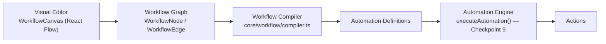

# Workflow Builder

**Status: v2 Checkpoint 10, extended in Checkpoint 13.** BloomOS's visual orchestration layer — the place a member *designs* what should happen after a real business event, without writing a single Automation Definition by hand. It is deliberately **not** the Automation Engine, **not** background execution, and **not** an AI Agent: the Workflow Builder produces Automation Definitions, it never runs one. Publishing a Workflow compiles its graph into real, registered Automations (Checkpoint 9); from that moment on, the Automation Engine's own `executeAutomation()` is the only thing that ever executes them. Checkpoint 13 adds an Execution Simulator, built-in Workflow Templates, a generalized (field-agnostic) Condition node family, and generic Skill-Registry-driven Action node discovery — every addition composes the Node Registry, Compiler, and Automation Engine that already existed; none of it introduces new orchestration logic of its own.

## Why this exists

Checkpoint 9 gave BloomOS its first execution layer, but every Automation still had to be hand-written as a `registerAutomation()` call in code — real, auditable, but not something a non-engineer could design. The Workflow Builder is the visual front-end onto that same Engine: drag Trigger, Condition, Approval, and Action nodes onto a canvas, connect them, and publishing produces the exact same kind of `AutomationDefinition` a developer would have written by hand — just compiled, not typed.

## Architecture

Every arrow above is one-way. The Compiler is the **only** file in the Workflow Builder permitted to import `core/automation/registry` (`core/workflow/publisher.ts`, specifically `registerAutomation()`); nothing in `core/workflow`/`modules/workflow` ever imports `executeAutomation()`/`dispatchAutomationTrigger()` — verified by a repo-wide grep as part of this checkpoint's own test suite, the same boundary proof Checkpoint 9 established for Skills.

### The Canvas is an implementation detail

Per this checkpoint's own explicit direction, `@xyflow/react` (React Flow) supplies rendering and interaction only — pan, zoom, drag, connect, selection, keyboard delete. It is isolated behind four files in `modules/workflow/canvas/`:

- **`WorkflowCanvas.tsx`** — the only component the Editor imports. Every prop and every method on its own imperative handle (`addNode`, `duplicateSelected`, `updateNodeData`, `undo`, `redo`) speaks BloomOS's own domain types (`WorkflowGraph`, `AddableWorkflowNodeType`, plain node ids) — never an `@xyflow/react` type.
- **`NodeRenderer.tsx`** / **`EdgeRenderer.tsx`** — one generic component each, rendering every node kind and every node type by reading a safe, server-fetched `WorkflowNodeSummary` catalog via React Context (`NodeCatalogContext.tsx`) — never the real Node Registry directly (see "Why the Canvas can't read the real registry" below).
- **`useCanvasController.ts`** — the only place `useNodesState`/`useEdgesState` are called. Owns its own undo/redo history as two `WorkflowGraph` snapshot stacks (real React state, not a ref), pushed only on a *committed* change — a drag finishing, a node/edge added/removed/connected/edited — never on every intermediate pointer-move event.
- **`graphAdapters.ts`** — the one translation boundary between `WorkflowGraph`/`WorkflowNode`/`WorkflowEdge` and React Flow's own `Node`/`Edge` shape. If the rendering library is ever replaced, this is the only file that needs to change — the Compiler, Validation Engine, Storage, and every business-logic caller are untouched.

A `grep -rl "@xyflow/react"` across `src/` returns exactly five files, all inside `modules/workflow/canvas/` — confirmed by this checkpoint's own test suite.

### Why the Canvas can't read the real registry

The Node Registry (`core/workflow/nodeRegistry.ts`) is populated by `registerWorkflowNodes()`, which registers the built-in Action nodes (`modules/workflow/nodes/actionNodes.ts`) — and those import the *real* Automation Actions from Checkpoint 9, several of which transitively reach `server-only`-guarded modules (the same class of bug this session has hit for every AI/Automation entry point). Calling `registerWorkflowNodes()` from a Client Component would trip that exact violation. Instead, `getWorkflowEditorData.ts` (a Server Action) fetches a safe, **function-free** `WorkflowNodeSummary[]` — the same RSC-safety pattern `AutomationActionSummary` established in Checkpoint 9 — and the Editor provides it to the canvas via `NodeCatalogContext`. `NodeRenderer` and the Node Library panel both read from that Context, never from `core/workflow/nodeRegistry` directly.

## 1. Workflow Domain (`types/workflow.ts`)

Framework-agnostic — nothing here imports React or `@xyflow/react`:

| Type | Purpose |
|---|---|
| `WorkflowNodeKind` | Closed, 6-value structural role (`start`/`trigger`/`condition`/`approval`/`action`/`end`) — the graph's own shape rules are written against this set. |
| `WorkflowNode` / `WorkflowEdge` | One node instance (`nodeTypeId` into the open Node Registry, plus `data`), one connection (`branch: "true" \| "false" \| null` for a Condition's two outgoing paths). |
| `WorkflowVariable` | A static, author-time-declared named value a node's own `data` may reference — never a runtime-mutable loop variable (loops are a non-goal). |
| `WorkflowMetadata` | Name/description/category/tags. |
| `WorkflowExecutionPolicy` | `requiredPermissions`/`minimumRole`/`featureFlag`/`maxRetries` — copied onto every compiled Automation. |
| `WorkflowGraph` | `{nodes, edges, variables}` — the one shape the Canvas, Compiler, and Validation Engine all share. |
| `WorkflowStatus` | `draft` / `published` / `archived`. |
| `WorkflowNodeDefinition` | The Step 3/17 Node Registry's own open declaration — id, kind, category, icon/color (design-token names, never raw hex or a React component reference), permissions, `compileTarget`, an optional `validate`. |
| `WorkflowIssue` / `WorkflowIssueCode` | One shared, 13-value closed set covering both the Compiler's own structural checks and the Validation Engine's own semantic checks. |

## 2. Node Registry (`core/workflow/nodeRegistry.ts`, `nodeDiscovery.ts`)

The same `Map<id, definition>` shape every registry in this codebase already uses. `WorkflowNodeKind` (closed) and node type id (open) mirror the Trigger/Action split Checkpoint 9 already established — "Future node types must register automatically" (Step 2) and "No hardcoded node rendering" (Step 3) are this file's own literal wording. `listWorkflowNodesForWorkspace()` mirrors `listAutomationsForWorkspace` almost exactly: permission/role checked synchronously, feature flag checked async, sorted alphabetically for a stable Node Library order.

### The built-in node types (`modules/workflow/nodes/`, Step 9, extended Checkpoint 13)

| Category | Count | Compiles to |
|---|---|---|
| Control | 2 | Purely structural (Start/End) — no `compileTarget`. |
| Trigger | 13 | One of `AUTOMATION_TRIGGER_TYPES` (Checkpoint 10's own 9, plus Checkpoint 13's Event Created, New Client, Manual Trigger, Timer). **Manual Trigger and Timer register with `compileTarget: null`** — see "Simulation-only Triggers" below. |
| Condition | 10 | Checkpoint 10's own 6 fixed-field nodes, plus Checkpoint 13's 4 field-agnostic ones (If, Compare, Exists, Switch) — see "Generalized Condition nodes" below. |
| Action | 10 static + 1 per registered Skill | Checkpoint 10's own 5 non-Skill actions, Checkpoint 12's 5 "Generate X Document" actions, Checkpoint 13's Custom Action (`compileTarget: null`), plus one dynamically-generated node per real, runnable AI Skill — see "Dynamic Skill node discovery" below. |
| Approval | 4 | One `ApprovalPolicyKind` each — "Manager Approval"/"Owner Approval" both compile to `role_restricted`, distinguished by `data.minimumApproverRole`. |

### Simulation-only Triggers (Checkpoint 13)

Manual Trigger and Timer both register with `compileTarget: null`. The Compiler's own `enumeratePaths` already skips a trigger with no `compileTarget` (a pre-existing guard, not new for this checkpoint) — so a Workflow whose only Trigger is Manual or Timer **compiles and publishes successfully, producing zero real Automations**. This is a deliberate reading of the stop condition "do not build the execution engine": both nodes exist so a member can design and simulate a workflow meant for on-demand or scheduled dispatch today, with real dispatch left to a future checkpoint — not a bug, not a placeholder pretending to work.

### Generalized Condition nodes (Checkpoint 13)

If, Compare, Exists, and Switch are field-agnostic: unlike the 6 fixed nodes (each baking one `AutomationConditionField` into `compileTarget`), these four let the member pick which of the 8 fields to branch on **per node instance**, stored in `data.field`. `compileTarget` holds one of three reserved sentinels (`DYNAMIC_CONDITION_FIELD_TARGET`, `DYNAMIC_CONDITION_EXISTS_TARGET`, `DYNAMIC_CONDITION_SWITCH_TARGET`, all in `types/workflow.ts`); `core/workflow/compiler.ts`'s `conditionFromNode()` checks for these before falling back to its original "`compileTarget` names the field directly" path, so every one of Checkpoint 10's own fixed nodes still compiles unchanged.

- **If** / **Compare** — both fully generic: field + operator + value all from `data`, compiled exactly like a fixed node once the field is resolved.
- **Exists** — field only; compiles to `neq(field, "")` on the true branch, `eq(field, "")` on the false branch. No operator/value to configure.
- **Switch** — field + a comma-separated `data.cases` string (no arrays in `WorkflowNode.data`, which stays a flat `Record<string, string|number|boolean|null>`); compiles to a **set-membership** check — `in(field, cases)` true, `notIn(field, cases)` false — reusing the existing binary branch model and the 8 `AutomationConditionOperator`s already in `types/automation.ts`. Deliberately not a true N-way branch: that would need `WorkflowEdge.branch` to carry an arbitrary case label instead of the closed `"true"|"false"|null` every other Condition node already relies on, a materially larger change to the Graph model and the Compiler's path enumeration for a checkpoint whose own stop condition is "do not build the execution engine." Set-membership delivers Switch's real value — branching on one of several configured values — without it.

### Dynamic Skill node discovery (Step 9, Checkpoint 13)

"Every Skill should appear automatically... do not hardcode Proposal Generator, CRM Assistant, Finance Assistant, Daily Brief." `modules/workflow/nodes/skillActionNodes.ts`'s `buildSkillActionNodes()` registers every AI Skill itself (mirroring `getBloomAIOverview.ts`'s own inline, idempotent registration-on-load — this is the only guaranteed opportunity for `registerWorkflowNodes()` to see every Skill), then builds one `WorkflowNodeDefinition` per Skill that's actually runnable (`skill.execute` defined — a "Coming Soon" placeholder Skill gets no node, since it could never compile to a working Action). The 4 Skills that already have a bespoke, hand-written Automation Action (Proposal Generator, Daily Operations Brief, CRM Assistant, Finance Assistant) keep using it; any other Skill (Browse AI Memory, Event Operations Brief, and any future one) routes to a generic fallback Action, auto-registered by `registerAutomationActions.ts`'s own loop over `listSkills()` via `runSkillActionFactory.ts`'s `makeRunSkillAction()` — the same "closure over one id at registration time" shape `generateDocumentActionFactory.ts` already established, for the same reason: `AutomationActionParams` only ever exposes a trigger's own flat `facts`, never a Workflow node's own static `data`, so a *generic, runtime-parameterized* Action isn't possible — only a *registration-time* one is. A future 5th Skill needs zero changes to either file to get both a real Automation Action and a real Workflow node.

## 3. Workflow Compiler (`core/workflow/compiler.ts`, Step 4)

Deterministic: the same graph, metadata, and execution policy always produce the same Automation Definitions, in the same order. Refuses to compile a structurally unsound graph outright — `analyzeWorkflowGraph()` (`graphAnalysis.ts`, shared with the Validation Engine) checks duplicate ids, missing node references, invalid edges, unsupported kind-to-kind transitions, a single required Start node, reachability from it, and cycles (white/gray/black DFS) — before a single `AutomationDefinition` is produced.

### Branching compiles to multiple Automations, not one

The Automation Engine has no concept of branching inside a single Automation — it only ever evaluates a flat, AND-combined condition list. So the Compiler enumerates **every simple path** from each Trigger node to a terminal node (an End node, or any node with no further outgoing edge), and compiles **each path into its own `AutomationDefinition`**. A Condition node's `"true"`/`"false"` branches contribute the same field/value with the operator negated on the `"false"` side (a total, self-inverse map over all eight `AutomationConditionOperator`s) — so two Automations compiled from opposite branches of one Condition node are mutually exclusive and jointly exhaustive over that one condition, without the Engine itself ever needing to know a "branch" existed.

Each compiled `AutomationDefinition.id` is `workflow-${workflowId}-trigger-${triggerNodeId}-path-${pathIndex}` — stable across identical recompiles, so publishing the same graph twice in a row produces identical ids (and therefore just re-registers in place, per `registerAutomation()`'s own replace-by-id semantics).

## 4. Validation Engine (`core/workflow/validation.ts`, Step 5)

Runs only before publishing — never at runtime; once published, the Automation Engine's own `executeAutomation()` never re-validates anything. Starts from the same `analyzeWorkflowGraph()` pass the Compiler uses, then adds five of its own checks: missing trigger, missing action, orphan nodes (no edge at all — distinct from the Compiler's own "unreachable," which means an edge exists but no path from Start reaches it), duplicate variable keys, and approval loops (a cycle specifically passing through an Approval node). A sixth check runs every node's own `WorkflowNodeDefinition.validate` — e.g. a Condition node missing its own operator/value, an Approval node missing a valid minimum role.

## 5. Workflow Storage & Versioning (`lib/data/core/workflow/`, `core/workflow/manager.ts`, Steps 6 & 11)

"Never mutate published versions" is enforced by the repository interface's own shape: there is no `updateVersion`/`deleteVersion` method — a `WorkflowVersion` can only ever be created. `Workflow.graph` is always the current, possibly-unpublished *draft*; a published, immutable snapshot lives separately as a `WorkflowVersion`, so a Workflow can sit at `status: "published"` while its own draft has already drifted further, awaiting the next Publish.

- **Draft → Published → Archived** — the three statuses.
- **Clone** — a brand-new Workflow (its own id, `status: "draft"`, `currentVersion: 0`) copying the source's current draft.
- **Restore** — copies a prior version's own `graph`/`metadata`/`executionPolicy` back onto the current draft, discarding in-progress edits; never touches the version record itself, never re-publishes.
- **Version History** — every published version, newest first, each independently restorable.

## 6. Publishing — Automation Integration (`core/workflow/publisher.ts`, Step 10)

`publishWorkflow()` is the **only** function in the Workflow Builder that reaches the Automation Engine: validate → compile → unregister the *previous* version's own compiled Automations (a re-publish may have removed a Trigger or path — a stale Automation must never linger under an id nothing in the current graph produces anymore) → register the new set via `registerAutomation()` → record the new immutable `WorkflowVersion`. Archiving a published Workflow flips its own last-published Automations to `status: "disabled"` (never fully unregistered, so they stay discoverable, matching Checkpoint 9's own contract) rather than leaving them silently active forever; unarchiving re-enables them.

## 6a. Execution Simulator (Step 6, Checkpoint 13)

`core/workflow/simulator.ts`'s `simulateWorkflow()` reuses the Compiler's own `analyzeWorkflowGraph()` + `enumeratePaths()` + `conditionFromNode()` rather than re-implementing graph traversal a second time — a Simulation can never show a path, a branch, or a condition the real Compiler wouldn't also produce. It adds exactly two things beyond the Compiler: a plain-language `preview` string per step (trigger fires, condition compares, action runs, approval requires, custom step waits), and a coarse, workspace-level, read-only Memory summary (via the real `summarizeMemories()` — Step 11's own "read memory," never bypassing Memory's own policies) surfaced only when at least one simulated path actually touches a Memory-related node. **Nothing here calls a real Action, Skill, or Automation — no side effects at all**, matching the stop condition's own "do not build the execution engine." `simulateWorkflowAction.ts` is the Server Action the Editor's own "Run Simulation" button and Command Palette entry both call, permission/workspace-scoped identically to `validateWorkflowDraft.ts`.

## 6b. Workflow Templates (Step 7, Checkpoint 13)

`core/workflow/templateRegistry.ts` is an open `Map<id, WorkflowTemplate>` registry, the same shape every other registry in this codebase uses — a future built-in Template needs only its own file plus one `registerWorkflowTemplate()` call. Three ship today (`modules/workflow/templates/`), each built entirely from real, already-registered node types (never a new kind of step):

| Template | Graph |
|---|---|
| Proposal Accepted → Contract | Proposal Accepted → Generate Contract (Document Compiler) → Create Notification → Create Memory |
| Invoice Paid → Finance Update | Invoice Paid → Run Finance Assistant (dynamic Skill node, standing in for "Update Finance" since no ledger-mutating Action exists yet) → Create Notification ("Notify CRM") → Create Memory |
| New Client → Welcome | New Client → Run CRM Assistant (dynamic Skill node) → Generate Welcome Guide (Document Compiler) → Create Task ("Create Reminder" — `createTaskAction.ts` already records its to-do as a Note with `category: "reminder"`) |

`createWorkflow.ts` accepts an optional `templateId`: when given, the Template's own `graph` is deep-cloned (`JSON.parse(JSON.stringify(...))`, since `WorkflowGraph` is plain data) onto the new Workflow instead of `buildInitialGraph`'s bare Start(+Trigger) — the registered Template itself is never mutated by editing a Workflow created from it. The "New Workflow" dialog (`WorkflowsListView.tsx`) shows a Template picker above the name/category fields; selecting one pre-fills both.

## 7. Canvas Interaction (Step 8)

React Flow supplies pan/zoom/drag/connect/selection/delete natively. This checkpoint adds:

- **Duplicate** — `Cmd/Ctrl+D` or the toolbar button, clones every selected node with a new id, offset by 40px, selected.
- **Undo/redo** — `Cmd/Ctrl+Z` / `Cmd/Ctrl+Shift+Z`, backed by `useCanvasController`'s own two-stack history (50-entry cap).
- **Grid snapping** — `snapToGrid`, 16px grid.
- **Responsive** — below the `lg` breakpoint, the three-column layout (Node Library / Canvas / Properties) can't fit side by side (an inherently wide-screen editing surface), so the Editor shows a mobile-only pane switcher (Nodes / Canvas / Panel) instead of squeezing the canvas to nothing.

## 8. Bloom AI Integration (Step 12)

`getWorkflowSuggestions.ts` is **deterministic**, not a generative AI call: for every Trigger type with a real built-in node but zero active Automations listening for it (the same signal the Automation Dashboard's own "Triggers With No Listener" already surfaces), it suggests building a Workflow for it. Accepting a suggestion pre-fills the "New Workflow" dialog (name, and a Start→Trigger already connected) — nothing is created until the member explicitly clicks "Create Workflow," the human-approval step this Step requires. Mirrors Checkpoint 9's own "Skills may suggest Automations, never execute them" boundary.

## 8a. Memory Integration (Step 11, Checkpoint 13)

**Create**: unchanged from Checkpoint 10 — the `action.create-memory` node compiles to `CREATE_MEMORY_ACTION_ID`, which already goes through the real Memory Layer's own write path (and, by extension, its own policies) rather than writing directly to storage. **Attach**: covered by the same node — in this domain, recording a Memory entry already attaches it to the relevant Client/Event context; no separate "attach" mechanism was introduced. **Read**: genuinely new — the Execution Simulator (see 6a above) calls the real `summarizeMemories()` for an informational, workspace-level preview whenever a simulated path touches a Memory-related node, read-only and policy-respecting throughout. None of this bypasses Memory's own approval/review workflow — a Workflow can request that a Memory entry be created, never that one be silently approved.

## 9. Dashboard (Step 13)

Folded into the existing `/workflows` list page rather than a second, separate route (`WorkflowDashboardSection.tsx`): Workflow Statistics (total/published/draft counts), Validation Errors (every non-archived Workflow with a live issue), and Automation Usage (every published Workflow's own latest version and how many real Automations it has registered) — the same data that doubles as "Execution Links," since every entry links straight back to `/automation`, the Automation Engine's own Dashboard (Checkpoint 9), rather than a second, separately maintained execution view.

## 10. Command Palette (Step 14)

Self-registers the same way every command in this codebase already does (the global `CommandPalette` shell isn't mounted anywhere yet — see Checkpoint 9's own precedent): "Open Workflow Builder," "Create Workflow," and "Recent Workflows" from the List page; "Publish Workflow" and Checkpoint 13's own "Run Simulation" from the Editor page, since both are contextual to whichever Workflow is currently open. "Run Simulation" always simulates the Editor's own *current* graph — a `graphRef` kept in sync via `useEffect` so the command's callback (registered once, not on every edit) never reads a stale snapshot.

## 11. Permissions & Observability (Steps 15–16)

**Workspace scoped**: every query checks or filters by `workspaceId`. **Role aware / Feature Flag aware**: both via the Node Registry's own per-node-type gates (Node Library visibility) and via `WorkflowExecutionPolicy`, copied onto every compiled Automation and enforced by `executeAutomation()` itself. **Publishing requires elevated permission**: `workspace.manage` — the same permission `/settings` itself requires — checked in `publishWorkflowAction.ts`, `createWorkflow.ts`, `archiveWorkflow.ts`, `cloneWorkflow.ts`, and `restoreWorkflowVersion.ts`; viewing, editing, and **simulating** a draft needs only active membership (`simulateWorkflowAction.ts` mirrors `validateWorkflowDraft.ts`'s own, lighter gate exactly).

Every stage logs via `core/observability/logger`, safe fields only — workflow/version ids, status, issue counts, automation counts. Checkpoint 13 adds **compile-time duration** and **node count** to both the success and blocked-by-issues log lines in `compileWorkflow()`, and **simulation duration**, **node count**, **trigger count**, and **path count** to `simulateWorkflow()`'s own log line — Step 14's own "Track... compile time... node count... execution time" (read here as *simulation* time, since no real execution exists yet). **Never logged**: a graph's own nodes, edges, or node `data` (which may carry a Condition's own comparison value), and Memory content (the Simulator's own read-only preview logs only aggregate counts, never a Memory entry's own text).

## 12. Accessibility (Step 15, Checkpoint 13)

The Canvas wrapper already had `role="application"`, `aria-label`, `tabIndex`, and real keyboard handlers (undo/redo/duplicate) since Checkpoint 10. Checkpoint 13 adds `role="group"` + a descriptive `aria-label` (kind, label, selected state) to every rendered node (`NodeRenderer.tsx`), `aria-label`s to each connection handle ("Incoming connection," "True branch," "False branch," "Outgoing connection"), and an `aria-label` to every edge plus its branch pill (`EdgeRenderer.tsx`) — per-node/per-edge accessibility was previously thin (noted in Checkpoint 10's own report as a gap). Responsive behavior (the mobile pane switcher) is unchanged and re-verified against the Simulation panel specifically, which renders cleanly at 375px width.

## 13. Workflow Monitoring Center (Checkpoint 39 Final Addendum)

**Status: read-model only — no second execution engine.** The Monitoring Center at `/workflows/monitoring` gives every Workflow a Live Execution Monitor, Execution History, Error Center, Performance Dashboard, Workflow Dependency Map, Health Panel, and immutable Workflow Audit — all seven composed as pure functions over data the Automation Engine, Workflow store, and existing Validation/Graph-Analysis engines already produce. Nothing in `core/workflowMonitoring/` writes to a new store, computes a second health score, or re-implements graph traversal; every engine's own doc comment names exactly which real engine or data source it reads.

### Why "Running" is always empty

`executeAutomation()` (`core/automation/resolver.ts`) is **fully synchronous** — it blocks until every action has run and the result is already persisted before any caller can observe it. There is no real "currently executing" state to report. Rather than fabricate one, the Live Execution Monitor maps all 6 requested buckets onto the 6 real `AutomationExecutionStatus` values (`success`→Successful, `failure`/`partial_failure`→Failed, `pending_approval`→Waiting, `rejected`→Cancelled, `skipped_conditions_not_met`→Skipped) plus an honestly-always-empty **Running** bucket, documented in the UI itself. "Scheduled Workflows" is shown as `Workflow.executionPolicy.scheduledExecution` **configuration**, not a live queue — BloomOS has no background scheduler yet.

### `core/workflowMonitoring/` engines

| Engine | Composes |
|---|---|
| `executionSummary.ts` | `AutomationExecution` records (Automation History) — reads `automation.metadata.{workflowId,workflowVersion,sourceNodeIds}` to attribute each execution back to the Workflow that published it. |
| `liveMonitor.ts` | `executionSummary.ts` output, bucketed by status, plus `Workflow.executionPolicy.scheduledExecution` for the Scheduled panel. |
| `errorCenter.ts` | Every failed `actionResult` inside every execution — one record per failure, newest first; "stack" is the real structured action-failure message, since the Action Runner never throws. |
| `performanceEngine.ts` | Average/slowest/fastest/most-executed rankings and node/action/trigger frequency counts, computed directly from `AutomationExecution.durationMs` and `actionResults` — no separate metrics store. |
| `dependencyMap.ts` | The real `AutomationDefinition.trigger`/`actionIds` of every compiled Automation. `ACTION_ID_PRODUCES_TRIGGER` is deliberately narrow — only `"create-event"` → `"event.created"` is derivable from real code (confirmed by auditing every Checkpoint-39 Action's own `lib/data` imports) — so "workflows triggering workflows" is never guessed wider than what the code actually proves. |
| `healthEngine.ts` | Reuses `core/workflow/validation.ts`'s `validateWorkflow()` and `core/workflow/graphAnalysis.ts`'s `analyzeWorkflowGraph()` as-is for every structural check (unreachable nodes, missing trigger/action, cycles). Only genuinely new checks — dead branch (BFS-to-End that never arrives), duplicated node (signature dedup), unused/disabled/archived workflow — are added on top. |
| `auditEngine.ts` | One immutable `WorkflowAuditRecord` per execution, built directly from that execution's own `automationVersion`, `triggerFacts`, `actionResults`, `durationMs`, `metadata.sourceNodeIds`, and `startedBy` — never recomputed. |
| `executiveIntegration.ts` | Translates a `WorkspaceWorkflowHealthSummary` into the same `RecommendationSource { generatedBy, recommendations }` contract every other platform (Proposal, Contract, Client Journey, DAM, ...) already feeds into Executive Decisions. |

### The `startedBy` extension

`AutomationExecution` and `RecordAutomationExecutionInput` (`types/automation.ts`) gained one optional field, `startedBy: string | null`, populated from `params.userId` at every one of `executeAutomation()`'s 7 `persist()` call sites (`core/automation/resolver.ts`). Backward compatible — every existing execution record and test fixture is unaffected; only the Workflow Audit's "actor" field and the Live Monitor's "started by" column depend on it, falling back to `"system"` when absent.

### Executive Integration — one wiring point, not three

`businessHealthEngine.ts`'s own doc comment names it the top-level orchestrator for **both** Business Health and Operational Intelligence, and it already had a `workflow_readiness` `HealthCategory` permanently stubbed `notApplicable` — an exact, pre-existing extension point. `ComputeBusinessHealthInput` gained one optional field, `workflowHealth?: WorkspaceWorkflowHealthSummary | null`; when supplied (wired in `businessHealthActions.ts`, which now also fetches Workflows + Automation executions before calling `computeBusinessHealth()`), `workflow_readiness` scores for real. Wiring into this one file therefore satisfies "Business Health," "Executive Decisions" (via the same `RecommendationSource` contract every other platform uses, added to `executiveDecisionsActions.ts`'s existing `Promise.all`), and "Operational Intelligence" simultaneously — no second or third wiring point was needed. No existing category's behavior changed for any caller that doesn't supply `workflowHealth`.

### Module actions (`modules/workflowMonitoring/monitoringCenterActions.ts`)

Every query (`getWorkflowLiveMonitorAction`, `getWorkflowExecutionHistoryAction`, `getWorkflowErrorsAction`, `getWorkflowPerformanceMetricsAction`, `getWorkflowDependencyMapAction`, `getWorkspaceWorkflowHealthAction`, `getWorkflowAuditLogAction`) and mutation (`retryWorkflowExecutionAction`, `cloneWorkflowExecutionAction`, `exportWorkflowExecutionLogAction`, `ignoreWorkflowErrorAction`, `archiveWorkflowErrorAction`) gates on `workspace.manage` — the same permission every other Workflow/Automation action already requires. **Retry** and **Clone** both re-run the original execution's own trigger facts through the real `executeAutomation()` engine — mirroring `approveAutomationExecution.ts`'s established "re-run through the real engine" pattern exactly, never re-implementing execution. Error acknowledgement (ignore/archive) is tracked in a small in-memory `Map<executionId::actionId, status>` (`workflowErrorAcknowledgementsStore.ts`) — a UI-only triage state, not a second copy of the error itself.

### UI (`/workflows/monitoring`)

`WorkflowMonitoringCenterView.tsx` is a 7-tab client component (Live Monitor, Execution History, Error Center, Performance, Dependency Map, Health Panel, Audit) that fetches all seven datasets in parallel on load. Reached from `/workflows` via a "Monitoring Center" button and a Command Palette entry (`open-workflow-monitoring-center`), alongside the List page's existing 3 registered commands. Next.js resolves the literal route `/workflows/monitoring` ahead of the dynamic `/workflows/[id]` — confirmed via `next build`'s own route listing.

## Developer guide — adding a new node type

Per Step 17's own Developer Experience requirement, a new node type needs only:

1. **Node Definition** — a `WorkflowNodeDefinition` object (id, kind, category, name, description, icon name, color token, `compileTarget`, optional `validate`) in `modules/workflow/nodes/`.
2. **Renderer** — nothing to add. `NodeRenderer.tsx` already renders every kind and every type generically, driven by the Node Registry's own icon/color/name.
3. **Validation** — only if the node has its own configuration to check (`validate: (context) => string | null`).
4. **Registration** — one `registerWorkflowNode(definition)` call, added to `registerWorkflowNodes.ts`.

No editor change. `core/workflow/nodeRegistry.test.ts` includes a dedicated proof mirroring the Automation Registry's own equivalent test.

## Future extension points (declared, not implemented)

Per Checkpoint 10's own non-goals: no scheduled execution, background workers, external integrations, webhook triggers, parallel action execution, timers, delays, loops, marketplace, or AI Agents. `AutomationDefinition.workflow` (Checkpoint 9's own reserved field) remains the seam a future capability would extend through.

Per Checkpoint 13's own non-goals: no real workflow execution, email sending, webhooks, API calls, marketplace, external integrations, OCR, or electronic signatures. Manual Trigger and Timer are registered and simulatable today specifically so a future checkpoint can wire real dispatch onto them without touching the Node Registry, Compiler, or Editor again — only the (currently nonexistent) execution engine itself.
